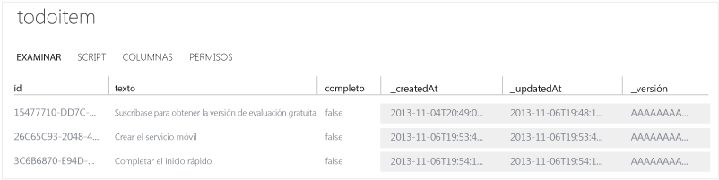

<properties
	pageTitle="Introducción a Servicios móviles de Azure para aplicaciones PhoneGap/Cordova | Microsoft Azure"
	description="Siga este tutorial para empezar a usar Servicios móviles de Azure para el desarrollo de PhoneGap para iOS, Android y Windows Phone."
	services="mobile-services"
	documentationCenter=""
	authors="ggailey777"
	manager="dwrede"
	editor=""/>

<tags
	ms.service="mobile-services"
	ms.workload="mobile"
	ms.tgt_pltfrm="mobile-phonegap"
	ms.devlang="multiple"
	ms.topic="get-started-article" 
	ms.date="02/10/2016"
	ms.author="ggailey777"/>

# Introducción a Servicios móviles

[AZURE.INCLUDE [mobile-services-selector-get-started](../../includes/mobile-services-selector-get-started.md)]&nbsp;

[AZURE.INCLUDE [mobile-services-hero-slug](../../includes/mobile-services-hero-slug.md)]

En este tutorial se muestra cómo agregar un servicio back-end basado en la nube a una aplicación con los Servicios móviles de Azure. Con este tutorial creará tanto un servicio móvil nuevo como una aplicación simple de _Lista de pendientes_ que almacena datos de la aplicación en el servicio móvil nuevo.

La siguiente captura de pantalla muestra la aplicación final:

![][3]

### Requisitos adicionales

Para completar este tutorial, se requiere lo siguiente:

+ Herramientas de PhoneGap (se requiere la versión v3.2+ para los proyectos de Windows Phone 8).

+ Una cuenta de Microsoft Azure activa.

+ PhoneGap admite el desarrollo para varias plataformas. Además de las propias herramientas de PhoneGap, debe instalar las herramientas para cada plataforma a la que se dirige:

	- Windows Phone: instale [Visual Studio 2012 Express para Windows Phone](https://go.microsoft.com/fwLink/p/?LinkID=268374)
	- iOS: instale [Xcode] (se requiere v4.4+)
	- Android: instale las [herramientas para desarrolladores de Android][Android SDK]  (el SDK de Servicios móviles para Android es compatible con aplicaciones para Android 2.2 o una versión posterior. Se requiere Android 4.2 o superior para ejecutar la aplicación de inicio rápido).

## Creación de un servicio móvil

[AZURE.INCLUDE [mobile-services-create-new-service](../../includes/mobile-services-create-new-service.md)]

## Creación de una aplicación PhoneGap

En esta sección, creará una aplicación de PhoneGap que se conecta al servicio móvil.

1.  En el [Portal de Azure clásico], haga clic en **Servicios móviles** y luego en el servicio móvil que acaba de crear.

2. En la pestaña de inicio rápido, haga clic en **PhoneGap** bajo **Seleccionar plataforma** y expanda **Creación de una aplicación de PhoneGap**.

   	![][0]

   	Con esto se muestran los tres sencillos pasos requeridos para crear una aplicación PhoneGap conectada al servicio móvil.

  	![][1]

3. Si aún no lo ha hecho, descargue e instale PhoneGap y al menos una de las herramientas de desarrollo de plataforma (Windows Phone, iOS o Android).

4. Haga clic en **Crear tabla TodoItem** para crear una tabla para almacenar los datos de la aplicación.

5. En **Descargar y ejecutar la aplicación**, haga clic en **Descargar**.

	De este modo se descarga el proyecto para la aplicación _To do list_ de ejemplo que está conectada al servicio móvil, además del SDK de JavaScript para Servicios móviles. Guarde el archivo comprimido del proyecto en el equipo local y anote dónde lo guardó.

## Ejecución de la nueva aplicación de PhoneGap

La etapa final de este tutorial consiste en crear y ejecutar la aplicación nueva.

1.	Desplácese a la ubicación donde se guardaron los archivos del proyecto comprimidos y expanda dichos archivos en el equipo.

2.	Abra y ejecute el proyecto de acuerdo con las siguientes instrucciones para cada plataforma.

	+ **Windows Phone 8**

		1. Abra el archivo .sln de la carpeta **platforms\\wp8** en Visual Studio 2012 Express para Windows Phone.

		2. Presione la tecla **F5** para recopilar el proyecto e iniciar la aplicación.

	  	![][2]

	+ **iOS**

		1. Abra el proyecto de la carpeta **platforms/ios** en Xcode.

		2. Presione el botón **Ejecutar** para crear el proyecto e iniciar la aplicación en el emulador de iPhone, que es el valor predeterminado para este proyecto.

	  	![][3]

	+ **Android**

		1. En Eclipse, haga clic en **File** (Archivo), **Import** (Importar), expanda **Android**, haga clic en **Existing Android Code into Workspace** (Código de Android existente en el espacio de trabajo) y luego haga clic en **Next** (Siguiente).

		2. Haga clic en **Examinar**, desplácese a la ubicación de los archivos de proyecto expandidos, haga clic en **Aceptar**, asegúrese de que el proyecto TodoActivity esté marcado y, a continuación, haga clic en **Finalizar**. 
De esta forma se importan los archivos del proyecto en el área de trabajo actual
.

		3. En el menú **Run** (Ejecutar), haga clic en **Run** (Ejecutar) para iniciar el proyecto en el emulador de Android.

			![][4]

		>[AZURE.NOTE]Para poder ejecutar el proyecto en el emulador de Android, debe definir al menos un dispositivo virtual de Android (AVD). Use el administrador AVD para crear y administrar estos dispositivos.

3. Después de iniciar la aplicación en uno de los emuladores móviles anteriormente, escriba algún texto en el cuadro de texto y, a continuación, haga clic en **Agregar**.

	Esta acción envía una solicitud POST al nuevo servicio móvil hospedado en Azure. Los datos de la solicitud se insertan en la tabla **TodoItem**. El servicio móvil devuelve los elementos almacenados en la tabla y los datos se muestran en la lista.

	> [AZURE.IMPORTANT] Los cambios en este proyecto de plataforma se sobrescribirán si el proyecto principal se recompila con las herramientas de PhoneGap. En su lugar, realice cambios en el directorio www raíz del proyecto tal como se describe en la sección siguiente.

4. De nuevo en el [Portal de Azure clásico], haga clic en la pestaña **Datos** y luego en la tabla **TodoItems**.

	

	Esto le permite examinar los datos que la aplicación inserta en la tabla.

	

## Realización de actualizaciones de aplicaciones y recompilación de proyectos para cada plataforma

1. Realice cambios en los archivos de código en el directorio 'www', que en este caso es 'todolist/www'.

2. Compruebe que todas las herramientas de la plataforma de destino se encuentren accesibles en la ruta de acceso del sistema.

2. Abra un símbolo del sistema en el directorio raíz del proyecto y ejecute uno de los siguientes comandos específicos de la plataforma:

	+ **Windows Phone**

		Ejecute el siguiente comando desde el símbolo del sistema de desarrollador para Visual Studio:

    		phonegap local build wp8

	+ **iOS**

		Abra el terminal y ejecute el siguiente comando:

    		phonegap local build ios

	+ **Android**

		Abra un símbolo del sistema o ventana de terminal y ejecute el siguiente comando.

		    phonegap local build android

4. Abra cada proyecto en el entorno de desarrollo adecuado como se describe en la sección anterior.

>[AZURE.NOTE]Puede revisar el código que tiene acceso a su servicio móvil para consultar e insertar datos, que se encuentra en el archivo js/index.js.

## Pasos siguientes
Ahora que completó el inicio rápido, aprenda a realizar importantes tareas adicionales en los Servicios móviles:

* **[Incorporación de autenticación a la aplicación]** Obtenga información sobre cómo autenticar a los usuarios de su aplicación con un proveedor de identidades.  

* **[Incorporación de notificaciones push a la aplicación](https://msdn.microsoft.com/magazine/dn879353.aspx)** Obtenga información sobre cómo registrarse para obtener notificaciones de inserción y enviarlas a la aplicación.

* **[Referencia conceptual de Servicios móviles con HTML/JavaScript](mobile-services-html-how-to-use-client-library.md)** Obtenga más información sobre cómo usar la biblioteca cliente de JavaScript para acceder a datos, llamar a las API personalizadas y realizar la autenticación.

[AZURE.INCLUDE [app-service-disqus-feedback-slug](../../includes/app-service-disqus-feedback-slug.md)]

<!-- Images. -->
[0]: ./media/mobile-services-javascript-backend-phonegap-get-started/portal-screenshot1.png
[1]: ./media/mobile-services-javascript-backend-phonegap-get-started/portal-screenshot2.png
[2]: ./media/mobile-services-javascript-backend-phonegap-get-started/mobile-portal-quickstart-wp8.png
[3]: ./media/mobile-services-javascript-backend-phonegap-get-started/mobile-portal-quickstart-ios.png
[4]: ./media/mobile-services-javascript-backend-phonegap-get-started/mobile-portal-quickstart-android.png

<!-- URLs. -->
[Incorporación de autenticación a la aplicación]: mobile-services-html-get-started-users.md
[Android SDK]: https://go.microsoft.com/fwLink/p/?LinkID=280125
[Portal de Azure clásico]: https://manage.windowsazure.com/
[Xcode]: https://go.microsoft.com/fwLink/p/?LinkID=266532
[Visual Studio 2012 Express for Windows Phone]: https://go.microsoft.com/fwLink/p/?LinkID=268374
 

<!---HONumber=AcomDC_0211_2016-->