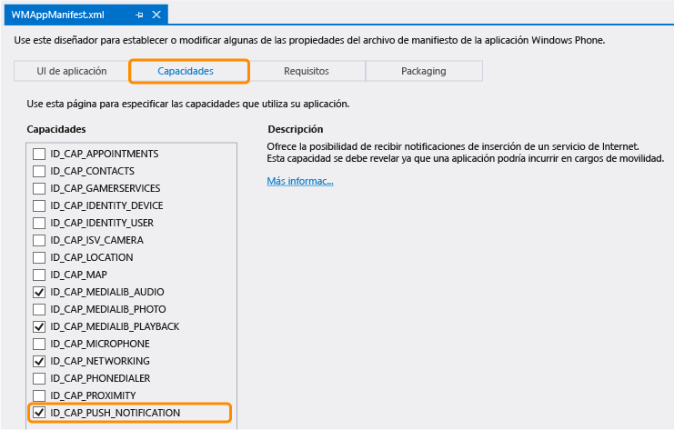

<properties 
	pageTitle="Incorporación de notificaciones de inserción a la aplicación Servicios móviles (Tienda Windows) | Microsoft Azure" 
	description="Obtenga información sobre cómo usar Servicios móviles de Azure y Centros de notificaciones para enviar notificaciones de inserción a la aplicación de Windows Phone." 
	services="mobile-services,notification-hubs" 
	documentationCenter="windows" 
	authors="ggailey777" 
	manager="dwrede" 
	editor=""/>

<tags 
	ms.service="mobile-services" 
	ms.workload="mobile" 
	ms.tgt_pltfrm="mobile-windows-phone" 
	ms.devlang="dotnet" 
	ms.topic="article" 
	ms.date="12/07/2015" 
	ms.author="glenga"/>

# Incorporación de notificaciones de inserción a la aplicación de Servicios móviles

[AZURE.INCLUDE [mobile-services-selector-get-started-push](../../includes/mobile-services-selector-get-started-push.md)]

##Información general

Este tema muestra cómo puede utilizar Servicios móviles de Azure para enviar notificaciones de inserción a una aplicación Silverlight de Windows Phone. Este tutorial le permite habilitar notificaciones de inserción con los Centros de notificaciones de Azure para el proyecto de inicio rápido. Cuando haya finalizado, el servicio móvil le enviará una notificación de inserción con Centros de notificaciones cada vez que se inserte un registro. El centro de notificaciones que cree es gratuito con el servicio móvil, puede administrarse independientemente del servicio móvil y pueden utilizarlo otras aplicaciones y servicios.

Este tutorial se basa en la aplicación de ejemplo TodoList. Antes de iniciar este tutorial, primero debe completar [Incorporación de Servicios móviles a una aplicación existente] para conectar su proyecto al servicio móvil. Si no se conecta un servicio móvil, el asistente para agregar notificaciones push puede crear esta conexión.

>[AZURE.NOTE]Para enviar notificaciones de inserción a una aplicación de la Tienda Windows Phone 8.1, siga la versión [Aplicación de la Tienda Windows](../mobile-services-javascript-backend-windows-store-dotnet-get-started-push.md) de este tutorial.

## Actualización de la aplicación para registrarse a fin de recibir notificaciones

Para que la aplicación pueda recibir notificaciones de inserción, debe registrar un canal de notificaciones.

1. En Visual Studio, abra el archivo App.xaml.cs y agregue la instrucción siguiente `using`:

        using Microsoft.Phone.Notification;

3. Agregue lo siguiente a App.xaml.cs:
	
        public static HttpNotificationChannel CurrentChannel { get; private set; }

        private void AcquirePushChannel()
        {
            CurrentChannel = HttpNotificationChannel.Find("MyPushChannel");

            if (CurrentChannel == null)
            {
                CurrentChannel = new HttpNotificationChannel("MyPushChannel");
                CurrentChannel.Open();
                CurrentChannel.BindToShellToast();
            }

            CurrentChannel.ChannelUriUpdated +=
                new EventHandler<NotificationChannelUriEventArgs>(async (o, args) =>
                {

                    // Register for notifications using the new channel
                    await MobileService.GetPush()
                        .RegisterNativeAsync(CurrentChannel.ChannelUri.ToString());
                });
        }

    Este código recupera el valor de ChannelURI de la aplicación desde el Servicio de notificación de inserción de Microsoft (MPNS) que usa Windows Phone 8.x "Silverlight" y luego lo registra para notificaciones de inserción.

	>[AZURE.NOTE]En este tutorial, el servicio móvil envía una notificación del sistema al dispositivo. Cuando envía una notificación de icono, debe llamar al método **BindToShellTile** en el canal.

4. En la parte superior del controlador de eventos **Application\_Launching** en App.xaml.cs, agregue la siguiente llamada al nuevo método **AcquirePushChannel**:

        AcquirePushChannel();

	Esto garantiza que se solicitará registro cada vez que se cargue la página. En la aplicación, es posible que solo desee realizar este registro de manera periódica para asegurarse de que el registro esté actualizado.

5. Presione la tecla **F5** para ejecutar la aplicación. Se muestra un cuadro de diálogo emergente con la clave de registro.
  
6.	En el Explorador de soluciones, expanda **Propiedades**, abra el archivo WMAppManifest.xml, haga clic en la pestaña **Funcionalidades** y asegúrese de que la funcionalidad **ID\_\_\_CAP\_\_\_PUSH\_NOTIFICATION** esté activada.

   	

   	Esto asegura que la aplicación puede generar notificaciones del sistema.

## Actualización de scripts del servidor para enviar notificaciones de inserción

Finalmente, debe actualizar el script registrado para insertar la operación en la tabla TodoItem a fin de enviar notificaciones.

1. Haga clic en **TodoItem**, en **Script** y seleccione **Insertar**. 

2. Reemplace la función de inserción por el siguiente código y, a continuación, haga clic en **Guardar**:

		function insert(item, user, request) {
		// Define a payload for the Windows Phone toast notification.
		var payload = '<?xml version="1.0" encoding="utf-8"?>' +
		    '<wp:Notification xmlns:wp="WPNotification"><wp:Toast>' +
		    '<wp:Text1>New Item</wp:Text1><wp:Text2>' + item.text + 
		    '</wp:Text2></wp:Toast></wp:Notification>';
		
		request.execute({
		    success: function() {
		        // If the insert succeeds, send a notification.
		    	push.mpns.send(null, payload, 'toast', 22, {
		            success: function(pushResponse) {
		                console.log("Sent push:", pushResponse);
						request.respond();
		                },              
		                error: function (pushResponse) {
		                    console.log("Error Sending push:", pushResponse);
							request.respond(500, { error: pushResponse });
		                    }
		                });
		            }
		        });      
		}

	Este script de inserción envía una notificación de inserción (con el texto del elemento insertado) a todos los registros de aplicaciones de Windows Phone una vez que se realiza la inserción.

3. Haga clic en la pestaña **Inserción**, marque **Habilite las notificaciones de inserción no autenticadas** y, a continuación, haga clic en **Guardar**.

	Con esto se permite que el servicio móvil se conecte a MPNS en modo sin autenticar para enviar notificaciones de inserción.

	>[AZURE.NOTE]Este tutorial usa MPNS en modo sin autenticar. En este modo, MPNS limita el número de notificaciones que se pueden enviar a un canal de dispositivo. Para quitar esta restricción, debe generar y cargar un certificado haciendo clic en **Upload** (Cargar) y seleccionando el certificado. Para obtener más información sobre la generación del certificado, consulte [Configuración de un servicio web autenticado para enviar notificaciones de inserción para Windows Phone].

## Prueba de las notificaciones push en su aplicación

1. En Visual Studio, presione la tecla F5 para ejecutar la aplicación.

    >[AZURE.NOTE]Es posible que se produzca una excepción 401 Unauthorized RegistrationAuthorizationException al realizar pruebas en el emulador de Windows Phone. Esta excepción puede producirse durante la llamada `RegisterNativeAsync()` debido a la manera en el que el emulador de Windows Phone sincroniza su reloj con el equipo host. Puede resultar en un token de seguridad rechazado. Para solucionarlo, establezca manualmente el reloj del emulador antes de realizar las pruebas.

5. En la aplicación, escriba el texto "hello push" en el cuadro de texto, haga clic en **Guardar** y luego haga clic inmediatamente en el botón Inicio o Atrás para abandonar la aplicación.

   	

  	Esto envía una solicitud de inserción al servicio móvil para almacenar el elemento agregado. Observe que el dispositivo recibe una notificación del sistema que dice **hello push**.

	

	>[AZURE.NOTE]No recibirá la notificación mientras permanezca en la aplicación. Para recibir una notificación del sistema mientras la aplicación esté activa, deberá gestionar el evento [ShellToastNotificationReceived](http://msdn.microsoft.com/library/windowsphone/develop/microsoft.phone.notification.httpnotificationchannel.shelltoastnotificationreceived.aspx).

## Pasos siguientes

En este tutorial hemos presentado las nociones para habilitar una aplicación de la Tienda Windows para que envíe notificaciones de inserción con Servicios móviles y Centros de notificaciones. A continuación, considere completar uno de los siguientes tutoriales:

+ [Enviar notificaciones de difusión a los suscriptores](../notification-hubs-windows-phone-send-breaking-news.md)  Sepa cómo los usuarios se pueden registrar y recibir notificaciones de inserción de categorías que les interesan.

+ [Envío de notificaciones independientes de la plataforma a los suscriptores](../notification-hubs-aspnet-cross-platform-notify-users.md)  Obtenga información sobre cómo usar las plantillas para enviar notificaciones de inserción desde su servicio móvil sin tener que diseñar cargas específicas de plataforma en el backend.

Puede obtener más información acerca de los Servicios móviles y los Centros de notificaciones en los siguientes temas:

* [Centros de notificaciones de Azure - Directrices de diagnóstico](../notification-hubs-diagnosing.md)  Obtenga información acerca de cómo solucionar los problemas de notificaciones de inserción.

* [Introducción a la autenticación]  Aprenda a autenticar a los usuarios de su aplicación con distintos tipos de cuentas con los servicios móviles.

* [¿Qué son los Centros de notificaciones?]  Aprenda cómo funcionan los Centros de notificaciones para entregar notificaciones a sus aplicaciones en todas las principales plataformas cliente.

* [Referencia conceptual de Servicios móviles con .NET]  Obtenga más información sobre cómo utilizar Servicios móviles con .NET.

* [Referencia del script del servidor de Servicios móviles]  Obtenga más información sobre cómo implementar lógica empresarial al servicio móvil.

<!-- Anchors. -->

<!-- Images. -->

<!-- URLs. -->
[Submit an app page]: http://go.microsoft.com/fwlink/p/?LinkID=266582
[My Applications]: http://go.microsoft.com/fwlink/p/?LinkId=262039
[Live SDK for Windows]: http://go.microsoft.com/fwlink/p/?LinkId=262253
[Incorporación de Servicios móviles a una aplicación existente]: mobile-services-windows-phone-get-started-data.md
[Introducción a la autenticación]: mobile-services-windows-phone-get-started-users.md

[Configuración de un servicio web autenticado para enviar notificaciones de inserción para Windows Phone]: http://msdn.microsoft.com/library/windowsphone/develop/ff941099(v=vs.105).aspx

[Referencia del script del servidor de Servicios móviles]: http://go.microsoft.com/fwlink/?LinkId=262293
[Referencia conceptual de Servicios móviles con .NET]: mobile-services-windows-dotnet-how-to-use-client-library.md

[¿Qué son los Centros de notificaciones?]: ../notification-hubs-overview.md

 

<!---HONumber=AcomDC_1210_2015-->