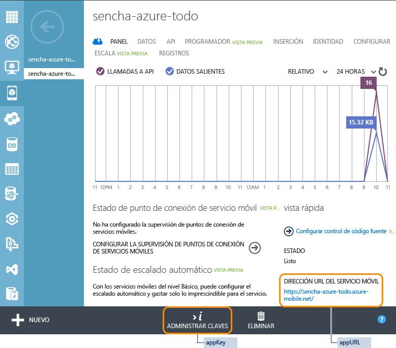

<properties
	pageTitle="Introducción a Servicios móviles de Azure y Sencha"
	description="Siga este tutorial para empezar a desarrollar con Servicios móviles y el marco de aplicación móvil HTML5 de Sencha."
	services="mobile-services"
	documentationCenter=""
	authors="ggailey777"
	manager="dwrede"
	editor=""/>

<tags
	ms.service="mobile-services"
	ms.workload="mobile"
	ms.tgt_pltfrm="mobile-sencha"
	ms.devlang="multiple"
	ms.topic="get-started-article"
	ms.date="02/10/2016"
	ms.author="glenga"/>

# Introducción a Servicios móviles y Sencha Touch

[AZURE.INCLUDE [mobile-service-note-mobile-apps](../../includes/mobile-services-note-mobile-apps.md)]

&nbsp;

[AZURE.INCLUDE [mobile-services-selector-get-started](../../includes/mobile-services-selector-get-started.md)]&nbsp;

[AZURE.INCLUDE [mobile-services-hero-slug](../../includes/mobile-services-hero-slug.md)]

##Información general

Este tutorial muestra cómo sacar provecho de los Servicios móviles de Azure en la aplicación Sencha Touch. Creará una sencilla aplicación *Lista de tareas pendientes* mediante Sencha Touch que emplea un servicio móvil definido a través del Portal de Azure clásico. Este tutorial se ha creado para desarrolladores de aplicaciones web intermedios y avanzados que conozcan bien JavaScript y que estén familiarizados con el marco de Sencha Touch.

Si prefiere ver un vídeo, este clip sigue los mismos pasos que este tutorial. En el vídeo, Arthur Kay explica cómo generar una aplicación Sencha Touch mediante un back-end de Servicios móviles de Azure.

> [AZURE.VIDEO getting-started-with-sencha-touch]

A continuación se muestra una captura de pantalla de la aplicación final:

![][0]

##Requisitos

- Descargue e instale [Sencha Touch] (http://wwww.sencha.com/products/touch/download"target =" \_blank").

- Descargue e instale la [herramienta Sencha Cmd] (http://www.sencha.com/products/sencha-cmd/download"target =" \_blank").

- Java Runtime Environment (JRE) o Kit de desarrollo de Java (si está creando aplicaciones de Android).
- Gema Ruby y SASS.

## Creación de un servicio móvil

[AZURE.INCLUDE [mobile-services-create-new-service](../../includes/mobile-services-create-new-service.md)]

##Creación de una tabla TodoItems

Después de crear el servicio móvil, puede seguir una sencilla introducción rápida en el Portal de Azure clásico para crear una tabla de base de datos a fin de usarla en el servicio móvil.

1. En el [Portal de Azure clásico], haga clic en **Servicios móviles** y luego en el servicio móvil que acaba de crear.

2. En la pestaña de inicio rápido, haga clic en **Seleccionar plataforma**, a continuación en **HTML** y expanda **Crear una nueva aplicación HTML**.

    

    Con esto se muestran los tres sencillos pasos requeridos para crear y hospedar una aplicación HTML conectada al servicio móvil.

    

3. Haga clic en **Crear tabla TodoItems** para crear una tabla donde almacenar los datos de la aplicación.

	> [AZURE.NOTE] NO descargue la aplicación HTML del Portal de Azure clásico. En su lugar, crearemos manualmente una aplicación Sencha Touch en la siguiente sección.

1. Anote el valor de **appKey** y **appUrl** en el Portal de Azure clásico. Usará esos valores en otras secciones de este tutorial.

    

1. En la pestaña **Configurar**, compruebe que `localhost` ya aparezca en la lista **Permitir solicitudes de nombres de host** en **Compartir recursos entre orígenes (CORS)**. Si no es así, escriba `localhost` en el campo **Nombre de host** y luego haga clic en **Guardar**.

    

##Generación de la aplicación Touch

La generación de una aplicación de plantillas de Sencha Touch es fácil mediante Sencha Cmd y es un método excelente para conseguir que la aplicación funcione de manera muy rápida.

En el directorio en el que instaló el marco de Touch, emita el siguiente comando:

	$ sencha generate app Basic /path/to/application

De esta forma, se genera una aplicación Touch de plantilla con un nombre de aplicación de "Basic". Para iniciar la aplicación, simplemente haga que el explorador apunte al directorio /path/to/application; de este modo, debería aparecer la aplicación de ejemplo de Touch estándar.

##Instalación de Sencha Touch Extension para Azure

La extensión para Azure se instala manualmente o como paquete de Sencha. El método que use es totalmente opcional.

###Instalación manual

En la mayoría de las aplicaciones Touch, si desea agregar una biblioteca externa de clases, simplemente descargue el paquete, descomprímalo en el directorio de la aplicación y configure el cargador de Touch con la ubicación de la biblioteca.

Puede agregar manualmente las extensiones de Azure a la aplicación mediante los siguientes pasos:

1. Descargue el paquete de extensiones de Azure desde [aquí](https://market.sencha.com/extensions/sencha-extensions-for-microsoft-azure). Es posible usar el identificador de foros de Sencha para obtener acceso a esta área.

2. Copie el paquete de extensiones de Azure desde el directorio de descarga en el que desee que se encuentre finalmente y descomprímalo:

        $ cd /path/to/application
	    $ mv /download-location/azure.zip .
    	$ unzip azure.zip

    De esta forma, se crea un directorio **azure** que contiene el origen del paquete al completo, ejemplos y documentación. El origen se encontrará en el directorio **azure/src**.

###Instalación como paquete de Sencha

> [AZURE.NOTE] Solo puede usar este método cuando haya generado la aplicación mediante el comando <code>sencha generate app</code>.

Todas las aplicaciones generadas por Sencha Cmd disponen de una carpeta "packages" en la raíz. La ubicación de esta carpeta se puede configurar, pero independientemente de su ubicación, el rol de la carpeta "packages" es servir como almacenamiento de todos los paquetes usados por la aplicación (o aplicaciones si ha creado un espacio de trabajo de Sencha).

Puesto que Ext.Azure es un paquete de Sencha Cmd, el código de origen puede instalarse e incluirse fácilmente en la aplicación mediante Sencha Cmd. (Consulte [Sencha Cmd Packages](http://docs.sencha.com/cmd/6.x/cmd_packages/cmd_packages.html) (Paquetes de Sencha Cmd) para obtener más información).

Para descargar e instalar el paquete de extensiones de Azure desde el repositorio de Sencha Packages, tendrá que agregar el nombre de paquete al archivo **app.json** y compilar la aplicación:

1. Agregue el paquete de Azure a la sección requires del archivo app.json:

	    {
            "name": "Basic",
	        "requires": [
    	        "touch-azure"
        	]
    	}

2. Recompile la aplicación mediante **sencha cmd** para obtener e instalar el paquete:

	    $ sencha app build

**sencha app build** y **sencha app refresh** realizarán ahora los pasos necesarios para integrar el paquete en la aplicación. Normalmente, después de cambiar los requisitos del paquete, tendrá que ejecutar **sencha app refresh** para que los metadatos necesarios para la compatibilidad con "dev mode" estén actualizados.

Independientemente del comando que ejecute, Sencha Cmd descargará y expandirá el paquete a la carpeta "packages". Después de esto, encontrará una carpeta "packages/touch-azure" en el espacio de trabajo.

##Inclusión y configuración de Azure

**Nombre de archivo**: app.js

Ahora que la extensión de Azure se ha descargado e instalado en el directorio de la aplicación, el siguiente paso es indicar a la aplicación dónde buscar los archivos de origen y solicitarlos:

1. Configure el cargador de Sencha con la ubicación del código de origen:

        Ext.Loader.setConfig({
       	    enabled : true,
           	paths   : {
               	'Ext'       : 'touch/src',
               	'Ext.azure' : '/path-to/azure-for-touch/azure/src'
            }
        });

2. Solicite los archivos de clase de Azure:

		Ext.application({

			requires: [ 'Ext.azure.Azure' ],

			// ...

		});

3. Configuración de Azure

	El paquete de Azure se inicia mediante la llamada al método **Ext.Azure.init** en la sección de inicio de la aplicación. En este método se pasa un objeto de configuración que contiene credenciales del servicio móvil, así como otras credenciales y características que desee utilizar.

	Mientras pueda pasar el objeto de configuración directamente al método init, le sugerimos crear una propiedad de configuración de la aplicación Sencha denominada **azure** y colocar ahí toda la información apropiada. A continuación, puede pasar el valor de la propiedad al método Ext.Azure.init.

	Cuando cree un servicio móvil en Azure (consulte [Introducción a Azure](http://senchaazuredocs.azurewebsites.net/#!/guide/getting_started)), se asignará una clave de aplicación y una dirección URL a ese servicio. Esa información debe proporcionarse en el paquete de Azure de manera que pueda conectarse al servicio.

	En este ejemplo se muestra una inicialización y configuración de Azure sencillas que proporcionan solo la clave de aplicación y la dirección URL:

	    Ext.application({
    	    name: 'Basic',

        	requires: [ 'Ext.azure.Azure' ],

	        azure: {
    	        appKey: 'myazureservice-access-key',
        	    appUrl: 'myazure-service.azure-mobile.net'
	        },

    	    launch: function() {

        	    // Call Azure initialization

            	Ext.Azure.init(this.config.azure);

 	       }
    	});

	Para obtener más información sobre las opciones de configuración de Azure, consulte la documentación de la API Ext.Azure.

¡Enhorabuena! Su aplicación debe disponer ahora de acceso al servicio móvil.

##Creación de una aplicación ToDo

Ahora que ha configurado la aplicación para incluir la extensión de Azure y proporcionarla con las credenciales del servicio móvil, puede pasar a la creación de una aplicación Touch que use el servicio móvil para la visualización y edición de los datos de la lista ToDo almacenados en el servicio.

###Configuración del proxy de datos de Azure

**Nombre de archivo**: app/model/TodoItem.js

La aplicación Touch se comunicará con el servicio móvil a través de un proxy de datos. El proxy realizará todo el trabajo de envío de solicitudes al servicio móvil y recepción de datos desde dicho servicio. Touch, que se usa en combinación con el almacenamiento y el modelo de datos de Touch, quita y administra todo el trabajo duro de procesamiento de datos remotos y la obtención de estos en la aplicación.

Los modelos de Sencha Touch proporcionan la definición de los registros de datos que usará en la aplicación. Le permiten no solo definir los campos de datos, sino también proporcionar configuración sobe el proxy que administrará la comunicación entre la aplicación y el servicio móvil de Azure.

En el siguiente código puede ver que definimos los campos (y sus tipos) para el modelo, y también se proporciona una configuración de proxy. Cuando se configura el proxy, debe proporcionarle un tipo (en este caso, "azure"), el nombre de tabla del servicio móvil (ToDoItem) y otros parámetros opcionales. En este ejemplo, activaremos la paginación de proxy de manera que podamos pasar página hacia adelante y hacia atrás de manera fluida a través de los elementos de la lista.

El proxy de Azure configurará automáticamente todos los encabezados HTTP con las operaciones CRUD que espera la API de Azure (incluidas las credenciales de autenticación, si existieran).

	Ext.define('Basic.model.TodoItem', {
    	extend : 'Ext.data.Model',

	    requires : [
    	    'Ext.azure.Proxy'
    	],

	    config : {
    	    idProperty : 'id',
        	useCache   : false,

	        fields     : [
    	        {
        	        name : 'id',
            	    type : 'int'
            	},
            	{
                	name : 'text',
                	type : 'string'
            	},
            	{
	                name : 'complete',
    	            type : 'boolean'
        	    }
	        ],

	        proxy : {
    	        type               : 'azure',
        	    tableName          : 'TodoItem',
            	enablePagingParams : true
        	}
    	}
	});

###Almacenamiento de elementos ToDo

**Nombre de archivo**: app/store/TodoItems.js

Los almacenes de Sencha Touch se usan para almacenar recopilaciones de registros de datos (modelos) que pueden usarse como orígenes para componentes de Touch a fin de mostrar los registros en una variedad de formas distintas. Entre ellas se encuentran cuadrículas, gráficos, listas, etc.

Aquí definimos un almacén que se usará para contener todos los elementos de la lista ToDo de almacenamiento que se recupera del servicio móvil de Azure. Tenga en cuenta que la configuración del almacén contiene el nombre del tipo de modelo (Basic.model.TodoItem definido anteriormente). De esta forma, se define la estructura de los registros que habrá en el almacén.

También disponemos de algunas opciones de configuración adicionales para el almacén, como la especificación del tamaño de página (8 registros). La ordenación de los registros para este almacén la realiza de forma remota el servicio móvil de Azure (no se realiza la ordenación localmente en el propio almacén).

	Ext.define('Basic.store.TodoItems', {
    	extend : 'Ext.data.Store',

	    requires : [
    	    'Basic.model.TodoItem'
	    ],

	    config : {
    	    model        : 'Basic.model.TodoItem',
        	pageSize     : 8,
	        remoteSort   : true,
    	    remoteFilter : true
    	}
	});

###Visualización y edición de los elementos ToDo

**Nombre de archivo**: app/view/DataItem.js

Ahora que ha definido la estructura de cada elemento ToDo y ha creado un almacén para colocar en él todos los registros, debemos pensar en cómo queremos mostrar esa información al usuario de la aplicación. Normalmente mostramos información al usuario a través el uso de **Vistas**. Una vista puede ser cualquier componente de Touch individual o combinado con otros.

La vista siguiente está formada por ListItem, que define cómo se mostrará cada registro con algunos botones que contendrán las acciones para eliminar cada elemento.

	Ext.define('Basic.view.DataItem', {
    	extend : 'Ext.dataview.component.ListItem',
    	xtype  : 'basic-dataitem',

	    requires : [
    	    'Ext.Button',
        	'Ext.layout.HBox',
        	'Ext.field.Checkbox'
    	],

	    config : {
    	    checkbox : {
        	    docked     : 'left',
            	xtype      : 'checkboxfield',
            	width      : 50,
            	labelWidth : 0
        	},

	        text : {
    	        flex : 1
        	},

	        button : {
    	        docked   : 'right',
        	    xtype    : 'button',
            	ui       : 'plain',
	            iconMask : true,
    	        iconCls  : 'delete',
        	    style    : 'color: red;'
        	},

	        dataMap : {
    	        getText : {
        	        setHtml : 'text'
            	},

	            getCheckbox : {
    	            setChecked : 'complete'
        	    }
        	},

	        layout : {
    	        type : 'hbox',
        	    align: 'stretch'
        	}
    	},

	    applyCheckbox : function(config) {
    	    return Ext.factory(config, Ext.field.Checkbox, this.getCheckbox());
    	},

	    updateCheckbox : function (cmp) {
    	    if (cmp) {
        	    this.add(cmp);
        	}
    	},

	    applyButton : function(config) {
    	    return Ext.factory(config, Ext.Button, this.getButton());
    	},

	    updateButton : function (cmp) {
    	    if (cmp) {
        	    this.add(cmp);
        	}
    	}

	});

###Creación de la vista principal

**Nombre de archivo**: app/view/Main.js

Ahora que hemos definido el diseño de un elemento de la lista ToDo individual (anteriormente), queremos ajustar una interfaz de usuario completa en torno a esa lista que defina la lista real de elementos, un título de aplicación y un botón para agregar una nueva tarea.

	Ext.define('Basic.view.Main', {
    	extend : 'Ext.dataview.List',
    	xtype  : 'main',

	    requires : [
    	    'Ext.TitleBar',
        	'Ext.dataview.List',
        	'Ext.data.Store',
        	'Ext.plugin.PullRefresh',
        	'Ext.plugin.ListPaging',
        	'Basic.view.DataItem'
    	],

	    config : {
    	    store : 'TodoItems',

        	useSimpleItems : false,
        	defaultType    : 'basic-dataitem',

	        plugins : [
    	        {
        	        xclass          : 'Ext.plugin.PullRefresh',
            	    pullRefreshText : 'Pull down to refresh!'
            	},
            	{
                	xclass     : 'Ext.plugin.ListPaging',
                	autoPaging : true
            	}
        	],

	        scrollable : {
    	        direction     : 'vertical',
        	    directionLock : true
        	},

	        items : [
    	        {
        	        docked : 'top',
            	    xtype  : 'titlebar',
                	title  : 'Azure Mobile - Basic Data Example'
            	},
            	{
                	xtype  : 'toolbar',
                	docked : 'bottom',
                	items  : [
                    	{
                        	xtype       : 'textfield',
                        	placeHolder : 'Enter new task',
                        	flex        : 1
                    	},
                    	{
                        	xtype  : 'button',
                        	action : 'add',
                        	text   : 'Add'
                    	}
                	]
            	}
        	]
    	}
	});

###Funcionamiento conjunto

**Nombre de archivo**: app/controller/Main.js

El paso final en nuestra aplicación consiste en responder a las pulsaciones de botones (eliminar, guardar, etc.) y proporcionar la lógica subyacente a todas estas solicitudes. Sencha Touch utiliza controladores que escuchan estos eventos y responde en consecuencia.

	Ext.define('Basic.controller.Main', {
    	extend : 'Ext.app.Controller',

	    config : {
    	    refs : {
        	    todoField : 'main toolbar textfield',
            	main      : 'main'
        	},

	        control : {
    	        'button[action=add]'    : {
        	        tap : 'onAddItem'
            	},
            	'button[action=reload]' : {
                	tap : 'onReload'
            	},

	            main : {
    	            activate      : 'loadInitialData',
        	        itemdoubletap : 'onItemEdit'
            	},

	            'basic-dataitem checkboxfield' : {
    	            change : 'onItemCompleteTap'
        	    },

            	'basic-dataitem button' : {
                	tap : 'onItemDeleteTap'
            	}
        	}
    	},

	    loadInitialData : function () {
    	    Ext.getStore('TodoItems').load();
    	},

	    onItemDeleteTap : function (button, e, eOpts) {
    	    var store    = Ext.getStore('TodoItems'),
        	    dataItem = button.up('dataitem'),
            	rec      = dataItem.getRecord();

	        rec.erase({
    	        success: function (rec, operation) {
        	        store.remove(rec);
            	},
            	failure: function (rec, operation) {
                	Ext.Msg.alert(
                    	'Error',
                    	Ext.util.Format.format('There was an error deleting this task.  	Status Code: {0} Status Text: {1}',
                    	operation.error.status,
                    	operation.error.statusText)
                	);
            	}
        	});
    	},

	    onItemCompleteTap : function (checkbox, newVal, oldVal, eOpts) {
    	    var dataItem = checkbox.up('dataitem'),
        	    rec      = dataItem.getRecord(),
            	recVal   = rec.get('complete');

	        // this check is needed to prevent an issue where multiple creates get triggered from one create
        	if (newVal !== recVal) {
            	rec.set('complete', newVal);
            	rec.save({
                	success: function (rec, operation) {
                    	rec.commit();
                	},
                	failure: function (rec, operation) {
                    	// since there was a failure doing the update on the server then silently reject the change
	                    rec.reject(true);
    	                Ext.Msg.alert(
        	                'Error',
            	            Ext.util.Format.format('There was an error updating this task.  Status Code: {0} Status Text: {1}',
            	            operation.error.status,
            	            operation.error.statusText)
	                    );
    	            }
        	    });
        	}
    	},

	    onItemEdit : function (list, index, target, record, e, eOpts) {
    	    var rec = list.getSelection()[0];

        	Ext.Msg.prompt('Edit', 'Rename task',
            	function (buttonId, value) {
                	if (buttonId === 'ok') {
                    	rec.set('text', value);
                    	rec.save({
                        	success: function (rec, operation) {
                            	rec.commit();
                        	},
                        	failure: function (rec, operation) {
                            	// since there was a failure doing the update on the server then reject the change
                            	rec.reject();
                            	Ext.Msg.alert(
                                	'Error',
                                	Ext.util.Format.format('There was an error updating this task.  Status Code: {0} Status Text: {1}',
                                	operation.error.status,
                                	operation.error.statusText)
                            	);
                        	}
                    	});
                	}
            	},
            	null,
            	false,
            	record.get('text')
        	);
    	},

	    onReload : function () {
    	    Ext.getStore('TodoItems').load();
    	},

	    onAddItem : function () {
    	    var me = this,
        	    rec,
            	store = Ext.getStore('TodoItems'),
            	field = me.getTodoField(),
            	value = field.getValue();

	        if (value === '') {
    	        Ext.Msg.alert('Error', 'Please enter Task name', Ext.emptyFn);
        	}
        	else {
            	rec = Ext.create('Basic.model.TodoItem', {
                	complete : false,
                	text     : value
            	});
            	//store.insert(0, rec); //insert at the top
            	//store.sync();
            	rec.save({
                	success: function (rec, operation) {
                    	store.insert(0, rec); //insert at the top
                    	field.setValue('');
                	},
                	failure: function (rec, operation) {
                    	Ext.Msg.alert(
                        	'Error',
                        	Ext.util.Format.format('There was an error creating this task.  Status Code: {0} Status Text: {1}',
                        	operation.error.status,
                        	operation.error.statusText)
                    	);
                	}
            	});
        	}
    	}
	});

###Colocación de todo junto

**Nombre de archivo**: app.js

Nuestro paso final consiste en acabar la edición del archivo de la aplicación principal y proporcionar información sobre los modelos, almacenes, vistas y controladores definidos. Los archivos de origen para estos recursos se cargan automáticamente en la aplicación. Finalmente, se llama al método de inicio que crea y muestra la vista de la aplicación principal "Basic.main.View".

	Ext.Loader.setConfig({
    	enabled : true,
    	paths   : {
        	'Ext'       : 'touch/src',
        	'Ext.azure' : 'packages/azure/src'
    	}
	});

	Ext.application({
    	name : 'Basic',

	    requires : [
    	    'Ext.MessageBox',
        	'Ext.azure.Azure'
    	],

	    views : [
    	    'Main'
    	],

	    controllers : [
    	    'Main'
    	],

	    stores : [
    	    'TodoItems'
    	],

	    azure : {
    	    appUrl : 'YOUR_APP_URL.azure-mobile.net',
        	appKey : 'YOUR_APP_KEY'
    	},

	    icon : {
    	    '57'  : 'resources/icons/Icon.png',
        	'72'  : 'resources/icons/Icon~ipad.png',
        	'114' : 'resources/icons/Icon@2x.png',
        	'144' : 'resources/icons/Icon~ipad@2x.png'
    	},

	    isIconPrecomposed : true,

	    startupImage : {
    	    '320x460'   : 'resources/startup/320x460.jpg',
        	'640x920'   : 'resources/startup/640x920.png',
        	'768x1004'  : 'resources/startup/768x1004.png',
        	'748x1024'  : 'resources/startup/748x1024.png',
        	'1536x2008' : 'resources/startup/1536x2008.png',
        	'1496x2048' : 'resources/startup/1496x2048.png'
    	},

	    launch : function () {
    	    // Destroy the #appLoadingIndicator element
        	Ext.fly('appLoadingIndicator').destroy();

	        // Initialize Azure
    	    Ext.Azure.init(this.config.azure);

	        // Initialize the main view
    	    Ext.Viewport.add(Ext.create('Basic.view.Main'));
	    },

	    onUpdated : function () {
    	    Ext.Msg.confirm(
        	    "Application Update",
            	"This application has just successfully been updated to the latest version. Reload now?",
	            function (buttonId) {
    	            if (buttonId === 'yes') {
        	            window.location.reload();
            	    }
            	}
        	);
   		}
	});

###Hospedaje y ejecución de la aplicación Sencha Touch

La etapa final de este tutorial consiste en hospedar y ejecutar la aplicación nueva en su equipo local.

  1. En el terminal, busque la ubicación de la aplicación sin comprimir.

  2. Use Sencha Cmd para ejecutar los siguientes comandos:

    * *sencha app refresh*: este comando indica a Sencha Cmd que busque todas las dependencias de aplicación y descargue los paquetes necesarios (por ejemplo, [Sencha Touch Extensions for Azure](https://market.sencha.com/extensions/sencha-extensions-for-microsoft-azure)).

    * *sencha web start*: iniciará un servidor web local para realizar una prueba de la aplicación.

    

  3. Abra la dirección URL que aparece en el terminal en un explorador web para iniciar la aplicación (por ejemplo, http://localhost:1841)).

  4. En la aplicación, escriba un texto significativo, como "Realizar el tutorial" y haga clic en **Add** (Agregar).

    

    Esta acción envía una solicitud POST al nuevo servicio móvil hospedado en Azure. Los datos de la solicitud se insertan en la tabla TodoItem.

  5. De nuevo en el [Portal de Azure clásico], haga clic en la pestaña **Datos** y luego en la tabla TodoItems.

    

    Esto le permite examinar los datos que la aplicación inserta en la tabla.

    

##Pasos siguientes
Ahora que completó la guía de inicio rápido, aprenda a realizar importantes tareas adicionales en los Servicios móviles con Sencha.

[Descargue](https://github.com/arthurakay/sencha-touch-azure-example) una aplicación de ejemplo finalizada con características y estilos adicionales para ver qué otras tareas puede hacer Sencha Touch.

A continuación, obtenga más información sobre Sencha Touch Extension para Azure:

  * [Tutorial](http://docs.sencha.com/touch-azure/1.0.0/#!/guide/data_filters) de la aplicación de ejemplo
  * Obtención de ayuda en los [foros de Sencha](http://www.sencha.com/forum)
  * Búsqueda en la [documentación de Sencha](http://docs.sencha.com/)
  * Using Sencha With Azure Mobile Services (Uso de Sencha con los Servicios móviles de Azure): [(Vídeo)](http://channel9.msdn.com/Shows/Cloud+Cover/Episode-126-Using-Sencha-With-Windows-Azure-Mobile-Services)

##Recursos adicionales

  * [Descarga de Sencha Touch](http://pages.sencha.com/touch-for-azure.html)
  * [Sencha Touch Extensions for Azure](https://market.sencha.com/extensions/sencha-extensions-for-microsoft-azure)

##Resumen

El ejemplo descrito aquí se proporciona en el paquete de Sencha Touch Extension para Azure y se encuentra en los directorios de ejemplo como ejemplo de Basic Data. Se proporcionan algunos ejemplos más que muestran otras funcionalidades de esta extensión junto con explicaciones y comentarios detallados.

Para obtener información sobre las tareas iniciales de Sencha Touch, consulte el conjunto completo de [guías](http://docs.sencha.com/touch/#!/guide)

[AZURE.INCLUDE [app-service-disqus-feedback-slug](../../includes/app-service-disqus-feedback-slug.md)]

<!-- images -->
[0]: ./media/partner-sencha-mobile-services-get-started/finished-app.png

[Portal de Azure clásico]: https://manage.windowsazure.com/

<!---HONumber=AcomDC_0211_2016-->