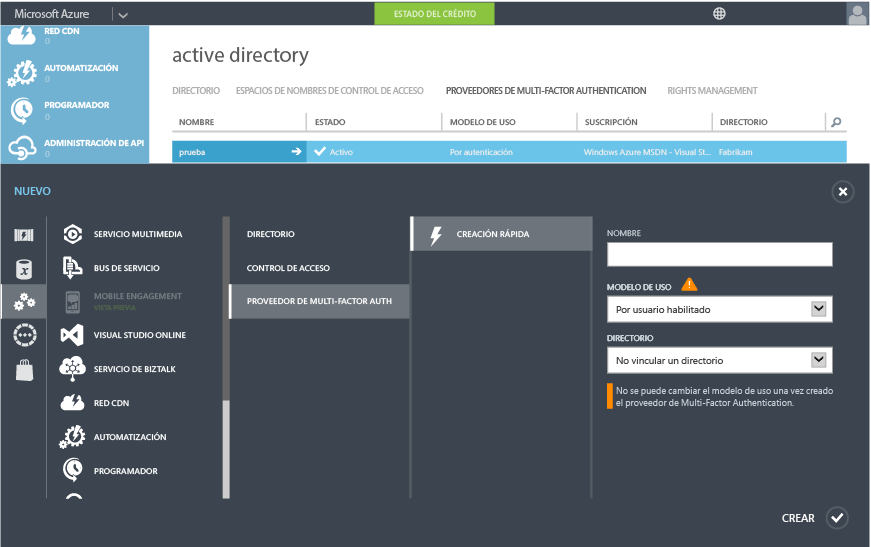
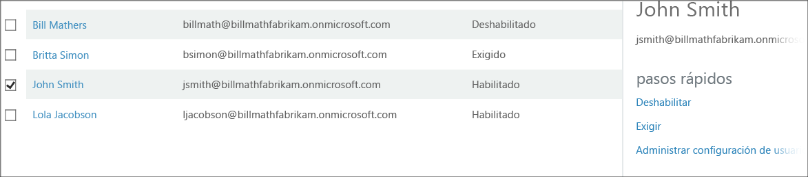

<properties 
	pageTitle="Introducción a Azure Multi-Factor Authentication en la nube" 
	description="En esta página de Azure Multi-Factor Authentication se describe cómo empezar a trabajar con Azure MFA en la nube." 
	services="multi-factor-authentication" 
	documentationCenter="" 
	authors="billmath" 
	manager="stevenpo" 
	editor="curtand"/>

<tags 
	ms.service="multi-factor-authentication" 
	ms.workload="identity" 
	ms.tgt_pltfrm="na" 
	ms.devlang="na" 
	ms.topic="get-started-article" 
	ms.date="02/16/2016" 
	ms.author="billmath"/>

# Introducción a Azure Multi-Factor Authentication en la nube

Ahora que hemos determinado que estamos usando la autenticación multifactor en la nube, ¡comencemos! Tenga en cuenta que si utiliza Multi-Factor Authentication para Office 365 o Multi-Factor Authentication para administradores de Azure puede ir directamente al paso 3.

1. [Registrarse para obtener una suscripción a Azure](https://azure.microsoft.com/pricing/free-trial/)
	- Si todavía no dispone de una suscripción de Azure, es necesario que se registre para obtener una. Si simplemente está comenzando a utilizar Azure MFA, puede usar una suscripción de prueba.
2. [Crear un Proveedor de Multi-Factor Authentication](#creating-an-azure-multi-factor-auth-provider) o [asignar licencias a usuarios](multi-factor-authentication-get-started-cloud.md#assigning-an-azure-ad-premium-or-enterprise-mobility-license-to-users)
	- Necesitará crear un Proveedor de Multi-Factor Authentication y asignarlo a su directorio o asignar licencias de Azure MFA, Azure AD Premium o licencias de EMS a sus usuarios. Azure Multi Factor Authentication está incluido en Azure Active Directory Premium y, por lo tanto, también está incluido en Enterprise Mobility Suite. Si tiene suficientes licencias de Azure MFA, Azure AD Premium y EMS para cubrir todos los usuarios que utilizarán la autenticación multifactor, no necesitará crear un Proveedor de Multi-Factor Authentication. Consulte la sección siguiente sobre cómo asignar licencias a los usuarios.
3. [Activación de Multi-Factor Authentication para los usuarios](#turn-on-multi-factor-authentication-for-users)
	- Habilite MFA de Azure en los usuarios a través de Office 365 o el Portal de Azure. Consulte la sección siguiente para obtener información sobre cómo hacerlo.
4. [Envío de correo electrónico a usuarios finales para informarles sobre MFA](#send-email-to-end-users)
	- Una vez que un usuario tenga la autenticación multifactor activada para su cuenta, se recomienda que le envíe un correo electrónico que le informa de esto. Se solicitará al usuario que complete el proceso de la próxima vez que inicie sesión, por lo que estará informado de lo que le espera. Consulte la sección siguiente para ver una plantilla de correo electrónico de ejemplo.

## Creación de un Proveedor de autenticación multifactor de Azure
La autenticación multifactor está disponible de forma predeterminada para los administradores globales que tienen Azure Active Directory. Sin embargo, si desea ampliar la autenticación multifactor a todos los usuarios o que los administradores globales y usuarios de Office 365 puedan aprovechar características avanzadas, como IP de confianza, saludos personalizados e informes, debe adquirir la versión completa de Azure MFA. Una manera de hacerlo es mediante la creación de un Proveedor de Multi-Factor Authentication.

### Creación de un Proveedor de autenticación multifactor
--------------------------------------------------------------------------------

1. Inicie sesión en el Portal de Azure como administrador.
2. En la parte izquierda, seleccione Active Directory.
3. En la página Active Directory, en la parte superior, seleccione Proveedores de autenticación multifactor. Haga clic en **Nuevo** en la parte inferior.
4. En Servicios de aplicaciones, seleccione Proveedores de Multi-Factor Authentication y Creación rápida.
5. Rellene los campos siguientes y haga clic en Crear.
	1. Nombre: nombre del Proveedor de Multi-Factor Authentication.
	2. Modelo de uso: modelo de uso del Proveedor de autenticación multifactor.
		- Por autenticación: modelo de adquisición que se carga por autenticación. Normalmente se usa para escenarios que utilizan Azure Multi-Factor Authentication en una aplicación orientada al consumidor.
		- Por usuario habilitado: modelo de adquisición que se carga por usuario habilitado. Suele utilizarse para el acceso de los empleados a aplicaciones como Office 365.
	2. Directorio: inquilino de Azure Active Directory con el que está asociado el Proveedor de autenticación multifactor. Tenga en cuenta lo siguiente:
		- No es necesario tener un directorio de Azure AD para crear un Proveedor de autenticación multifactor. Esto puede dejarse en blanco si planea usar Servidor Azure Multi-Factor Authentication o solo el SDK.
		- Deberá asociar el Proveedor de Multi-Factor Authentication con un directorio de Azure AD si desea ampliar la autenticación multifactor a todos los usuarios y/o desea que sus administradores globales puedan usar características avanzadas como IP de confianza, saludos personalizados e informes.
		- Azure AD Connect, AAD Sync o DirSync solo son un requisito si va a sincronizar su entorno de Active Directory local con un directorio de Azure AD. Si solo usa un directorio de Azure AD que no está sincronizado con una instancia local de Active Directory, no los necesita.
		

5. Una vez que haga clic en Crear, se creará el Proveedor de autenticación multifactor y debe ver un mensaje que indique: El proveedor de Autenticación multifactor se creó correctamente. Haga clic en Aceptar.

## Asignación de una licencia de Azure MFA, Azure AD Premium o Enterprise Mobility a usuarios

Si ha adquirido Azure MFA, Azure AD Premium o Enterprise Mobility Suite, no necesita crear un Proveedor de Multi-Factor Authentication. Simplemente necesita asignar las licencias a los usuarios y, después, puede empezar a habilitarlos para MFA.

### Para asignar una licencia de Azure MFA, Azure AD Premium o Enterprise Mobility Suite
--------------------------------------------------------------------------------

1. Inicie sesión en el Portal de Azure como administrador.
2. En la parte izquierda, seleccione **Active Directory**.
3. En la página Active Directory, haga doble clic en el directorio que tiene los usuarios que desea habilitar.
4. En la parte superior de la página de directorios, seleccione **Licencias**.
5. En la página Licencias, seleccione Azure Multi-Factor Authentication, Active Directory Premium o Enterprise Mobility Suite y haga clic en Asignar. 
6. En el cuadro de diálogo, seleccione los usuarios o grupos a los que desee asignar las licencias y haga clic en el icono de marca de verificación para guardar los cambios.

## Activación de autenticación multifactor para usuarios

Las cuentas de usuario de Azure Multi-Factor Authentication tienen los siguientes tres estados:

Estado | Descripción |Aplicaciones que no son de explorador afectadas| Notas 
:-------------: | :-------------: |:-------------: |:-------------: |
Disabled | Estado predeterminado para un nuevo usuario no inscrito en la autenticación multifactor.|No|El usuario no está utilizando actualmente la autenticación multifactor.
Enabled |El usuario está inscrito en la autenticación multifactor.|No. Continuarán funcionando hasta que se complete el proceso de registro.|El usuario está habilitado pero no ha completado el proceso de registro. Se le pedirá que complete el proceso en el inicio de sesión siguiente.
Aplicado|El usuario se ha inscrito y ha completado el proceso de registro para usar la autenticación multifactor.|Sí. No funcionarán hasta que se creen y utilicen contraseñas de aplicación. | El usuario puede haber completado o no el registro. Si ha completado el proceso de registro, está utilizando la autenticación multifactor. De lo contrario, se le pedirá que complete el proceso en el inicio de sesión siguiente.
Ahora que tenemos un Proveedor de Multi-Factor Authentication o hemos asignado licencias a los usuarios, el siguiente paso es activar MFA para los usuarios en el directorio. Utilice el procedimiento siguiente para habilitar MFA para los usuarios.

### Activación de Azure Multi-Factor Authentication
--------------------------------------------------------------------------------
1.  Inicie sesión en el Portal de administración de Azure como administrador.
2.  En la parte izquierda, haga clic en Active Directory.
3.  En Directorio, haga clic en el directorio para el usuario que desea activar.
4.  En la parte superior, haga clic en Usuarios.
5.  En la parte inferior de la página, haga clic en Admin. Multi-Factor Auth.
6.  Busque el usuario que desea habilitar para la autenticación multifactor. Puede que necesite cambiar la vista en la parte superior. Asegúrese de que el estado del usuario está deshabilitado y active la casilla situada junto a su nombre.
7.  Esto mostrará dos opciones a la derecha, Habilitar y Administrar configuración de usuario. Haga clic en Habilitar. Aparecerá una ventana emergente que especificará los pasos que debe tomar con los usuarios. Haga clic en Habilitar Multi-Factor Auth.
8.  Una vez habilitados los usuarios, se recomienda enviarles un correo electrónico que les informe de cómo pueden utilizar sus aplicaciones que no son de explorador y no estén bloqueados.

Para cambiar el estado del usuario con Windows PowerShell, puede utilizar lo siguiente. Puede cambiar `$st.State` para que sea igual a uno de los estados mencionados anteriormente.

		$st = New-Object -TypeName Microsoft.Online.Administration.StrongAuthenticationRequirement
		$st.RelyingParty = "*"
		$st.State = “Enabled”
		$sta = @($st)
		Set-MsolUser -UserPrincipalName bsimon@contoso.com -StrongAuthenticationRequirements $sta

## Envío de correo electrónico a usuarios finales

Una vez habilitados los usuarios, se recomienda enviarles un correo electrónico que les informe de que deberán proporcionar la información de contacto. La siguiente es una plantilla de correo electrónico que se puede utilizar y que incluye un vínculo a un vídeo que los usuarios pueden ver.

		Subject: ACTION REQUIRED: Your password for Outlook and other apps needs updated

		Body:

		For added security, we have enabled multi-factor authentication for your account. 

		Action Required: You will need to complete the enrollment steps below to make your account secure with multi-factor authentication.  

		What to expect once MFA is enabled:

		Multi-factor authentication requires a password that you know and a phone that you have in order to sign into browser applications and to access Office 365, Azure portals.

		For Office 365 non-browser applications such as outlook, lync, a mail client on your mobile device etc, a special password called an app password is required instead of your account password to sign in. App passwords are different than your account password, and are generated during the multi-factor authentication set up process. 

		Please follow these enrollment steps to avoid interruption of your Office 365 service:

			1.  Sign in to the Office 365 Portal at http://portal.microsoftonline.com.
			2.  Follow the instructions to set up your preferred multi-factor authentication method when signing into Office 365 using a web browser. 
			3.  Create one app password for each device.
			4.  Enter the same app password in all applicable apps on that device e.g. Outlook, Mail client, Lync, Word, Powerpoint, Excel, CRM etc. 
			5.  Update your Office client applications or other mobile applications to use an app password.

		You can visit http://aka.ms/mfasetup to create app passwords or change your MFA Setting.  Please bookmark this.

		NOTE: Before entering an app password, you will need to clear the sign-in information (delete sign-in info), restart the application,   and sign-in with the username and app password. Follow the steps documented : http://technet.microsoft.com/library/dn270518.aspx#apppassword.

		Watch a video showing these steps at http://g.microsoftonline.com/1AX00en/175.

		Best Regards,
		Your Administrator

## Pasos siguientes
Ahora que ha configurado la autenticación multifactor en la nube, puede desplazarse a lo siguiente en [Configuración de Azure Multi-Factor Authentication.](multi-factor-authentication-whats-next.md) Obtendrá información acerca de los informes, alerta de fraudes, personalización de mensajes de voz y todas las características que ofrece Azure Multi-Factor Authentication.

<!---HONumber=AcomDC_0218_2016-->