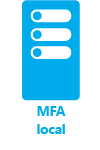
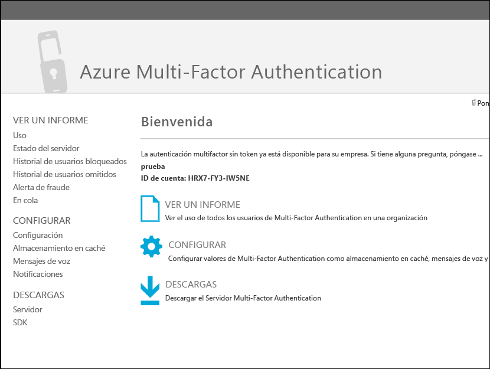
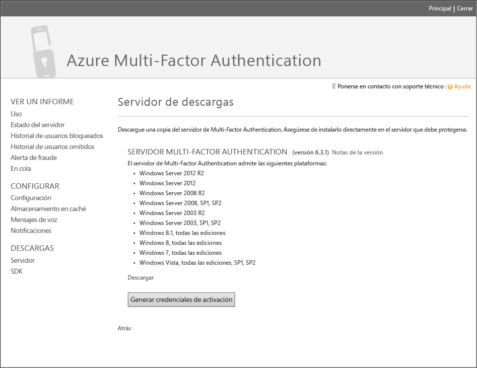
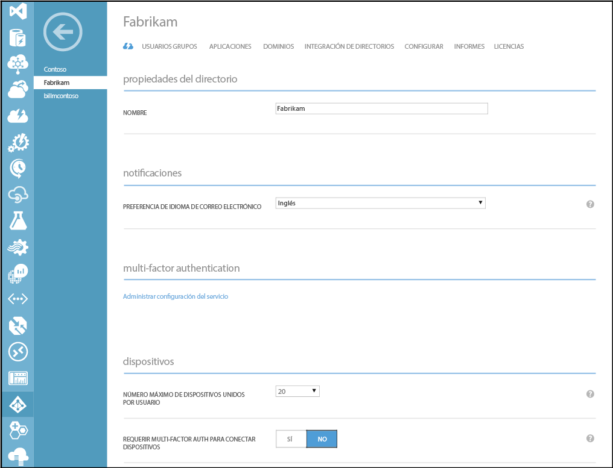
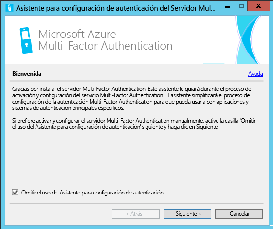
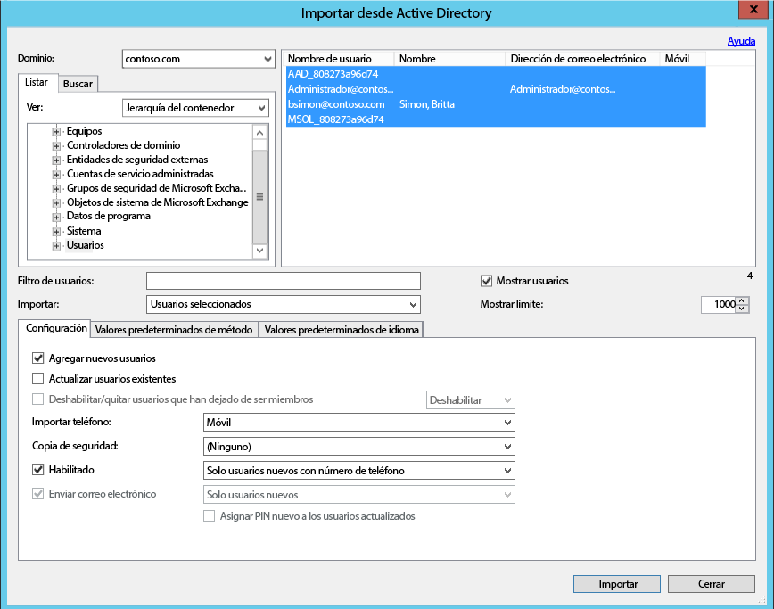
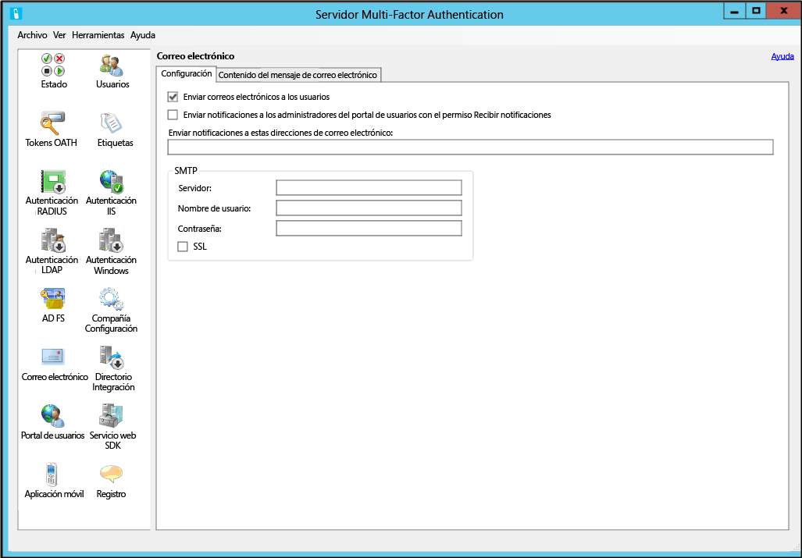
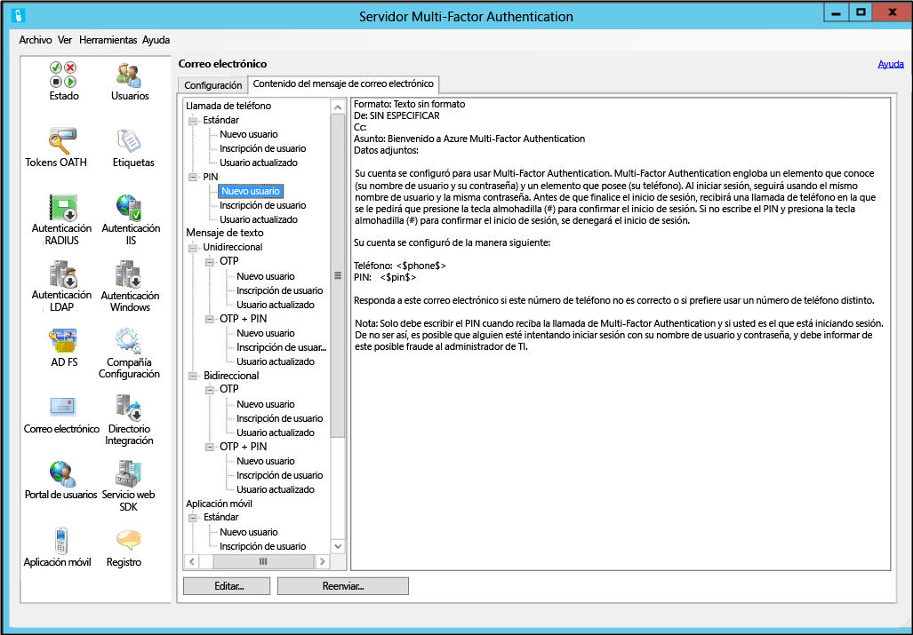

<properties 
	pageTitle="Introducción a Servidor Azure Multi-Factor Authentication" 
	description="En esta página de Azure Multi-Factor Authentication se describe cómo empezar a trabajar con Servidor Azure Multi-Factor Authentication." 
	services="multi-factor-authentication"
	keywords="servidor de autenticación, página de activación de la aplicación de azure multi factor autenticación, descarga del servidor de autenticación" 
	documentationCenter="" 
	authors="billmath" 
	manager="stevenpo" 
	editor="curtand"/>

<tags 
	ms.service="multi-factor-authentication" 
	ms.workload="identity" 
	ms.tgt_pltfrm="na" 
	ms.devlang="na" 
	ms.topic="get-started-article" 
	ms.date="02/16/2016" 
	ms.author="billmath"/>

# Introducción a Servidor Azure Multi-Factor Authentication

Ahora que hemos determinado si se utiliza la autenticación multifactor local, vamos al paso siguiente. Esta página trata de una nueva instalación del servidor y de su configuración con Active Directory local. Si ya tiene instalado el servidor de Phonefactor y desea actualizarlo, consulte [Actualización de PhoneFactor Agent al Servidor Azure Multi-Factor Authentication](multi-factor-authentication-get-started-server-upgrade.md) o si busca información acerca de cómo instalar solo el servicio web, consulte [Implementación del servicio web de aplicación móvil del servidor Multi-Factor Authentication](multi-factor-authentication-get-started-server-webservice.md).

## Descarga de Servidor Azure Multi-Factor Authentication

Hay dos maneras diferentes de descargar Servidor Azure Multi-Factor Authentication. Ambas se pueden hacer a través del Portal de Azure. La primera es administrando el proveedor de autenticación multifactor directamente. La segunda es mediante la configuración del servicio. La segunda opción requiere un Proveedor de Multi-Factor Authentication o una licencia de Azure MFA, Azure AD Premium o Enterprise Mobility Suite.

### Para descargar Servidor Azure Multi-Factor Authentication del Portal de Azure.
--------------------------------------------------------------------------------

1. Inicie sesión en el Portal de Azure como administrador.
2. En la parte izquierda, seleccione Active Directory.
3. En la parte superior de la página Active Directory, haga clic en **Proveedores de autenticación multifactor**.
4. Haga clic en **Administrar** en la parte inferior.
5. De este modo se abrirá una nueva página. Haga clic en **Descargas.** 
6. Encima de **Generar credenciales de activación**, haga clic en **Descargar.** 
7. Guarde el archivo descargado.

### Descarga del Servidor de Azure Multi-Factor Authentication mediante la configuración del servicio

1. Inicie sesión en el Portal de Azure como administrador.
2. En la parte izquierda, seleccione Active Directory.
3. Haga doble clic en la instancia de Azure AD.
4. En la parte superior, haga clic en **Configurar.** 
5. En Multi-Factor Authentication, seleccione **Administrar configuración del servicio**.
6. En la parte inferior de la página de configuración de servicios, haga clic en **Ir al portal**. 

7. De este modo se abrirá una nueva página. Haga clic en **Descargas**.
8. Encima de **Generar credenciales de activación**, haga clic en **Descargar**.
9. Guarde el archivo descargado.

## Instalación y configuración del Servidor Azure Multi-Factor Authentication
Una vez descargado el servidor, puede instalarlo y configurarlo. Asegúrese de que el servidor que va a instalar cumple los requisitos siguientes:

Requisitos del Servidor Azure Multi-Factor Authentication|Descripción|
:------------- | :------------- | 
Hardware|<li>200 MB de espacio en disco duro</li><li>procesador compatible x32 o x64</li><li>1 GB o más de RAM</li>
Software|<li>Windows Server 2003 o superior si el host es un sistema operativo de servidor</li><li>Windows Vista o superior si el host es un sistema operativo cliente</li><li>Microsoft .NET 2.0 Framework</li><li>ISS 6.0 o superior si instala el SDK del servicio web o del Portal de usuarios</li>

### Requisitos de firewall del Servidor Azure Multi-Factor Authentication
--------------------------------------------------------------------------------
Cada servidor MFA debe ser capaz de comunicar en el puerto 443 de salida a lo siguiente:

- https://pfd.phonefactor.net
- https://pfd2.phonefactor.net
- https://css.phonefactor.net

Si están restringidos los firewalls de salida en el puerto 443, deberán abrirse los siguientes intervalos de direcciones IP:

Subred IP|Máscara de red|Rango de direcciones IP
:------------- | :------------- | :------------- |
134\.170.116.0/25|255\.255.255.128|134\.170.116.1 – 134.170.116.126
134\.170.165.0/25|255\.255.255.128|134\.170.165.1 – 134.170.165.126
70\.37.154.128/25|255\.255.255.128|70\.37.154.129 – 70.37.154.254

Si no está utilizando características de confirmación de evento de Azure Multi-Factor Authentication y los usuarios no se autentican con las aplicaciones móviles de Multi-Factor Authentication desde dispositivos en la red corporativa, los rangos de direcciones IP se pueden reducir a lo siguiente:

Subred IP|Máscara de red|Rango de direcciones IP
:------------- | :------------- | :------------- |
134\.170.116.72/29|255\.255.255.248|134\.170.116.72 – 134.170.116.79
134\.170.165.72/29|255\.255.255.248|134\.170.165.72 – 134.170.165.79
70\.37.154.200/29|255\.255.255.248|70\.37.154.201 – 70.37.154.206

### Para instalar y configurar el Servidor Azure Multi-Factor Authentication
--------------------------------------------------------------------------------

1. Haga doble clic en el archivo ejecutable. Esto comenzará la instalación.
2. En la pantalla Seleccionar carpeta de instalación, asegúrese de que la carpeta sea correcta y haga clic en Siguiente.
3. Una vez completada la instalación, haga clic en Finalizar. Se inicia al asistente de configuración.
4. En la pantalla de bienvenida del Asistente de configuración, coloque una marca de verificación en **Omitir el uso del Asistente para configuración de autenticación** y haga clic en **Siguiente**.  Se cerrará al Asistente y se iniciará el servidor.

5. De vuelta en la página desde la que hemos descargado el servidor, haga clic en el botón **Generar credenciales de activación**. Copie esta información en Servidor Azure Multi-Factor Authentication en los cuadros correspondientes y haga clic en **Activar**.

Los pasos anteriores muestran una instalación rápida con el Asistente para configuración. Puede volver a ejecutar al Asistente para la autenticación si se selecciona en el menú Herramientas en el servidor.

##Importación de usuarios desde Active Directory

Ahora que está instalado y configurado el servidor, puede importar rápidamente los usuarios en Servidor Azure Multi-Factor Authentication.

### Para importar usuarios desde Active Directory
--------------------------------------------------------------------------------

1. En Servidor Azure Multi-Factor Authentication, a la izquierda, seleccione **Usuarios**.
2. En la parte inferior, seleccione **Importar desde Active Directory**.
3. Ahora puede buscar usuarios individuales o buscar en el directorio de AD las unidades organizativas con usuarios en ellas. En este caso, se especificarán las unidades organizativas de los usuarios.
4. Resalte todos los usuarios de la derecha y haga clic en **Importar**. Debe aparecer una ventana emergente que le indica que la operación se realizó correctamente. Cierre la ventana de importación.

## Enviar un correo electrónico a los usuarios
Ahora que ha importado los usuarios al servidor Azure Multi-Factor Authentication, se recomienda enviar a los usuarios un correo electrónico que les informe de que se han inscrito en la autenticación multifactor.

Con el servidor Azure Multi-Factor Authentication, existen distintas formas de configurar los usuarios para usar la autenticación multifactor. Por ejemplo, si conoce los números de teléfono de los usuarios o no pudieron importar los números de teléfono en el servidor Azure Multi-Factor Authentication desde el directorio de su compañía, el correo electrónico indicará a los usuarios que se han configurado para usar Azure Multi-Factor Authentication, se proporcionarán algunas instrucciones sobre el uso de Azure Multi-Factor Authentication y se informará al usuario del número de teléfono en el que recibirán sus autenticaciones.

El contenido del correo electrónico variará según el método de autenticación que se haya establecido para el usuario (por ejemplo, llamada de teléfono, SMS, aplicación móvil). Por ejemplo, si el usuario debe usar un PIN para autenticarse, el correo electrónico le indicará el PIN inicial que se ha establecido. Normalmente los usuarios deben cambiar su código PIN durante su primera autenticación.

Si no se han configurado o importado los números de teléfono de los usuarios al servidor de Azure Multi-Factor Authentication, o los usuarios están preconfigurados para usar la aplicación móvil para la autenticación, puede enviarles un correo electrónico que les permita saber que se han configurado para usar la Azure Multi-Factor Authentication, y este les dirigirá para completar la inscripción de las cuentas mediante el portal de usuario de Azure Multi-Factor Authentication. Se incluirá un hipervínculo en el que el usuario puede hacer clic para acceder al portal de usuario. Cuando el usuario haga clic en el hipervínculo, se abrirá su explorador web y se dirigirá al portal del usuario de Azure Multi-Factor Authentication.

### Configuración del correo electrónico y las plantillas de correo electrónico

Haciendo clic en el icono de correo electrónico situado a la izquierda, puede configurar las opciones de envío de estos correos electrónicos. Aquí es donde puede especificar la información de SMTP del servidor de correo electrónico que le permite enviar un correo electrónico a varias direcciones mediante la adición de una marca de verificación a la casilla de Enviar correos a los usuarios.

En la ficha Contenido del correo electrónico, verá todas las distintas plantillas de correo electrónico que están disponibles para elegir. Por ello, dependiendo de cómo haya configurado los usuarios para usar la autenticación multifactor, puede elegir la plantilla que mejor se adapte a usted.

## ¿Cómo controla el Servidor Azure Multi-Factor Authentication los datos de usuario?

Cuando se usa Servidor Azure Multi-Factor Authentication (MFA) local, los datos de un usuario se almacenan en los servidores locales. Los datos de usuario persistentes no se almacenan en la nube. Cuando el usuario realiza una autenticación en dos fases, Servidor MFA envía datos al servicio en la nube de Azure MFA para realizar la autenticación. Cuando estas solicitudes de autenticación se envían al servicio en la nube, en la solicitud y los registros se incluyen los siguientes campos para que estén disponibles en los informes de uso/autenticación del cliente. Algunos de los campos son opcionales y se pueden habilitar o deshabilitar en Servidor Multi-Factor Authentication. La comunicación desde Servidor MFA al servicio en la nube MFA usa SSL/TLS en el puerto 443 de salida. Estos campos son:

- Id. exclusivo: nombre de usuario o Id. interno de Servidor MFA
- Nombre y apellidos: opcional
- Dirección de correo electrónico: opcional
- Número de teléfono: al realizar la autenticación de una llamada de voz o SMS
- Token de dispositivo: al realizar la autenticación de una aplicación móvil
- Modo de autenticación 
- Resultado de la autenticación 
- Nombre de Servidor MFA 
- IP de Servidor MFA 
- IP de cliente: si está disponible

Además de los campos anteriores, el resultado de la autenticación (aceptación o denegación) y el motivo de la denegación también se almacenan con los datos de autenticación y están disponibles mediante los informes de uso y de autenticación.

## Configuraciones de servidor de Azure Multi-Factor Authentication avanzadas
Para obtener información adicional sobre la configuración avanzada y la información de configuración, use la tabla siguiente.

Método|Descripción
:------------- | :------------- | 
[Portal de usuario](multi-factor-authentication-get-started-portal.md)| Información sobre la instalación y configuración del portal de usuario, incluida la implementación y el autoservicio del usuario.
[Servicio de federación de Active Directory](multi-factor-authentication-get-started-adfs.md)|Información sobre cómo configurar la Azure Multi-Factor Authentication con AD FS.
[Autenticación de RADIUS](multi-factor-authentication-get-started-server-radius.md)| Información sobre la instalación y configuración del servidor de MFA de Azure con RADIUS.
[Autenticación de IIS](multi-factor-authentication-get-started-server-iis.md)|Información sobre la instalación y configuración del servidor de MFA de Azure con IIS.
[Autenticación de Windows](multi-factor-authentication-get-started-server-windows.md)| Información sobre la instalación y configuración del servidor de MFA de Azure con la autenticación de Windows.
[Autenticación LDAP](multi-factor-authentication-get-started-server-ldap.md)|Información sobre la instalación y configuración del servidor de MFA de Azure con la autenticación LDAP.
[Puerta de enlace de Escritorio remoto y Servidor Azure Multi-Factor Authentication con RADIUS](multi-factor-authentication-get-started-server-rdg.md)| Información sobre la instalación y configuración del servidor de MFA de Azure con la puerta de enlace de escritorio remoto mediante RADIUS.
[Sincronización con Windows Server Active Directory](multi-factor-authentication-get-started-server-dirint.md)|Información sobre la instalación y configuración de la sincronización entre Active Directory y el servidor de MFA de Azure.
[Implementación del servicio web móvil de la aplicación móvil del servidor de Azure Multi-Factor Authentication](multi-factor-authentication-get-started-server-webservice.md)|Información sobre la instalación y configuración del servicio web del servidor de Azure MFA.

<!---HONumber=AcomDC_0218_2016-->