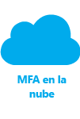

<properties 
	pageTitle="Azure Multi-Factor Authentication: Introducción" 
	description="Elija la solución de seguridad para la autenticación multifactor que sea más adecuada para su situación contestando a dos preguntas: qué estoy tratando de asegurar y dónde están ubicados mis usuarios. A continuación, elija la nube, Servidor MFA o AD FS." 
	services="multi-factor-authentication" 
	documentationCenter="" 
	authors="billmath" 
	manager="stevenpo" 
	editor="curtland"/>

<tags 
	ms.service="multi-factor-authentication" 
	ms.workload="identity" 
	ms.tgt_pltfrm="na" 
	ms.devlang="na" 
	ms.topic="get-started-article" 
	ms.date="03/03/2016" 
	ms.author="billmath"/>

#Selección de la solución de seguridad multifactor más adecuada

Puesto que existen varios modelos de Azure Multi-Factor Authentication, es necesario determinar primero un par de cosas para descubrir cuál es el más adecuado para usar. Estas cosas son:

-	[Qué es lo que quiero proteger](#what-am-i-trying-to-secure)
-	[Dónde se encuentran los usuarios](#where-are-the-users-located)

Las siguientes secciones proporcionan instrucciones para determinar cada uno de estos puntos.

## ¿Qué es lo que quiero proteger?

Para determinar la solución correcta para la autenticación multifactor, en primer lugar, hay que responder a la pregunta de qué es lo que está intentando proteger con un segundo método de autenticación. ¿Es una aplicación que está en Azure? O es, por ejemplo, un sistema de acceso remoto. Mediante la determinación de lo que estamos intentando proteger, encontraremos la respuesta a la pregunta de dónde hay que habilitar la autenticación multifactor.

¿Qué intenta proteger?| Multi-Factor Authentication en la nube|Servidor Multi-Factor Authentication 
------------- | :-------------: | :-------------: |
Aplicaciones propias de Microsoft|* |* |
Aplicaciones de SaaS en la Galería de aplicaciones|* |* |
Aplicaciones de IIS que se publican a través del proxy de aplicación de Azure AD|* |* |
Aplicaciones de IIS que no se publican a través del proxy de aplicación de Azure AD | |* |
Acceso remoto como VPN, RDG| |* |

## Dónde se encuentran los usuarios

A continuación, dependiendo de dónde se encuentren los usuarios, podemos determinar la solución correcta a utilizar, la autenticación multifactor en la nube o local con el Servidor MFA.

Ubicación del usuario| Solución
------------- | :------------- | 
Azure Active Directory| Multi-Factor Authentication en la nube|
Azure AD y AD local mediante la federación con AD FS| Tanto MFA en la nube como Servidor MFA son opciones que están disponibles 
Azure AD y AD local a través de DirSync, Azure AD Sync, Azure AD Connect - sin sincronización de contraseñas|Tanto MFA en la nube como Servidor MFA son opciones que están disponibles 
Azure AD y AD local a través de DirSync, Azure AD Sync, Azure AD Connect - con sincronización de contraseñas|Multi-Factor Authentication en la nube
Active Directory local|Servidor Multi-Factor Authentication

La tabla siguiente es una comparación de las características que aparecen en Multi-Factor Authentication en la nube con las del Servidor Multi-Factor Authentication.

 | Multi-Factor Authentication en la nube | Servidor Multi-Factor Authentication
------------- | :-------------: | :-------------: |
Notificación de aplicación móvil como segundo factor | ● | ● |
Código de comprobación de aplicación móvil como segundo factor | ● | ●
Llamada de teléfono como segundo factor | ● | ● 
SMS unidireccional como segundo factor | ● | ●
SMS bidireccional como segundo factor | | ● 
Tokens de hardware como segundo factor | | ● 
Contraseñas de aplicación para los clientes que no son compatibles con MFA | ● |  
Control de administración sobre los métodos de autenticación | (Vista previa pública) | ● 
Modo de PIN | | ●
Alerta de fraude | ● | ●
Informes de MFA | ● | ● 
Omisión por única vez | | ● 
Saludos personalizados para las llamadas de teléfono | ● | ● 
Identificador de llamada personalizable para llamadas telefónicas | ● | ● 
IP de confianza | ● | ● 
Recordar MFA para dispositivos de confianza (versión preliminar pública) | ● |  
Acceso condicional | ● | ● 
Memoria caché | | ● 

Ahora que hemos determinado cuál vamos a usar: la autenticación multifactor de nube o el Servidor MFA local, ya podemos comenzar a configurar y usar Azure Multi-Factor Authentication. **Seleccione el icono que representa su opción**

  &#160;&#160;&#160;&#160;&#160;&#160;&#160;&#160;&#160;&#160;&#160;&#160;&#160;&#160;&#160;&#160;&#160;&#160;&#160;&#160;&#160;&#160;&#160;&#160;&#160; &#160;&#160;&#160;&#160;&#160; 

<!---HONumber=AcomDC_0309_2016-->