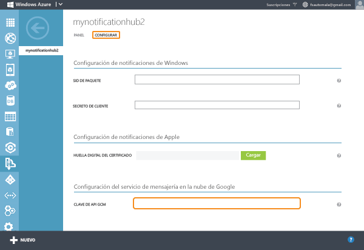

<properties
	pageTitle="Introducción a Centros de notificaciones para aplicaciones Android | Microsoft Azure"
	description="En este tutorial aprenderá a usar los Centros de notificaciones de Azure para enviar notificaciones push a dispositivos Android."
	services="notification-hubs"
	documentationCenter="android"
	authors="wesmc7777"
	manager="dwrede"
	editor=""/>
<tags
	ms.service="notification-hubs"
	ms.workload="mobile"
	ms.tgt_pltfrm="mobile-android"
	ms.devlang="java"
	ms.topic="hero-article"
	ms.date="12/15/2015"
	ms.author="wesmc"/>

# Introducción a Centros de notificaciones para aplicaciones Android

[AZURE.INCLUDE [notification-hubs-selector-get-started](../../includes/notification-hubs-selector-get-started.md)]

##Información general

Este tutorial muestra cómo puede usar Centros de notificaciones de Azure para enviar notificaciones push a una aplicación de Android. Creará una aplicación de Android en blanco que reciba notificaciones push mediante el servicio de mensajería en la nube de Google (GCM). Cuando haya finalizado, podrá usar el centro de notificaciones para difundir notificaciones push a todos los dispositivos que ejecutan su aplicación.

En este tutorial se demuestra el escenario de difusión sencillo con centros de notificaciones. Asegúrese de seguirlo junto con el próximo tutorial para saber cómo usar los Centros de notificaciones para abordar usuarios y grupos de dispositivos específicos.

## Antes de empezar

[AZURE.INCLUDE [notification-hubs-hero-slug](../../includes/notification-hubs-hero-slug.md)]

El código completo de este tutorial se puede encontrar en GitHub [aquí](https://github.com/Azure/azure-notificationhubs-samples/tree/master/Android/GetStarted).

##Requisitos previos

Este tutorial requiere lo siguiente:

+ Android Studio, que puede descargar en el <a href="http://go.microsoft.com/fwlink/?LinkId=389797">sitio de Android</a>.
+ Una cuenta de Azure activa. En caso de no tener ninguna, puede crear una cuenta de evaluación gratuita en tan solo unos minutos. Para obtener más información, consulte [Evaluación gratuita de Azure](https://azure.microsoft.com/pricing/free-trial/?WT.mc_id=A0E0E5C02&amp;returnurl=http%3A%2F%2Fazure.microsoft.com%2Fes-ES%2Fdocumentation%2Farticles%2Fnotification-hubs-android-get-started%2F).

La realización de este tutorial es un requisito previo para todos los tutoriales de Centros de notificaciones para aplicaciones Android.

##Creación de un proyecto que admite el servicio de mensajería en la nube de Google

[AZURE.INCLUDE [mobile-services-enable-Google-cloud-messaging](../../includes/mobile-services-enable-google-cloud-messaging.md)]

##Configuración de un centro de notificaciones nuevo

[AZURE.INCLUDE [notification-hubs-portal-create-new-hub](../../includes/notification-hubs-portal-create-new-hub.md)]

&emsp;&emsp;7. Haga clic en la pestaña **Configurar** en la parte superior, escriba el valor **Clave de API** que obtuvo en la sección anterior y, a continuación, haga clic en **Guardar**.

&emsp;&emsp;

El centro de notificaciones ya está configurado para funcionar con GCM y dispone de las cadenas de conexión para registrar la aplicación para que reciba notificaciones y para enviar notificaciones de inserción.

##Conexión de la aplicación al Centro de notificaciones

###Creación de un nuevo proyecto de Android

1. En Android Studio, inicie un nuevo proyecto de Android Studio.

   	![][13]

2. Elija el factor de forma **Teléfono y tableta** y el **SDK mínimo** que desea admitir. A continuación, haga clic en **Siguiente**.

   	![][14]

3. Elija **Actividad en blanco** para la actividad principal, haga clic en **Siguiente** y, luego, haga clic en **Finalizar**.

###Incorporación de los servicios de Google Play al proyecto

[AZURE.INCLUDE [Incorporación de Play Services](../../includes/notification-hubs-android-studio-add-google-play-services.md)]

###Incorporación de código

1. Descargue el archivo notification-hubs-0.4.jar de la pestaña **Archivos** del [Notification-Hubs-Android-SDK en Bintray](https://bintray.com/microsoftazuremobile/SDK/Notification-Hubs-Android-SDK/0.4). Arrastre el archivo directamente a la carpeta **libs** en la ventana Project View (Vista del proyecto) de Android Studio. A continuación, haga clic en el archivo y haga clic en **Add as Library** (Agregar como biblioteca).
  
2. En el archivo Build.Gradle de la **aplicación**, agregue la siguiente línea en la sección de **dependencias**.

	    compile 'com.microsoft.azure:azure-notifications-handler:1.0.1@aar'

	Agregue el repositorio siguiente después de la sección de **dependencias**.

		repositories {
		    maven {
		        url "http://dl.bintray.com/microsoftazuremobile/SDK"
		    }
		}

3. Configure la aplicación para obtener un Id. de registro desde GCM y úselo para registrar la instancia de la aplicación en el centro de notificaciones.

	En el archivo AndroidManifest.xml, agregue los siguientes permisos debajo de la etiqueta `</application>`. Asegúrese de reemplazar `<your package>` por el nombre del paquete que aparece en la parte superior del archivo AndroidManifest.xml (`com.example.testnotificationhubs` en este ejemplo).

		<uses-permission android:name="android.permission.INTERNET"/>
		<uses-permission android:name="android.permission.GET_ACCOUNTS"/>
		<uses-permission android:name="android.permission.WAKE_LOCK"/>
		<uses-permission android:name="com.google.android.c2dm.permission.RECEIVE" />

		<permission android:name="<your package>.permission.C2D_MESSAGE" android:protectionLevel="signature" />
		<uses-permission android:name="<your package>.permission.C2D_MESSAGE"/>

3. En la clase **MainActivity**, agregue las siguientes instrucciones `import` sobre la declaración de clase.

		import android.app.AlertDialog;
		import android.content.DialogInterface;
		import android.os.AsyncTask;
		import com.google.android.gms.gcm.*;
		import com.microsoft.windowsazure.messaging.*;
		import com.microsoft.windowsazure.notifications.NotificationsManager;
		import android.widget.Toast;

4. Agregue los siguientes miembros privados en la parte superior de la clase.

		private String SENDER_ID = "<your project number>";
		private GoogleCloudMessaging gcm;
		private NotificationHub hub;
    	private String HubName = "<Enter Your Hub Name>";
		private String HubListenConnectionString = "<Your default listen connection string>";
	    private static Boolean isVisible = false;

	Asegúrese de actualizar los tres marcadores de posición: 
	* **SENDER\_ID**: establezca `SENDER_ID` en el número de proyecto que obtuvo anteriormente del proyecto que creó en la [consola de la nube de Google](http://cloud.google.com/console). 
	* **HubListenConnectionString**: establezca `HubListenConnectionString` en la cadena de conexión **DefaultListenAccessSignature** correspondiente a su centro. Para copiar dicha cadena de conexión, haga clic en **Ver cadena de conexión** en la pestaña **Panel** del centro en el [Portal de Azure clásico]. 
	* **HubName**: use el nombre del Centro de notificaciones que aparece en la parte superior de la página de Azure correspondiente a su centro (**no** la dirección URL completa). Por ejemplo, use `"myhub"`.

5. En el método **OnCreate** de la clase **MainActivity**, agregue el código siguiente para realizar el registro de la creación de la actividad en el Centro de notificaciones.

        MyHandler.mainActivity = this;
        NotificationsManager.handleNotifications(this, SENDER_ID, MyHandler.class);
        gcm = GoogleCloudMessaging.getInstance(this);
        hub = new NotificationHub(HubName, HubListenConnectionString, this);
        registerWithNotificationHubs();

6. En **MainActivity.java**, agregue el código siguiente para el método **registerWithNotificationHubs()**. Este método informa el éxito después del registro con el Servicio de mensajería en la nube de Google y el Centro de notificaciones.

    	@SuppressWarnings("unchecked")
    	private void registerWithNotificationHubs() {
        	new AsyncTask() {
            	@Override
            	protected Object doInBackground(Object... params) {
                	try {
                    	String regid = gcm.register(SENDER_ID);
                    ToastNotify("Registered Successfully - RegId : " +
						hub.register(regid).getRegistrationId());
                	} catch (Exception e) {
                    	ToastNotify("Registration Exception Message - " + e.getMessage());
                    	return e;
                	}
                	return null;
            	}
        	}.execute(null, null, null);
    	}

7. Agregue el método `ToastNotify` a la actividad para mostrar la notificación cuando la aplicación se ejecuta y está visible. Invalide también `onStart`, `onPause`, `onResume` y `onStop` para determinar si la actividad está visible para mostrar la notificación del sistema.

	    @Override
	    protected void onStart() {
	        super.onStart();
	        isVisible = true;
	    }
	
	    @Override
	    protected void onPause() {
	        super.onPause();
	        isVisible = false;
	    }
	
	    @Override
	    protected void onResume() {
	        super.onResume();
	        isVisible = true;
	    }
	
	    @Override
	    protected void onStop() {
	        super.onStop();
	        isVisible = false;
	    }

	    public void ToastNotify(final String notificationMessage)
	    {
	        if (isVisible == true)
	            runOnUiThread(new Runnable() {
	                @Override
	                public void run() {
	                    Toast.makeText(MainActivity.this, notificationMessage, Toast.LENGTH_LONG).show();
	                }
	            });
	    }

8. Puesto que Android no muestra las notificaciones, debe escribir su propio receptor. En **AndroidManifest.xml**, agregue el siguiente elemento dentro del elemento `<application>`.

	> [AZURE.NOTE] Reemplace el marcador de posición por el nombre del paquete.

        <receiver android:name="com.microsoft.windowsazure.notifications.NotificationsBroadcastReceiver"
            android:permission="com.google.android.c2dm.permission.SEND">
            <intent-filter>
                <action android:name="com.google.android.c2dm.intent.RECEIVE" />
                <category android:name="<your package name>" />
            </intent-filter>
        </receiver>

9. En la Vista de proyecto, expanda **app** > **src** > **main** > **java**. Haga clic con el botón derecho en la carpeta del paquete en **java**, haga clic en **Nuevo** y, a continuación, haga clic en **Clase Java**.

	![][6]

10. En el campo **Nombre** de la nueva clase, escriba **MyHandler** y haga clic en **Aceptar**.

11. Agregue las siguientes instrucciones import en la parte superior de **MyHandler.java**:

		import android.app.NotificationManager;
		import android.app.PendingIntent;
		import android.content.Context;
		import android.content.Intent;
		import android.os.Bundle;
		import android.support.v4.app.NotificationCompat;
		import com.microsoft.windowsazure.notifications.NotificationsHandler;

12. Actualice la declaración de clase de la siguiente manera para hacer de `MyHandler` una subclase de `com.microsoft.windowsazure.notifications.NotificationsHandler`, tal y como se muestra a continuación.

		public class MyHandler extends NotificationsHandler {

13. Agregue el siguiente código para la clase `MyHandler`.

	Este código invalida el método `OnReceive`, por lo que el controlador mostrará una notificación del sistema para indicar las notificaciones recibidas. El controlador también envía la notificación al administrador de notificaciones de Android con el método `sendNotification()`.

    	public static final int NOTIFICATION_ID = 1;
    	private NotificationManager mNotificationManager;
    	NotificationCompat.Builder builder;
    	Context ctx;

    	static public MainActivity mainActivity;

    	@Override
    	public void onReceive(Context context, Bundle bundle) {
        	ctx = context;
        	String nhMessage = bundle.getString("message");

        	sendNotification(nhMessage);
	        mainActivity.ToastNotify(nhMessage);
    	}

    	private void sendNotification(String msg) {
        	mNotificationManager = (NotificationManager)
                ctx.getSystemService(Context.NOTIFICATION_SERVICE);

        	PendingIntent contentIntent = PendingIntent.getActivity(ctx, 0,
                new Intent(ctx, MainActivity.class), 0);

			NotificationCompat.Builder mBuilder =
				new NotificationCompat.Builder(ctx)
					.setSmallIcon(R.mipmap.ic_launcher)
					.setContentTitle("Notification Hub Demo")
					.setStyle(new NotificationCompat.BigTextStyle()
					.bigText(msg))
					.setContentText(msg);

			mBuilder.setContentIntent(contentIntent);
			mNotificationManager.notify(NOTIFICATION_ID, mBuilder.build());
		}

14. En la barra de menús de Android Studio, haga clic en **Build** (Compilar) -> **Rebuild Project** (Recompilar proyecto) para asegurarse de que no se detectan errores.

##Envío de notificaciones

Para probar las notificaciones de recepción en la aplicación, envíe notificaciones en el [Portal de Azure clásico] mediante la pestaña de depuración del Centro de notificaciones, como se muestra en la pantalla siguiente.

![][30]

[AZURE.INCLUDE [notification-hubs-sending-notifications-from-the-portal](../../includes/notification-hubs-sending-notifications-from-the-portal.md)]

## (Opcional) Enviar notificaciones desde la aplicación

1. En la vista de proyecto de Android Studio, expanda **App** > **src** > **main** > **res** > **layout**. Abra el archivo de diseño **activity\_main.xml** y haga clic en la pestaña **Texto** para actualizar los contenidos de texto del archivo. Actualícelo con el siguiente código, que agrega nuevos controles `Button` y `EditText` para enviar mensajes de notificación al Centro de notificaciones. Agregue este código al final, inmediatamente antes de `</RelativeLayout>`.

	    <Button
        android:layout_width="wrap_content"
        android:layout_height="wrap_content"
        android:text="@string/send_button"
        android:id="@+id/sendbutton"
        android:layout_centerVertical="true"
        android:layout_centerHorizontal="true"
        android:onClick="sendNotificationButtonOnClick" />

	    <EditText
        android:layout_width="match_parent"
        android:layout_height="wrap_content"
        android:id="@+id/editTextNotificationMessage"
        android:layout_above="@+id/sendbutton"
        android:layout_centerHorizontal="true"
        android:layout_marginBottom="42dp"
        android:hint="@string/notification_message_hint" />

2. Agregue esta línea al archivo **build.gradle** en `android`

		useLibrary 'org.apache.http.legacy'

3. En la Vista de proyecto de Android Studio, expanda **App** > **src** > **main** > **res** > **values**. Abra el archivo **strings.xml** y agregue los valores de cadena a los que los nuevos controles `Button` y `EditText` hacen referencia. Agréguelos al final del archivo, justo antes de `</resources>`.

        <string name="send_button">Send Notification</string>
        <string name="notification_message_hint">Enter notification message text</string>

4. En el archivo **MainActivity.java**, agregue las siguientes instrucciones `import` sobre la clase `MainActivity`.

		import java.net.URLEncoder;
		import javax.crypto.Mac;
		import javax.crypto.spec.SecretKeySpec;

		import android.util.Base64;
		import android.view.View;
		import android.widget.EditText;

		import org.apache.http.HttpResponse;
		import org.apache.http.client.HttpClient;
		import org.apache.http.client.methods.HttpPost;
		import org.apache.http.entity.StringEntity;
		import org.apache.http.impl.client.DefaultHttpClient;

5. En el archivo **MainActivity.java**, agregue los siguientes miembros en la parte superior de la clase `MainActivity`.

	Actualice `HubFullAccess` con la cadena de conexión **DefaultFullSharedAccessSignature** de su centro. Para copiar esta cadena de conexión desde el [Portal de Azure clásico], haga clic en **Ver cadena de conexión** en la pestaña **Panel** del Centro de notificaciones.

	    private String HubEndpoint = null;
	    private String HubSasKeyName = null;
	    private String HubSasKeyValue = null;
		private String HubFullAccess = "<Enter Your DefaultFullSharedAccess Connection string>";

6. La actividad contiene el nombre del centro y la cadena de conexión de acceso compartido correspondiente al centro. Debe crear un token de firma de acceso a software (SaS) para autenticar una solicitud POST para enviar mensajes a su centro de notificaciones. Para ello, analice los datos de clave de la cadena de conexión y, luego, cree el token SaS como se menciona en la referencia de API de REST de [Conceptos comunes](http://msdn.microsoft.com/library/azure/dn495627.aspx).

	En **MainActivity.java**, agregue el método siguiente a la clase `MainActivity` para analizar la cadena de conexión.

	    /**
    	 * Example code from http://msdn.microsoft.com/library/azure/dn495627.aspx
    	 * to parse the connection string so a SaS authentication token can be
    	 * constructed.
    	 *
    	 * @param connectionString This must be the DefaultFullSharedAccess connection
    	 *                         string for this example.
	     */
	    private void ParseConnectionString(String connectionString)
	    {
	        String[] parts = connectionString.split(";");
	        if (parts.length != 3)
	            throw new RuntimeException("Error parsing connection string: "
	                    + connectionString);

	        for (int i = 0; i < parts.length; i++) {
	            if (parts[i].startsWith("Endpoint")) {
	                this.HubEndpoint = "https" + parts[i].substring(11);
	            } else if (parts[i].startsWith("SharedAccessKeyName")) {
	                this.HubSasKeyName = parts[i].substring(20);
	            } else if (parts[i].startsWith("SharedAccessKey")) {
	                this.HubSasKeyValue = parts[i].substring(16);
	            }
	        }
	    }

7. En **MainActivity.java**, agregue el método siguiente a la clase `MainActivity` para crear un token de autenticación SaS.

        /**
         * Example code from http://msdn.microsoft.com/library/azure/dn495627.aspx to
         * construct a SaS token from the access key to authenticate a request.
         *
         * @param uri The unencoded resource URI string for this operation. The resource
         *            URI is the full URI of the Service Bus resource to which access is
         *            claimed. For example,
         *            "http://<namespace>.servicebus.windows.net/<hubName>"
         */
        private String generateSasToken(String uri) {

            String targetUri;
            try {
                targetUri = URLEncoder
                        .encode(uri.toString().toLowerCase(), "UTF-8")
                        .toLowerCase();

                long expiresOnDate = System.currentTimeMillis();
                int expiresInMins = 60; // 1 hour
                expiresOnDate += expiresInMins * 60 * 1000;
                long expires = expiresOnDate / 1000;
                String toSign = targetUri + "\n" + expires;

                // Get an hmac_sha1 key from the raw key bytes
                byte[] keyBytes = HubSasKeyValue.getBytes("UTF-8");
                SecretKeySpec signingKey = new SecretKeySpec(keyBytes, "HmacSHA256");

                // Get an hmac_sha1 Mac instance and initialize with the signing key
                Mac mac = Mac.getInstance("HmacSHA256");
                mac.init(signingKey);

                // Compute the hmac on input data bytes
                byte[] rawHmac = mac.doFinal(toSign.getBytes("UTF-8"));

            	// Using android.util.Base64 for Android Studio instead of
	            // Apache commons codec
                String signature = URLEncoder.encode(
                        Base64.encodeToString(rawHmac, Base64.NO_WRAP).toString(), "UTF-8");

                // Construct authorization string
                String token = "SharedAccessSignature sr=" + targetUri + "&sig="
                        + signature + "&se=" + expires + "&skn=" + HubSasKeyName;
                return token;
            } catch (Exception e) {
                DialogNotify("Exception Generating SaS",e.getMessage().toString());
            }

            return null;
        }

8. En **MainActivity.java**, agregue el método siguiente a la clase `MainActivity` para controlar el clic de botón **Enviar notificación** y envíe el mensaje de notificación al centro mediante la API de REST.

        /**
         * Send Notification button click handler. This method parses the
         * DefaultFullSharedAccess connection string and generates a SaS token. The
         * token is added to the Authorization header on the POST request to the
         * notification hub. The text in the editTextNotificationMessage control
         * is added as the JSON body for the request to add a GCM message to the hub.
         *
         * @param v
         */
        public void sendNotificationButtonOnClick(View v) {
            EditText notificationText = (EditText) findViewById(R.id.editTextNotificationMessage);
            final String json = "{"data":{"message":"" + notificationText.getText().toString() + ""}}";

            new Thread()
            {
                public void run()
                {
                    try
                    {
                        HttpClient client = new DefaultHttpClient();

                        // Based on reference documentation...
                        // http://msdn.microsoft.com/library/azure/dn223273.aspx
                        ParseConnectionString(HubFullAccess);
                        String url = HubEndpoint + HubName + "/messages/?api-version=2015-01";
                        HttpPost post = new HttpPost(url);

                        // Authenticate the POST request with the SaS token
                        post.setHeader("Authorization", generateSasToken(url));

                        // JSON content for GCM
                        post.setHeader("Content-Type", "application/json;charset=utf-8");

                        // Notification format should be GCM
                        post.setHeader("ServiceBusNotification-Format", "gcm");
                        post.setEntity(new StringEntity(json));

                        HttpResponse response = client.execute(post);
                    }
                    catch(Exception e)
                    {
                        DialogNotify("Exception",e.getMessage().toString());
                    }
                }
            }.start();
        }

##Prueba de la aplicación

####Pruebas de emulador

Si desea probar en un emulador, asegúrese de que la imagen del emular admita el nivel de API de Google que elija para la aplicación. Si la imagen no es compatible con las API de Google, recibirá la excepción **SERVICE\_NOT\_AVAILABLE**.

Asegúrese también de haber agregado su cuenta de Google al emulador en ejecución en **Configuración**->**Cuentas**. De lo contrario, sus intentos de registrarse con GCM podrían generar la excepción **AUTHENTICATION\_FAILED**.

####Prueba de la aplicación

1. Ejecute la aplicación y observe que el Id. de registro se informa para un registro correcto.

   	![][18]

2. Escriba un mensaje de notificación que se enviará a todos los dispositivos Android registrados con el centro.

   	![][19]

3. Presione **Enviar notificación**. Los dispositivos que tengan la aplicación en ejecución mostrarán un `AlertDialog` con el mensaje de notificación. Los dispositivos que no tengan la aplicación en ejecución, pero que anteriormente se registraron para recibir las notificaciones, recibirán una notificación agregada al administrador de notificaciones. Para ver las notificaciones, deslice el dedo hacia abajo desde la esquina superior izquierda.

   	![][21]

##Pasos siguientes

En este sencillo ejemplo, ha difundido notificaciones a todos los dispositivos con Windows mediante el portal o aplicación de consola. Se recomienda seguir el tutorial [Notificación a los usuarios con los Centros de notificaciones de Azure] como paso siguiente. Le mostrará cómo enviar notificaciones desde un back-end de ASP.NET mediante etiquetas para dirigirse a usuarios específicos.

Si desea segmentar los usuarios por grupos de interés, consulte [Uso de los Centros de notificaciones para enviar noticias de última hora].

Para más información general sobre los Centros de notificaciones, consulte [Guía de los Centros de notificaciones].

<!-- Images. -->
[6]: ./media/notification-hubs-android-get-started/notification-hub-android-new-class.png

[12]: ./media/notification-hubs-android-get-started/notification-hub-connection-strings.png

[13]: ./media/notification-hubs-android-get-started/notification-hubs-android-studio-new-project.png
[14]: ./media/notification-hubs-android-get-started/notification-hubs-android-studio-choose-form-factor.png
[15]: ./media/notification-hubs-android-get-started/notification-hub-create-android-app4.png
[16]: ./media/notification-hubs-android-get-started/notification-hub-create-android-app5.png
[17]: ./media/notification-hubs-android-get-started/notification-hub-create-android-app6.png

[18]: ./media/notification-hubs-android-get-started/notification-hubs-android-studio-registered.png
[19]: ./media/notification-hubs-android-get-started/notification-hubs-android-studio-set-message.png

[20]: ./media/notification-hubs-android-get-started/notification-hub-create-console-app.png
[21]: ./media/notification-hubs-android-get-started/notification-hubs-android-studio-received-message.png
[22]: ./media/notification-hubs-android-get-started/notification-hub-scheduler1.png
[23]: ./media/notification-hubs-android-get-started/notification-hub-scheduler2.png
[29]: ./media/mobile-services-android-get-started-push/mobile-eclipse-import-Play-library.png

[30]: ./media/notification-hubs-android-get-started/notification-hubs-debug-hub-gcm.png

[31]: ./media/notification-hubs-android-get-started/notification-hubs-android-studio-add-ui.png

<!-- URLs. -->
[Get started with push notifications in Mobile Services]: ../mobile-services-javascript-backend-android-get-started-push.md
[Mobile Services Android SDK]: https://go.microsoft.com/fwLink/?LinkID=280126&clcid=0x409
[Referencing a library project]: http://go.microsoft.com/fwlink/?LinkId=389800
[Portal de Azure clásico]: https://manage.windowsazure.com/
[Guía de los Centros de notificaciones]: http://msdn.microsoft.com/library/jj927170.aspx
[Notificación a los usuarios con los Centros de notificaciones de Azure]: notification-hubs-aspnet-backend-android-notify-users.md
[Uso de los Centros de notificaciones para enviar noticias de última hora]: notification-hubs-aspnet-backend-android-breaking-news.md

<!----HONumber=AcomDC_0128_2016-->