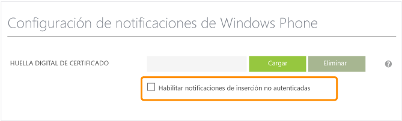

<properties
	pageTitle="Introducción a Centros de notificaciones de Azure para Windows Phone | Microsoft Azure"
	description="En este tutorial aprenderá a usar Centros de notificaciones de Azure para enviar notificaciones push a aplicaciones Windows Phone 8 o Windows Phone 8.1 Silverlight."
	services="notification-hubs"
	documentationCenter="windows"
	authors="wesmc7777"
	manager="dwrede"
	editor="dwrede"/>

<tags
	ms.service="notification-hubs"
	ms.workload="mobile"
	ms.tgt_pltfrm="mobile-windows-phone"
	ms.devlang="dotnet"
	ms.topic="hero-article"
	ms.date="12/14/2015"
	ms.author="wesmc"/>

# Introducción a Centros de notificaciones para Windows Phone

[AZURE.INCLUDE [notification-hubs-selector-get-started](../../includes/notification-hubs-selector-get-started.md)]

##Información general

Este tutorial muestra cómo puede usar Centros de notificaciones de Azure para enviar notificaciones push a aplicaciones Windows Phone 8 o Windows Phone 8.1 Silverlight. Si va a desarrollar para Windows Phone 8.1 (no Silverlight), consulte entonces la versión [Windows Universal](notification-hubs-windows-store-dotnet-get-started.md). En este tutorial puede crear una aplicación de Windows Phone 8 vacía que recibe notificaciones push mediante el Servicio de notificaciones de inserción de Microsoft (MPNS). Cuando haya finalizado, podrá usar el centro de notificaciones para difundir notificaciones push a todos los dispositivos que ejecutan su aplicación.

> [AZURE.NOTE] El SDK de Windows Phone para Centros de notificaciones no admite el uso de Servicios de notificaciones de inserción de Windows (WNS) con aplicaciones de Windows Phone 8.1 Silverlight. Para usar WNS (en lugar de MPNS) con aplicaciones de Windows Phone 8.1 Silverlight, siga el [tutorial Centros de notificaciones: Windows Phone Silverlight], que usa API de REST.

En este tutorial se demuestra el escenario de difusión sencillo con centros de notificaciones.

##Requisitos previos

Este tutorial requiere lo siguiente:

+ [Visual Studio 2012 Express para Windows Phone], o una versión posterior.

La realización de este tutorial es un requisito previo para todos los demás tutoriales de Centros de notificaciones para aplicaciones de Windows Phone 8.

> [AZURE.NOTE] Para completar este tutorial, deberá tener una cuenta de Azure activa. En caso de no tener ninguna, puede crear una cuenta de evaluación gratuita en tan solo unos minutos. Para obtener más información, consulte [Evaluación gratuita de Azure](https://azure.microsoft.com/pricing/free-trial/?WT.mc_id=A0E0E5C02&amp;returnurl=http%3A%2F%2Fazure.microsoft.com%2Fes-ES%2Fdocumentation%2Farticles%2Fnotification-hubs-windows-phone-get-started%2F).

##Creación de su centro de notificaciones

[AZURE.INCLUDE [notification-hubs-portal-create-new-hub](../../includes/notification-hubs-portal-create-new-hub.md)]

<ol start="7">
<li>
Haga clic en la pestaña <b>Configurar</b> y, luego, active la casilla <b>Habilite las notificaciones de inserción no autenticadas</b> en la sección <b>Configuración de notificaciones de Windows Phone</b>.

</li>
</ol>

&emsp;&emsp;

El concentrador se crea y configura ahora para enviar una notificación sin autenticar para Windows Phone.

> [AZURE.NOTE] Este tutorial usa MPNS en modo sin autenticar. El modo sin autenticar de MPNS viene con restricciones sobre las notificaciones que puede enviar a cada canal. Los Centros de notificaciones admiten el [modo autenticado de MPNS](http://msdn.microsoft.com/library/windowsphone/develop/ff941099.aspx) al permitir que cargue su certificado.
<!--Refer to [Notification Hubs How-To for Windows Phone 8] for more information on how to use MPNS authenticated mode.-->

##Conexión de su aplicación al centro de notificaciones

1. En Visual Studio, cree una aplicación nueva de Windows Phone 8.

   	![][13]

	En Visual Studio 2013 Update 2 o versiones posteriores, cree en su lugar una aplicación Silverlight de Windows Phone.

	![][11]

2. En Visual Studio, haga clic con el botón derecho en la solución y, luego, haga clic en **Administrar paquetes de NuGet**.

	De este modo aparece el cuadro de diálogo **Administrar paquetes de NuGet**.

3. Busque `WindowsAzure.Messaging.Managed`, haga clic en **Instalar** y acepte los términos de uso.

	![][20]

	A continuación, se descarga, instala y agrega una referencia a la biblioteca de Mensajería de Azure para Windows mediante el <a href="http://nuget.org/packages/WindowsAzure.Messaging.Managed/">paquete de NuGet WindowsAzure.Messaging.Managed</a>.

4. Abra el archivo App.xaml.cs y agregue las siguientes instrucciones `using`:

        using Microsoft.Phone.Notification;
        using Microsoft.WindowsAzure.Messaging;

5. Agregue el siguiente código en la parte superior del método **Application\_Launching** en App.xaml.cs:

	    var channel = HttpNotificationChannel.Find("MyPushChannel");
        if (channel == null)
        {
            channel = new HttpNotificationChannel("MyPushChannel");
            channel.Open();
            channel.BindToShellToast();
        }

        channel.ChannelUriUpdated += new EventHandler<NotificationChannelUriEventArgs>(async (o, args) =>
        {
            var hub = new NotificationHub("<hub name>", "<connection string>");
            var result = await hub.RegisterNativeAsync(args.ChannelUri.ToString());

            System.Windows.Deployment.Current.Dispatcher.BeginInvoke(() =>
            {
                MessageBox.Show("Registration :" + result.RegistrationId, "Registered", MessageBoxButton.OK);
            });
        });

    Asegúrese de insertar el nombre del centro y la cadena de conexión llamada **DefaultListenSharedAccessSignature** que obtuvo en la sección anterior. Este código recupera el URI del canal de la aplicación desde MPNS y, luego, lo registra con su centro de notificaciones. Garantiza también que el URI del canal se registre en su centro de notificaciones cada vez que se inicia la aplicación.

	>[AZURE.NOTE]Este tutorial envía una notificación del sistema al dispositivo. Cuando envía una notificación de icono, debe llamar al método **BindToShellTile** en el canal. Para admitir notificaciones del sistema y notificaciones de icono, llame a ambos métodos, **BindToShellTile** y **BindToShellToast**.

6. En el Explorador de soluciones, expanda **Propiedades**, abra el archivo WMAppManifest.xml, haga clic en la pestaña **Funcionalidades** y asegúrese de que la funcionalidad **ID\_CAP\_PUSH\_NOTIFICATION** esté marcada.

   	![][14]

   	Esto asegura que la aplicación pueda recibir notificaciones de inserción.

7. Presione la tecla F5 para ejecutar la aplicación.

	Se muestra un mensaje de registro.

8. Cierre la aplicación. Debe cerrar la aplicación para recibir la notificación del sistema.

##Envío de notificaciones desde su back-end

Puede enviar notificaciones mediante Centros de notificaciones desde cualquier back-end a través de nuestra <a href="http://msdn.microsoft.com/library/windowsazure/dn223264.aspx">interfaz de REST</a>. En este tutorial enviará notificaciones con una aplicación de consola .NET. Para ver un ejemplo de cómo enviar notificaciones desde un back-end de Servicios móviles de Azure integrado en Centros de notificaciones, consulte "Introducción a las notificaciones push en Servicios móviles" ([back-end de .NET](../mobile-services-javascript-backend-windows-phone-get-started-push.md) | [back-end de JavaScript](../mobile-services-javascript-backend-windows-phone-get-started-push.md)). Para ver un ejemplo de cómo enviar notificaciones con las API de REST, consulte "Uso de Centros de notificaciones desde Java o PHP" ([Java](notification-hubs-java-backend-how-to.md) | [PHP](notification-hubs-php-backend-how-to.md)).

1. Haga clic con el botón derecho en la solución, seleccione **Agregar** y **Nuevo proyecto...**, luego, en **Visual C#** haga clic en **Windows**, **Aplicación de consola** y en **Aceptar**.

   	![][6]

	Esta acción agrega una aplicación de consola nueva de Visual C# a la solución. También puede hacer esto en una solución separada.

4. Haga clic en **Herramientas**, **Administrador de paquetes de biblioteca** y **Consola del Administrador de paquetes**.

	Esto muestra la Consola del Administrador de paquetes.

5.  En la ventana de la Consola del Administrador de paquetes, seleccione en **Proyecto predeterminado** el nuevo proyecto de aplicación de consola y, a continuación, ejecute el siguiente comando en la ventana de la consola:

        Install-Package Microsoft.Azure.NotificationHubs

	Se agrega una referencia al SDK de Centros de notificaciones de Azure mediante el <a href="http://www.nuget.org/packages/Microsoft.Azure.NotificationHubs/">paquete de NuGet Microsoft.Azure.Notification Hubs</a>.

6. Abra el archivo Program.cs y agregue la siguiente instrucción `using`:

        using Microsoft.Azure.NotificationHubs;

6. En la clase **Program**, agregue el siguiente método.

        private static async void SendNotificationAsync()
        {
            NotificationHubClient hub = NotificationHubClient
				.CreateClientFromConnectionString("<connection string with full access>", "<hub name>");
            string toast = "<?xml version="1.0" encoding="utf-8"?>" +
                "<wp:Notification xmlns:wp="WPNotification">" +
                   "<wp:Toast>" +
                        "<wp:Text1>Hello from a .NET App!</wp:Text1>" +
                   "</wp:Toast> " +
                "</wp:Notification>";
            await hub.SendMpnsNativeNotificationAsync(toast);
        }

	Asegúrese de reemplazar el marcador de posición "hub name" por el nombre del centro de notificaciones que aparece en el portal en la pestaña **Centros de notificaciones**. Reemplace también el marcador de posición de la cadena de conexión por la cadena de conexión llamada **DefaultFullSharedAccessSignature** que obtuvo en la sección "Configuración del centro de notificaciones".

	>[AZURE.NOTE]Asegúrese de usar la cadena de conexión con acceso **Total**, no con acceso **Escuchar**. La cadena de acceso de escucha no tiene permisos para enviar notificaciones.

4. Agregue la siguiente línea al método **Main**:

         SendNotificationAsync();
		 Console.ReadLine();

5. Con el emulador de Windows Phone en ejecución y su aplicación cerrada, establezca el proyecto de aplicación de consola como el proyecto de inicio predeterminado y, luego, presione la tecla F5 para ejecutar la aplicación.

	Recibirá una notificación del sistema. Al pulsar en el mensaje emergente, se carga la aplicación.

Puede encontrar todas las cargas posibles en los temas de [catálogo de notificaciones del sistema] y [catálogo de iconos] de MSDN.

##Pasos siguientes

En este sencillo ejemplo, ha difundido notificaciones a todos los dispositivos Windows Phone 8. Para dirigirse a usuarios específicos, consulte el tutorial [Uso de los Centros de notificaciones para insertar notificaciones para los usuarios]. Si desea segmentar a sus usuarios por grupos de interés, puede leer [Uso de Centros de notificaciones para enviar noticias de último minuto]. Obtenga más información sobre el uso de Centros de notificaciones en la [Orientación sobre los Centros de notificaciones].

<!-- Images. -->
[6]: ./media/notification-hubs-windows-phone-get-started/notification-hub-create-console-app.png
[7]: ./media/notification-hubs-windows-phone-get-started/notification-hub-create-from-portal.png
[8]: ./media/notification-hubs-windows-phone-get-started/notification-hub-create-from-portal2.png
[9]: ./media/notification-hubs-windows-phone-get-started/notification-hub-select-from-portal.png
[10]: ./media/notification-hubs-windows-phone-get-started/notification-hub-select-from-portal2.png
[11]: ./media/notification-hubs-windows-phone-get-started/notification-hub-create-wp-silverlight-app.png
[12]: ./media/notification-hubs-windows-phone-get-started/notification-hub-connection-strings.png

[13]: ./media/notification-hubs-windows-phone-get-started/notification-hub-create-wp-app.png
[14]: ./media/notification-hubs-windows-phone-get-started/mobile-app-enable-push-wp8.png
[15]: ./media/notification-hubs-windows-phone-get-started/notification-hub-pushauth.png
[20]: ./media/notification-hubs-windows-phone-get-started/notification-hub-windows-universal-app-install-package.png
[213]: ./media/notification-hubs-windows-phone-get-started/notification-hub-create-console-app.png

<!-- URLs. -->
[Visual Studio 2012 Express para Windows Phone]: https://go.microsoft.com/fwLink/p/?LinkID=268374
[Orientación sobre los Centros de notificaciones]: http://msdn.microsoft.com/library/jj927170.aspx
[modo sin autenticar de MPNS]: http://msdn.microsoft.com/library/windowsphone/develop/ff941099(v=vs.105).aspx
[Uso de los Centros de notificaciones para insertar notificaciones para los usuarios]: notification-hubs-aspnet-backend-windows-dotnet-notify-users.md
[Uso de Centros de notificaciones para enviar noticias de último minuto]: notification-hubs-windows-phone-send-breaking-news.md
[catálogo de notificaciones del sistema]: http://msdn.microsoft.com/library/windowsphone/develop/jj662938(v=vs.105).aspx
[catálogo de iconos]: http://msdn.microsoft.com/library/windowsphone/develop/hh202948(v=vs.105).aspx
[Notification Hub - WP Silverlight tutorial]: https://github.com/Azure/azure-notificationhubs-samples/tree/master/PushToSLPhoneApp

<!---HONumber=AcomDC_0128_2016-->