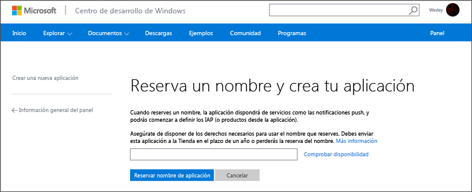
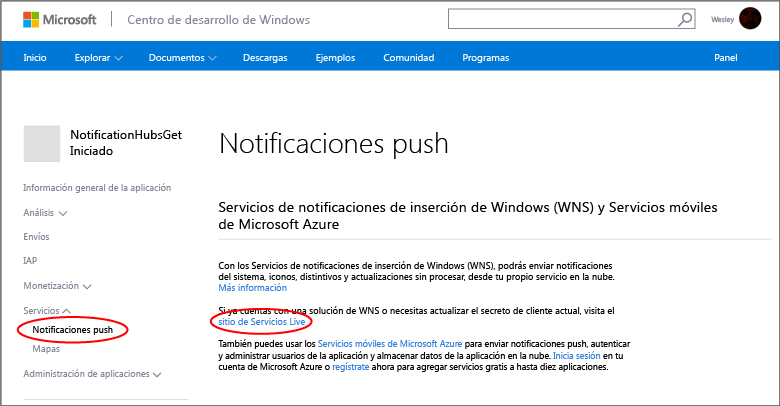
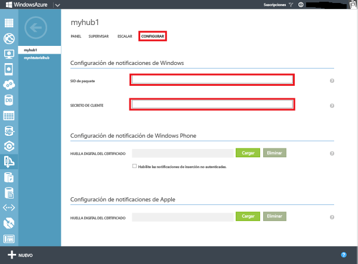
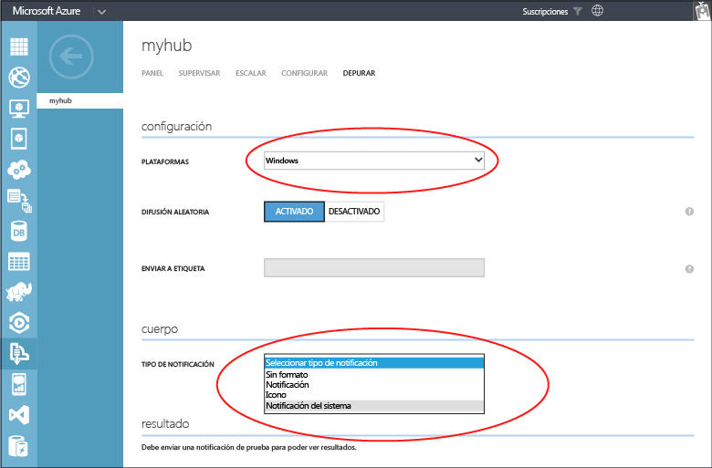

<properties
	pageTitle="Introducción a Centros de notificaciones de Azure para aplicaciones de la Tienda Windows | Microsoft Azure"
	description="En este tutorial aprende a usar Centros de notificaciones de Azure para enviar notificaciones push a una aplicación de la Tienda Windows o de Windows Phone 8.1 (no Silverlight)."
	services="notification-hubs"
	documentationCenter="windows"
	authors="wesmc7777"
	manager="dwrede"
	editor="dwrede"/>

<tags
	ms.service="notification-hubs"
	ms.workload="mobile"
	ms.tgt_pltfrm="mobile-windows"
	ms.devlang="dotnet"
	ms.topic="hero-article"
	ms.date="12/14/2015"
	ms.author="wesmc"/>

# Introducción a Centros de notificaciones para aplicaciones de la Tienda Windows

[AZURE.INCLUDE [notification-hubs-selector-get-started](../../includes/notification-hubs-selector-get-started.md)]

##Información general

En este tutorial se muestra cómo se pueden utilizar los Centros de notificaciones de Azure para enviar notificaciones push a una aplicación de la Tienda Windows o de Windows Phone 8.1 (no Silverlight). Si su objetivo es Silverlight para Windows Phone 8.1, consulte la versión de [Windows Phone](notification-hubs-windows-phone-get-started.md). En este tutorial puede crear una aplicación de la Tienda Windows vacía que recibe notificaciones push mediante el Servicios de notificaciones de inserción de Windows (WNS). Cuando haya finalizado, podrá usar el centro de notificaciones para difundir notificaciones push a todos los dispositivos que ejecutan su aplicación.

## Antes de empezar

[AZURE.INCLUDE [notification-hubs-hero-slug](../../includes/notification-hubs-hero-slug.md)]

El código completo de este tutorial se puede encontrar en GitHub [aquí](https://github.com/Azure/azure-notificationhubs-samples/tree/master/dotnet/GetStartedWindowsUniversal).

##Requisitos previos

Este tutorial requiere lo siguiente:

+ Microsoft Visual Studio Express 2013 para Windows con la actualización 2 o posterior Esta versión de Visual Studio es necesaria para crear un proyecto de aplicación universal. Si solo desea crear un aplicación para la Tienda Windows, necesita Visual Studio 2012 Express para Windows 8.

+ Una cuenta de la Tienda Windows activa

+ Una cuenta activa de Azure En caso de no tener cuenta, puede crear una de evaluación gratuita en tan solo unos minutos. Para obtener más información, consulte [Evaluación gratuita de Azure](https://azure.microsoft.com/pricing/free-trial/?WT.mc_id=A0E0E5C02&amp;returnurl=http%3A%2F%2Fazure.microsoft.com%2Fes-ES%2Fdocumentation%2Farticles%2Fnotification-hubs-windows-store-dotnet-get-started%2F).

Completar este tutorial es un requisito previo para todos los tutoriales de Centros de notificaciones para aplicaciones de la Tienda Windows.

##Registro de la aplicación para la Tienda Windows

Para enviar notificaciones push a las aplicaciones de la Tienda Windows, debe asociar su aplicación a la Tienda Windows. A continuación, debe configurar su Centro de notificaciones para que se integre con WNS.

1. Si aún no ha registrado la aplicación, navegue al [Centro de desarrollo de Windows](http://go.microsoft.com/fwlink/p/?LinkID=266582), conéctese con su cuenta Microsoft y, a continuación, haga clic en **Crear una nueva aplicación**.

2. Escriba un nombre para la aplicación y haga clic en **Reservar nombre de aplicación**.

   	

   	Se crea un nuevo registro de la Tienda Windows para su aplicación.

3. En Visual Studio, cree un nuevo proyecto de aplicaciones de la Tienda en Visual C# con la plantilla **Aplicación vacía**.

   	![][2]

4. En el Explorador de soluciones, haga clic con el botón derecho en el proyecto de la aplicación para la Tienda Windows, haga clic en **Tienda** y, a continuación, en **Asociar aplicación con la Tienda...**.

   	![][3]

   	Aparece el asistente **Asocie la aplicación con la Tienda Windows**.

5. En el asistente, haga clic en **Iniciar sesión** y, después, inicie sesión con su cuenta Microsoft.

6. Haga clic en la aplicación que registró en el paso 2, haga clic en **Siguiente** y, después, en **Asociar**.

   	![][4]

   	Se agrega la información de registro necesaria de la Tienda Windows al manifiesto de aplicación.

7. (Opcional) Repita los pasos 4–6 para el proyecto de la aplicación de la Tienda de Windows Phone.

8. De nuevo en la página [Centro de desarrollo de Windows](http://go.microsoft.com/fwlink/p/?LinkID=266582) de la nueva aplicación, haga clic en **Servicios**, **Notificaciones push** y **Sitio de Servicios Live** en **Servicios de notificaciones de inserción de Windows (WNS) y Servicios móviles de Microsoft Azure**.

   	

9. En la pestaña **Configuración de aplicaciones**, anote los valores de **Secreto del cliente** e **Identificador de seguridad de paquete (SID)**.

   	![][6]

 	> [AZURE.WARNING]
	El secreto de cliente y el SID del paquete son credenciales de seguridad importantes. No los comparta con nadie ni los distribuya con su aplicación.

##Configuración de su Centro de notificaciones

[AZURE.INCLUDE [notification-hubs-portal-create-new-hub](../../includes/notification-hubs-portal-create-new-hub.md)]

<ol start="7">
<li>
Seleccione la pestaña <b>Configurar</b> en la parte superior, escriba los valores de <b>Secreto del cliente</b> y <b>SID del paquete</b> obtenidos de WNS en la sección anterior y, a continuación, haga clic en <b>Guardar</b>.

</li>
</ol>

&emsp;&emsp;

Su Centro de notificaciones está ahora configurado para funcionar con WNS y tiene las cadenas de conexión para registrar su aplicación y enviar notificaciones.

##Conexión de la aplicación al Centro de notificaciones

1. En Visual Studio, haga clic con el botón derecho en la solución y, a continuación, haga clic en **Administrar paquetes NuGet**.

	Se muestra el cuadro de diálogo **Administrar paquetes de NuGet**.

2. Busque `WindowsAzure.Messaging.Managed` y haga clic en **Instalar**, seleccione todos los proyectos de la solución y acepte los términos de uso.

	![][20]

	Esta acción descarga, instala y agrega una referencia a todos los proyectos de la biblioteca de mensajería de Azure para Windows mediante el <a href="http://nuget.org/packages/WindowsAzure.Messaging.Managed/">paquete de NuGet WindowsAzure.Messaging.Managed</a>.

3. Abra el archivo de proyecto App.xaml.cs y agregue las siguientes instrucciones `using`. Este proyecto es universal, este archivo se encuentra en la carpeta `<project_name>.Shared`.

        using Windows.Networking.PushNotifications;
        using Microsoft.WindowsAzure.Messaging;
		using Windows.UI.Popups;

4. También en App.xaml.cs, agregue la siguiente definición de método **InitNotificationsAsync** a la clase **App**:

	    private async void InitNotificationsAsync()
        {
            var channel = await PushNotificationChannelManager.CreatePushNotificationChannelForApplicationAsync();

            var hub = new NotificationHub("<hub name>", "<connection string with listen access>");
			var result = await hub.RegisterNativeAsync(channel.Uri);

            // Displays the registration ID so you know it was successful
            if (result.RegistrationId != null)
            {
                var dialog = new MessageDialog("Registration successful: " + result.RegistrationId);
                dialog.Commands.Add(new UICommand("OK"));
                await dialog.ShowAsync();
            }

        }

    Este código recupera el URI del canal de la aplicación desde WNS y, luego, lo registra en el Centro de notificaciones.

    >[AZURE.NOTE]Asegúrese de reemplazar el marcador de posición "hub name" por el nombre del Centro de notificaciones que aparece en el [Portal de Azure clásico] en la pestaña **Centros de notificaciones** (por ejemplo, **mynotificationhub2** en el ejemplo anterior). Sustituya también el marcador de posición de la cadena de conexión por la cadena de conexión **DefaultListenSharedAccessSignature** que obtuvo en la sección anterior.

5. En la parte superior del controlador de eventos **OnLaunched** en App.xaml.cs, agregue la siguiente llamada al nuevo método **InitNotificationsAsync**:

        InitNotificationsAsync();

    Esto garantiza que el URI del canal se registre en su Centro de notificaciones cada vez que se inicia la aplicación.

6. En el Explorador de soluciones, haga doble clic en **Package.appxmanifest** de la aplicación de la Tienda Windows y, en **Notificaciones**, establezca **Capacidad de aviso** en **Sí**:

   	![][18]

   	En el menú **Archivo**, haga clic en **Guardar todo**.

7. (Opcional) Repita los pasos anteriores para el proyecto de la aplicación de la Tienda de Windows Phone.

8. Presione la tecla **F5** para ejecutar la aplicación. Se muestra un cuadro de diálogo emergente que contiene la clave de registro.

   	![][19]

9. (Opcional) Repita el paso anterior para ejecutar el proyecto de Windows Phone y registrar la aplicación en un dispositivo Windows Phone.

La carpeta ahora ya está lista para recibir notificaciones.

##Envío de notificaciones 

Para probar las notificaciones de recepción en la aplicación, envíe notificaciones en el [Portal de Azure clásico] mediante la pestaña de depuración del Centro de notificaciones, como se muestra en la pantalla siguiente.

Las notificaciones push se envían normalmente en un servicio back-end como Servicios móviles o ASP.NET mediante una biblioteca compatible. También puede usar la API de REST directamente para enviar mensajes de notificación si no hay disponible una biblioteca para su back-end.

En este tutorial, vamos a simplificar las cosas y mostrar solo la prueba de su aplicación cliente mediante el envío de notificaciones con el SDK de .NET para los centros de notificaciones en una aplicación de consola en lugar de un servicio back-end. Se recomienda seguir el tutorial [Los Centros de notificaciones de Azure notifican a los usuarios con back-end de .NET] como paso siguiente para enviar notificaciones desde un back-end de ASP.NET. Sin embargo, se pueden usar los siguientes enfoques para enviar notificaciones:

* **Interfaz de REST**: puede admitir notificaciones en cualquier plataforma de back-end mediante la [interfaz de REST](http://msdn.microsoft.com/library/windowsazure/dn223264.aspx).

* **SDK para .NET de Centros de notificaciones de Microsoft Azure**: en el Administrador de paquetes NuGet para Visual Studio, ejecute [Install-Package Microsoft.Azure.NotificationHubs](https://www.nuget.org/packages/Microsoft.Azure.NotificationHubs/).

* **Node.js**: [Uso de los Centros de notificaciones desde Node.js](notification-hubs-nodejs-how-to-use-notification-hubs.md).

* **Servicios móviles de Azure**: para ver un ejemplo de cómo enviar notificaciones desde un back-end de Servicios móviles de Azure integrado en los Centros de notificaciones, consulte "Incorporación de notificaciones de inserción a la aplicación de Servicios móviles" ([back-end de .NET](../mobile-services/mobile-services-javascript-backend-windows-store-dotnet-get-started-push.md) | [back-end de JavaScript](../mobile-services/mobile-services-javascript-backend-windows-store-dotnet-get-started-push.md)).

* **Java / PHP**: para ver un ejemplo de cómo enviar notificaciones con las API de REST, consulte "Uso de Centros de notificaciones desde Java o PHP" ([Java](notification-hubs-java-backend-how-to.md) | [PHP](notification-hubs-php-backend-how-to.md)).

## (Opcional) Enviar notificaciones desde una aplicación de consola

Para enviar notificaciones con una aplicación de consola .NET, siga estos pasos.

1. Haga clic con el botón derecho en la solución, seleccione **Agregar** y **Nuevo proyecto...** y, a continuación, en **Visual C#**, haga clic en **Windows**, **Aplicación de consola** y **Aceptar**.

   	![][13]

	Esta acción agrega una aplicación de consola nueva de Visual C# a la solución. También puede hacer esto en una solución separada.

2. En Visual Studio, haga clic en **Herramientas**, en **Administrador de paquetes de NuGet** y, después, haga clic en **Consola del administrador de paquetes**.

	Esto muestra la Consola del administrador de paquetes en Visual Studio.

3. En la ventana de la Consola del Administrador de paquetes, seleccione en **Proyecto predeterminado** el nuevo proyecto de aplicación de consola y, a continuación, ejecute el siguiente comando en la ventana de la consola:

        Install-Package Microsoft.Azure.NotificationHubs

	Se agrega una referencia al SDK de Centros de notificaciones de Azure mediante el <a href="http://www.nuget.org/packages/Microsoft.Azure.NotificationHubs/">paquete de NuGet Microsoft.Azure.Notification Hubs</a>.

	

4. Abra el archivo Program.cs y agregue la siguiente instrucción `using`:

        using Microsoft.Azure.NotificationHubs;

5. En la clase **Program**, agregue el siguiente método.

        private static async void SendNotificationAsync()
        {
            NotificationHubClient hub = NotificationHubClient
				.CreateClientFromConnectionString("<connection string with full access>", "<hub name>");
            var toast = @"<toast><visual><binding template=""ToastText01""><text id=""1"">Hello from a .NET App!</text></binding></visual></toast>";
            await hub.SendWindowsNativeNotificationAsync(toast);
        }

   	Asegúrese de reemplazar el marcador de posición "hub name" por el nombre del Centro de notificaciones que aparece en el [Portal de Azure clásico] en la pestaña **Centros de notificaciones**. Reemplace también el marcador de posición de la cadena de conexión por la cadena de conexión llamada **DefaultFullSharedAccessSignature** que obtuvo en la sección "Configuración del Centro de notificaciones".

	>[AZURE.NOTE]Asegúrese de usar una cadena de conexión con acceso **Total**, no con acceso de **Escucha**. La cadena de acceso de escucha no tiene permisos para enviar notificaciones.

6. Agregue las siguientes líneas al método **Main**:

         SendNotificationAsync();
		 Console.ReadLine();

7. Haga clic con el botón derecho en el proyecto de la aplicación de consola en Visual Studio y haga clic en **Establecer como proyecto de inicio** para establecerlo como proyecto de inicio. A continuación, presione la tecla **F5** para ejecutar la aplicación.

   	![][14]

	Debería recibir una notificación del sistema en todos los dispositivos registrados. Si hace clic o toca el banner de notificaciones se carga la aplicación.

Puede encontrar todas las cargas compatibles en los temas de [catálogo de notificaciones del sistema], [catálogo de iconos] e [información general sobre distintivos] de MSDN.

##Pasos siguientes

En este sencillo ejemplo, ha difundido notificaciones a todos los dispositivos con Windows mediante el portal o aplicación de consola. Se recomienda seguir el tutorial [Notificación a los usuarios con los Centros de notificaciones de Azure] como paso siguiente. Le mostrará cómo enviar notificaciones desde un back-end de ASP.NET mediante etiquetas para dirigirse a usuarios específicos.

Si desea segmentar los usuarios por grupos de interés, consulte [Uso de los Centros de notificaciones para enviar noticias de última hora].

Para más información general sobre los Centros de notificaciones, consulte [Guía de los Centros de notificaciones].

<!-- Images. -->
[2]: ./media/notification-hubs-windows-store-dotnet-get-started/notification-hub-create-windows-universal-app.png
[3]: ./media/notification-hubs-windows-store-dotnet-get-started/notification-hub-associate-win8-app.png
[4]: ./media/notification-hubs-windows-store-dotnet-get-started/mobile-services-select-app-name.png
[6]: ./media/notification-hubs-windows-store-dotnet-get-started/mobile-services-win8-app-push-auth.png
[11]: ./media/notification-hubs-windows-store-dotnet-get-started/notification-hub-configure-wns.png
[13]: ./media/notification-hubs-windows-store-dotnet-get-started/notification-hub-create-console-app.png
[14]: ./media/notification-hubs-windows-store-dotnet-get-started/notification-hub-windows-toast.png
[15]: ./media/notification-hubs-windows-store-dotnet-get-started/notification-hub-scheduler1.png
[16]: ./media/notification-hubs-windows-store-dotnet-get-started/notification-hub-scheduler2.png
[18]: ./media/notification-hubs-windows-store-dotnet-get-started/notification-hub-win8-app-toast.png
[19]: ./media/notification-hubs-windows-store-dotnet-get-started/notification-hub-windows-reg.png
[20]: ./media/notification-hubs-windows-store-dotnet-get-started/notification-hub-windows-universal-app-install-package.png

<!-- URLs. -->
[Portal de Azure clásico]: https://manage.windowsazure.com/
[Guía de los Centros de notificaciones]: http://msdn.microsoft.com/library/jj927170.aspx

[Los Centros de notificaciones de Azure notifican a los usuarios con back-end de .NET]: notification-hubs-aspnet-backend-windows-dotnet-notify-users.md
[Notificación a los usuarios con los Centros de notificaciones de Azure]: notification-hubs-aspnet-backend-windows-dotnet-notify-users.md
[Uso de los Centros de notificaciones para enviar noticias de última hora]: notification-hubs-windows-store-dotnet-send-breaking-news.md

[catálogo de notificaciones del sistema]: http://msdn.microsoft.com/library/windows/apps/hh761494.aspx
[catálogo de iconos]: http://msdn.microsoft.com/library/windows/apps/hh761491.aspx
[información general sobre distintivos]: http://msdn.microsoft.com/library/windows/apps/hh779719.aspx

<!---HONumber=AcomDC_0128_2016-->