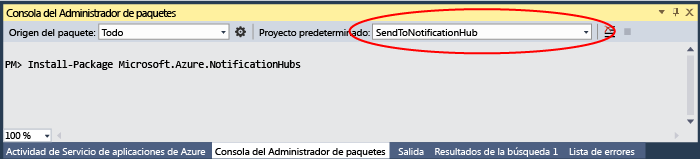

<properties
	pageTitle="Notificaciones push de iOS con Centros de notificaciones para aplicaciones Xamarin | Microsoft Azure"
	description="En este tutorial, obtenga información acerca de cómo usar los Centros de notificaciones de Azure para enviar notificaciones de inserción a una aplicación Xamarin iOS."
	services="notification-hubs"
    keywords="notificaciones push de ios,mensajes de inserción,notificaciones push,mensaje de notificación"
	documentationCenter="xamarin"
	authors="ysxu"
	manager="dwrede"
	editor=""/>

<tags
	ms.service="notification-hubs"
	ms.workload="mobile"
	ms.tgt_pltfrm="mobile-xamarin-ios"
	ms.devlang="dotnet"
	ms.topic="hero-article"
	ms.date="02/15/2016"
	ms.author="yuaxu"/>

# Notificaciones push de iOS con Centros de notificaciones para aplicaciones Xamarin

[AZURE.INCLUDE [notification-hubs-selector-get-started](../../includes/notification-hubs-selector-get-started.md)]

##Información general
> [AZURE.IMPORTANT] Para completar este tutorial, deberá tener una cuenta de Azure activa. En caso de no tener ninguna, puede crear una cuenta de evaluación gratuita en tan solo unos minutos. Para obtener más información, consulte [Evaluación gratuita de Azure](https://azure.microsoft.com/pricing/free-trial/?WT.mc_id=A643EE910&amp;returnurl=http%3A%2F%2Fazure.microsoft.com%2Fes-ES%2Fdocumentation%2Farticles%2Fpartner-xamarin-notification-hubs-ios-get-started).

Este tutorial muestra cómo puede utilizar los Centros de notificaciones de Azure para enviar notificaciones de inserción a una aplicación iOS. Creará una aplicación Xamarin.iOS vacía que recibe notificaciones push mediante el [Servicio de notificaciones push de Apple (APN)](https://developer.apple.com/library/ios/documentation/NetworkingInternet/Conceptual/RemoteNotificationsPG/Chapters/ApplePushService.html). Cuando haya finalizado, podrá usar el centro de notificaciones para difundir notificaciones de inserción a todos los dispositivos que ejecutan su aplicación. El código acabado está disponible en el ejemplo de la [aplicación NotificationHubs][GitHub].

En este tutorial se demuestra el escenario sencillo de difusión de mensajes de inserción con Centros de notificaciones.

##Requisitos previos

Este tutorial requiere lo siguiente:

+ [Xcode 6.0][Install Xcode]
+ Un dispositivo compatible con iOS 7.0 (o una versión posterior)
+ Pertenencia al programa para desarrolladores de iOS
+ [Xamarin.iOS]

   > [AZURE.NOTE] Debido a los requisitos de configuración de las notificaciones push de iOS, debe implementar y probar la aplicación de ejemplo en un dispositivo iOS físico (iPhone o iPad) en lugar de hacerlo en un simulador.

La realización de este tutorial es un requisito previo para todos los demás tutoriales de Centros de notificaciones para aplicaciones Xamarin para iOS.

[AZURE.INCLUDE [Los Centros de notificaciones permiten notificaciones push de Apple](../../includes/notification-hubs-enable-apple-push-notifications.md)]

##Configuración de su Centro de notificaciones

Esta sección le guía en la creación de un nuevo centro de notificaciones y la configuración de la autenticación con APNS mediante el certificado de inserción **.p12** que creó. Si desea usar un centro de notificaciones ya creado, puede omitir los pasos hasta el paso 5.

[AZURE.INCLUDE [notification-hubs-portal-create-new-hub](../../includes/notification-hubs-portal-create-new-hub.md)]

<ol start="7">
<li>

Como lo que queremos es configurar la conexión APNS, en el Portal de Azure, abra la configuración de Centro de notificaciones y haga clic en <b>Servicios de notificaciones</b> y luego en el elemento <b>Apple (APNS)</b> de la lista. A continuación, haga clic en <b>Cargar certificado</b> y seleccione el certificado <b>. p12</b> que exportó anteriormente, así como la contraseña del certificado.

Asegúrese de seleccionar el modo de <b>espacio aislado</b> puesto que va a enviar mensajes de inserción en un entorno de desarrollo. Utilice solamente la configuración de <b>Producción</b> si desea enviar notificaciones push a los usuarios que ya compraron la aplicación en la tienda.

</li>
</ol>
&emsp;&emsp;

&emsp;&emsp;

Su centro de notificaciones está ahora configurado para funcionar con APNS, y tiene las cadenas de conexión para registrar su aplicación y enviar notificaciones push.

##Conexión de la aplicación al Centro de notificaciones

#### Crear un nuevo proyecto

1. En Xamarin Studio, cree un nuevo proyecto iOS y seleccione la plantilla **Unified API** > **Single View Application** (API unificada > Aplicación de vista simple).

   	![Xamarin Studio: Selección del tipo de aplicación][31]

2. Agregue una referencia al componente de mensajería de Azure. En la vista de soluciones, haga clic con el botón derecho en la carpeta **Components** (Componentes) del proyecto y elija **Get More Components** (Obtener más componentes). Busque el componente **Azure Messaging** (Mensajería de Azure) y agréguelo a su proyecto.

3. En **AppDelegate.cs**, agregue la siguiente instrucción using:

    	using WindowsAzure.Messaging;

4. Declare una instancia de **SBNotificationHub**:

		private SBNotificationHub Hub { get; set; }

5. Cree una clase **Constants.cs** con las siguientes variables:

        // Azure app-specific connection string and hub path
        public const string ConnectionString = "<Azure connection string>";
        public const string NotificationHubPath = "<Azure hub path>";

6. En **AppDelegate.cs**, actualice el elemento **FinishedLaunching()** para que coincida con lo siguiente:

        public override bool FinishedLaunching(UIApplication application, NSDictionary launchOptions)
        {
            if (UIDevice.CurrentDevice.CheckSystemVersion (8, 0)) {
    			var pushSettings = UIUserNotificationSettings.GetSettingsForTypes (
                       UIUserNotificationType.Alert | UIUserNotificationType.Badge | UIUserNotificationType.Sound,
                       new NSSet ());

			    UIApplication.SharedApplication.RegisterUserNotificationSettings (pushSettings);
			    UIApplication.SharedApplication.RegisterForRemoteNotifications ();
			} else {
			    UIRemoteNotificationType notificationTypes = UIRemoteNotificationType.Alert | UIRemoteNotificationType.Badge | UIRemoteNotificationType.Sound;
			    UIApplication.SharedApplication.RegisterForRemoteNotificationTypes (notificationTypes);
			}

            return true;
        }

7. Invalide el método **RegisteredForRemoteNotifications()** en **AppDelegate.cs**:

        public override void RegisteredForRemoteNotifications(UIApplication application, NSData deviceToken)
        {
            Hub = new SBNotificationHub(Constants.ConnectionString, Constants.NotificationHubPath);

            Hub.UnregisterAllAsync (deviceToken, (error) => {
                if (error != null)
                {
                    Console.WriteLine("Error calling Unregister: {0}", error.ToString());
                    return;
                }

                NSSet tags = null; // create tags if you want
                Hub.RegisterNativeAsync(deviceToken, tags, (errorCallback) => {
                    if (errorCallback != null)
                        Console.WriteLine("RegisterNativeAsync error: " + errorCallback.ToString());
                });
            });
        }

8. Invalide el método **ReceivedRemoteNotification()** en **AppDelegate.cs**:

        public override void ReceivedRemoteNotification(UIApplication application, NSDictionary userInfo)
        {
            ProcessNotification(userInfo, false);
        }

9. Cree el método **ProcessNotification()** siguiente en **AppDelegate.cs**:

        void ProcessNotification(NSDictionary options, bool fromFinishedLaunching)
        {
            // Check to see if the dictionary has the aps key.  This is the notification payload you would have sent
            if (null != options && options.ContainsKey(new NSString("aps")))
            {
                //Get the aps dictionary
                NSDictionary aps = options.ObjectForKey(new NSString("aps")) as NSDictionary;

                string alert = string.Empty;

                //Extract the alert text
                // NOTE: If you're using the simple alert by just specifying
                // "  aps:{alert:"alert msg here"}  ", this will work fine.
                // But if you're using a complex alert with Localization keys, etc.,
                // your "alert" object from the aps dictionary will be another NSDictionary.
                // Basically the JSON gets dumped right into a NSDictionary,
                // so keep that in mind.
                if (aps.ContainsKey(new NSString("alert")))
                    alert = (aps [new NSString("alert")] as NSString).ToString();

                //If this came from the ReceivedRemoteNotification while the app was running,
                // we of course need to manually process things like the sound, badge, and alert.
                if (!fromFinishedLaunching)
                {
                    //Manually show an alert
                    if (!string.IsNullOrEmpty(alert))
                    {
                        UIAlertView avAlert = new UIAlertView("Notification", alert, null, "OK", null);
                        avAlert.Show();
                    }
                }
            }
        }

    > [AZURE.NOTE] Puede elegir invalidar **FailedToRegisterForRemoteNotifications()** para controlar determinadas situaciones, por ejemplo, cuando no haya conexión de red. Esto es especialmente importante si el usuario quisiera iniciar la aplicación en modo sin conexión (por ejemplo, Avión) y desea administrar los escenarios de mensajes de inserción específicos de su aplicación.

10. Ejecute la aplicación en el dispositivo.

## Envío de notificaciones push

Para probar la recepción de notificaciones push en la aplicación, envíe notificaciones en el [Portal de Azure] mediante la funcionalidad **Envío de prueba** del conjunto de herramientas de **Solución de problemas**, justo en la página del centro de notificaciones, como se muestra en la siguiente pantalla.

Las notificaciones push se envían normalmente en un servicio back-end como Servicios móviles o ASP.NET mediante una biblioteca compatible. También puede usar la API de REST directamente para enviar mensajes de inserción si no hay disponible una biblioteca en su escenario.

En este tutorial, vamos a simplificar las cosas y mostrar solo la prueba de su aplicación cliente mediante el envío de notificaciones con el SDK de .NET para los centros de notificaciones en una aplicación de consola en lugar de un servicio back-end. Se recomienda seguir el tutorial [Los Centros de notificaciones de Azure notifican a los usuarios con back-end de .NET](notification-hubs-aspnet-backend-ios-notify-users.md) como paso siguiente para enviar notificaciones desde un back-end de ASP.NET. Sin embargo, se pueden usar los siguientes enfoques para enviar notificaciones:

* **Interfaz de REST**: puede admitir notificaciones push en cualquier plataforma de back-end mediante la [interfaz de REST](http://msdn.microsoft.com/library/windowsazure/dn223264.aspx).

* **SDK para .NET de Centros de notificaciones de Microsoft Azure**: en el Administrador de paquetes NuGet para Visual Studio, ejecute [Install-Package Microsoft.Azure.NotificationHubs](https://www.nuget.org/packages/Microsoft.Azure.NotificationHubs/).

* **Node.js**: [Uso de los Centros de notificaciones desde Node.js](notification-hubs-nodejs-how-to-use-notification-hubs.md).

* **Servicios móviles de Azure**: para ver un ejemplo de cómo enviar notificaciones push desde un back-end de Servicios móviles de Azure integrado con Centros de notificaciones, consulte "Incorporación de notificaciones de inserción a la aplicación de Servicios móviles" ([back-end de .NET](../mobile-services/mobile-services-dotnet-backend-windows-universal-dotnet-get-started-push.md) | [back-end de JavaScript](../mobile-services/mobile-services-javascript-backend-windows-universal-dotnet-get-started-push.md)).

* **Java/PHP**: para ver un ejemplo de cómo enviar notificaciones push con las API de REST, consulte "Uso de los Centros de notificaciones desde Java o PHP" ([Java](notification-hubs-java-backend-how-to.md) | [PHP](notification-hubs-php-backend-how-to.md)).

####Envío de notificaciones push desde una aplicación de consola .NET (opcional)

En esta sección, enviará notificaciones push con una aplicación sencilla de consola .NET. Para los fines de este ejemplo, cambiaremos a un entorno de desarrollo de Windows que tenga ya instalado Visual Studio.

1. En Visual Studio, cree una nueva aplicación de consola en Visual C#:

   	![Visual Studio: Creación de una nueva aplicación de consola][213]

2. En Visual Studio, haga clic en **Herramientas**, en **Administrador de paquetes de NuGet** y, después, haga clic en **Consola del administrador de paquetes**.

	La consola del administrador de paquetes debe aparecer acoplada a la parte inferior del área de trabajo de Visual Studio.

3. En la ventana de la Consola del Administrador de paquetes, seleccione en **Proyecto predeterminado** el nuevo proyecto de aplicación de consola y, a continuación, ejecute el siguiente comando en la ventana de la consola:

        Install-Package Microsoft.Azure.NotificationHubs

	Se agrega una referencia al SDK de Centros de notificaciones de Azure mediante el <a href="http://www.nuget.org/packages/Microsoft.Azure.NotificationHubs/">paquete de NuGet Microsoft.Azure.Notification Hubs</a>.

	

4. Abra el archivo `Program.cs` y agregue la siguiente instrucción `using`, lo que garantiza que podemos utilizar clases y funciones de Azure dentro de la clase principal:

        using Microsoft.Azure.NotificationHubs;

3. En su clase `Program`, agregue el siguiente método (no olvide reemplazar la **cadena de conexión** y el **nombre del centro**):

        private static async void SendNotificationAsync()
        {
            NotificationHubClient hub = NotificationHubClient.CreateClientFromConnectionString("<connection string with full access>", "<hub name>");
            var alert = "{"aps":{"alert":"Hello from .NET!"}}";
            await hub.SendAppleNativeNotificationAsync(alert);
        }

4. Agregue las siguientes líneas al método `Main`:

         SendNotificationAsync();
		 Console.ReadLine();

5. Presione la tecla F5 para ejecutar la aplicación. En unos segundos, verá que aparece una notificación push en su dispositivo. Si usa Wi-Fi o una red de datos de telefonía móvil, asegúrese de que tenga una conexión a Internet activa en el dispositivo.

Puede buscar todas las cargas posibles en la guía [Local and Push Notification Programming Guide] (Guía de programación de notificaciones locales y de inserción) de Apple.

####Envío de notificaciones desde un servicio móvil (opcional)

En esta sección, enviaremos notificaciones push mediante un servicio móvil a través de un script de Node.

Para enviar una notificación mediante un servicio móvil, siga la [Introducción a Servicios móviles] y, a continuación:

1. Inicie sesión en el [Portal de Azure clásico] y seleccione su servicio móvil.

2. Seleccione la pestaña **Programador** en la parte superior.

   	![Portal de Azure clásico: Programador][215]

3. Cree un nuevo trabajo programado, inserte un nombre y seleccione **A petición**.

   	![Portal de Azure clásico: Creación de un nuevo trabajo][216]

4. Cuando se cree el trabajo, haga clic en el nombre del trabajo. Luego, haga clic en la pestaña **Script** de la barra superior.

5. Inserte el siguiente script en su función de programador. Asegúrese de reemplazar los marcadores de posición por su nombre del centro de notificaciones y la cadena de conexión para *DefaultFullSharedAccessSignature* que obtuvo anteriormente. Haga clic en **Guardar**.

		var azure = require('azure');
		var notificationHubService = azure.createNotificationHubService('<Hubname>', '<SAS Full access >');
		notificationHubService.apns.send(
	    	null,
    		{"aps":
        		{
          		"alert": "Hello from Mobile Services!"
        		}
    		},
    		function (error)
    		{
	        	if (!error) {
    	        	console.warn("Notification successful");
        		}
    		}
		);

6. Haga clic en **Ejecutar una vez** en la barra inferior. Debe recibir una alerta en el dispositivo.

##Pasos siguientes

En este sencillo ejemplo, se difunden notificaciones push a todos los dispositivos iOS. Para dirigirse a usuarios específicos, consulte el tutorial [Uso de los Centros de notificaciones para insertar notificaciones para los usuarios]. Si desea segmentar a sus usuarios por grupos de interés, puede leer [Uso de Centros de notificaciones para enviar noticias de último minuto]. Para más información sobre el uso de los Centros de notificaciones, consulte [Introducción a los centros de notificaciones] y los [Procedimientos de los Centros de notificaciones para iOS].

<!-- Images. -->

[213]: ./media/partner-xamarin-notification-hubs-ios-get-started/notification-hub-create-console-app.png

[215]: ./media/partner-xamarin-notification-hubs-ios-get-started/notification-hub-scheduler1.png
[216]: ./media/partner-xamarin-notification-hubs-ios-get-started/notification-hub-scheduler2.png

[31]: ./media/partner-xamarin-notification-hubs-ios-get-started/notification-hub-create-ios-app.png

<!-- URLs. -->
[Mobile Services iOS SDK]: http://go.microsoft.com/fwLink/?LinkID=266533
[Submit an app page]: http://go.microsoft.com/fwlink/p/?LinkID=266582
[My Applications]: http://go.microsoft.com/fwlink/p/?LinkId=262039
[Live SDK for Windows]: http://go.microsoft.com/fwlink/p/?LinkId=262253

[Introducción a Servicios móviles]: /develop/mobile/tutorials/get-started-xamarin-ios
[Portal de Azure clásico]: https://manage.windowsazure.com/
[Introducción a los centros de notificaciones]: http://msdn.microsoft.com/library/jj927170.aspx
[Procedimientos de los Centros de notificaciones para iOS]: http://msdn.microsoft.com/library/jj927168.aspx
[Install Xcode]: https://go.microsoft.com/fwLink/p/?LinkID=266532
[iOS Provisioning Portal]: http://go.microsoft.com/fwlink/p/?LinkId=272456

[Uso de los Centros de notificaciones para insertar notificaciones para los usuarios]: /manage/services/notification-hubs/notify-users-aspnet
[Uso de Centros de notificaciones para enviar noticias de último minuto]: /manage/services/notification-hubs/breaking-news-dotnet

[Local and Push Notification Programming Guide]: http://developer.apple.com/library/mac/#documentation/NetworkingInternet/Conceptual/RemoteNotificationsPG/Chapters/ApplePushService.html#//apple_ref/doc/uid/TP40008194-CH100-SW1
[Apple Push Notification Service]: http://go.microsoft.com/fwlink/p/?LinkId=272584

[Azure Mobile Services Component]: http://components.xamarin.com/view/azure-mobile-services/
[GitHub]: http://go.microsoft.com/fwlink/p/?LinkId=331329
[Xamarin.iOS]: http://xamarin.com/download
[WindowsAzure.Messaging]: https://github.com/infosupport/WindowsAzure.Messaging.iOS
[Portal de Azure]: https://portal.azure.com

<!----HONumber=AcomDC_0218_2016-->