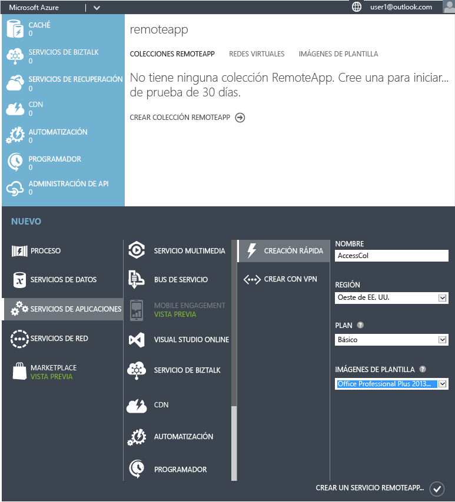
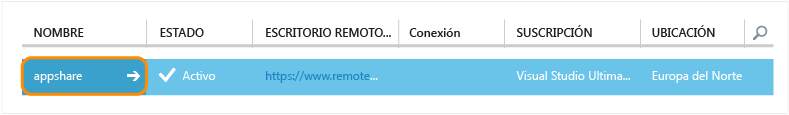
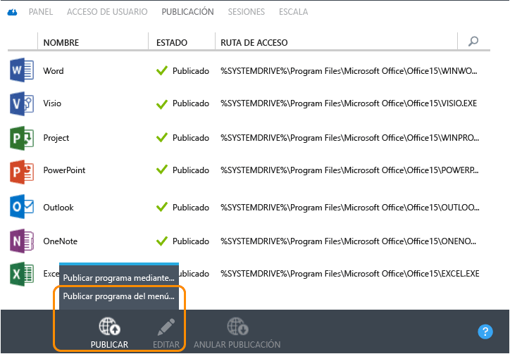
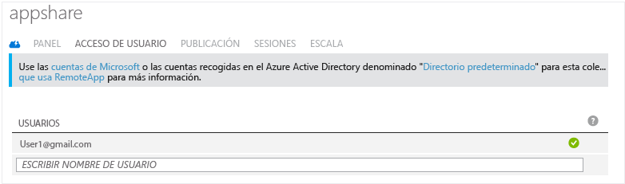
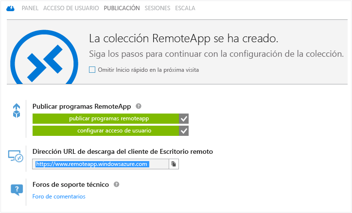
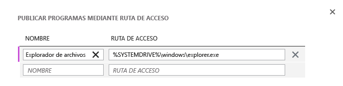
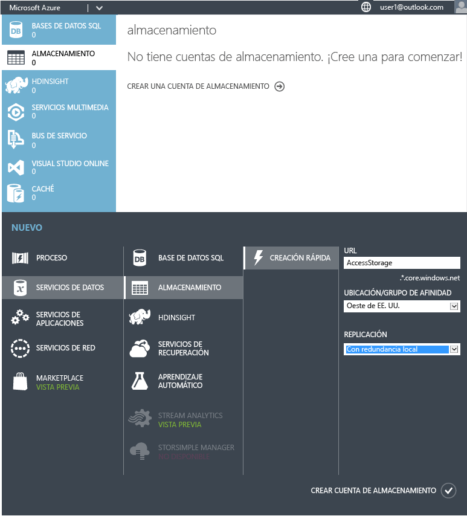
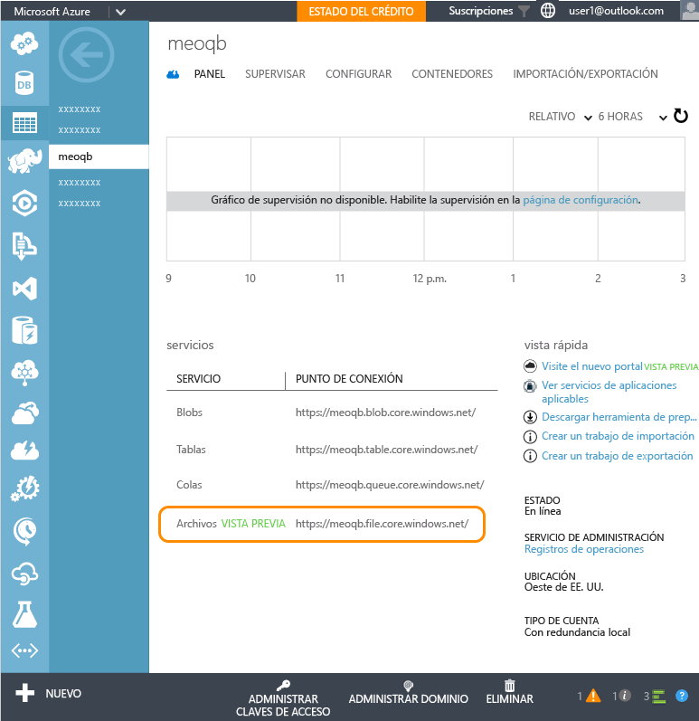
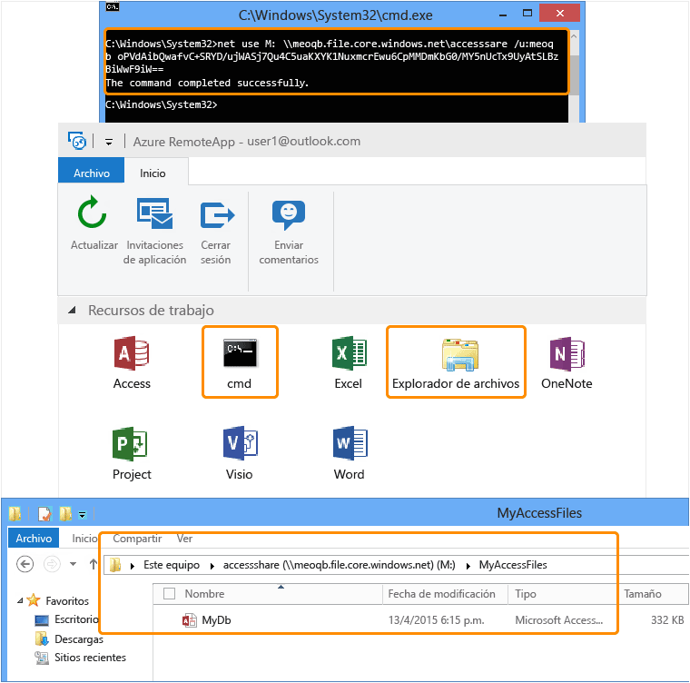
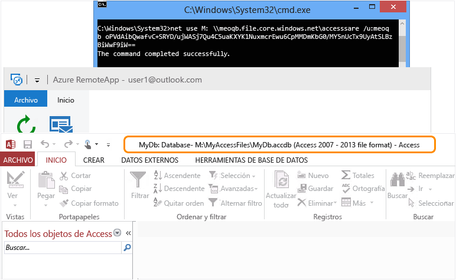

<properties
   pageTitle="Ejecución de cualquier aplicación de Windows en cualquier dispositivo con Azure RemoteApp | Microsoft Azure"
   description="Obtenga información acerca de cómo compartir cualquier aplicación de Windows con sus usuarios mediante Azure RemoteApp."
   services="remoteapp"
   documentationCenter=""
   authors="lizap"
   manager="mbaldwin"
   editor=""/>

<tags
   ms.service="remoteapp"
   ms.devlang="na"
   ms.topic="hero-article"
   ms.tgt_pltfrm="na"
   ms.workload="compute"
   ms.date="02/02/2016"
   ms.author="elizapo"/>

# Ejecución de cualquier aplicación de Windows en cualquier dispositivo con Azure RemoteApp

Puede ejecutar una aplicación de Windows en cualquier lugar, en cualquier dispositivo, ahora mismo, en serio: simplemente usando Azure RemoteApp. Ya se trate de una aplicación personalizada desarrollada hace 10 años o una aplicación de Office, los usuarios ya no estarán atados a un sistema operativo específico (como Windows XP) para esas pocas aplicaciones.

Mediante el uso de Azure RemoteApp, los usuarios también pueden emplear sus propios dispositivos Android o Apple y obtener la misma experiencia que en Windows (o en teléfonos de Windows). Esto se logra al hospedar la aplicación de Windows en una colección de máquinas virtuales de Windows en Azure. Los usuarios pueden tener acceso desde cualquier lugar con una conexión a Internet.

Siga leyendo para obtener un ejemplo sobre cómo hacerlo exactamente.

En este artículo, vamos a compartir Access con todos los usuarios. Sin embargo, puede usar CUALQUIER aplicación. Siempre que pueda instalar la aplicación en un equipo con Windows Server 2012 R2, puede compartirlo con los siguientes pasos. Puede revisar los [requisitos de la aplicación](remoteapp-appreqs.md) para asegurarse de que la aplicación funcionará.

Dado que Access es una base de datos, y deseamos que esa base de datos resulte útil, vamos a seguir unos pasos adicionales más para permitir a los usuarios tener acceso al recurso compartido de datos de Access. Si la aplicación no es una base de datos o no necesita que los usuarios tengan acceso a un recurso compartido de archivos, puede omitir los pasos de este tutorial

[AZURE.INCLUDE [free-trial-note](../../includes/free-trial-note.md)]

## Creación de una colección de RemoteApp

Empiece por crear una colección. La colección actúa como un contenedor para sus aplicaciones y usuarios. Cada colección se basa en una imagen; puede crear las suyas propias o utilizar una proporcionada con la suscripción. Para este tutorial, estamos usando la imagen de prueba de Office 2013, que contiene la aplicación que queremos compartir.

1. En el portal de Azure, desplácese hacia abajo en el árbol de navegación de la izquierda hasta que vea RemoteApp. Abra esa página.
2. Haga clic en **Crear una colección de RemoteApp**.
3. Haga clic en **Creación rápida** y escriba un nombre para la colección.
4. Seleccione la región que desee utilizar para crear la colección. Para obtener la mejor experiencia, seleccione la región más cercana geográficamente a la ubicación donde los usuarios tendrán acceso a la aplicación. Por ejemplo, en este tutorial, los usuarios se encuentran en Redmond (Washington). La región de Azure más cercana es **Oeste de EE. UU.**
5. Seleccione el plan de facturación que desee utilizar. El plan de facturación básico coloca 16 usuarios en una máquina virtual grande de Azure, mientras que el plan de facturación estándar tiene 10 usuarios en una máquina virtual grande de Azure. Como apunte general, el plan básico funciona muy bien para el flujo de trabajo de tipo de entrada de datos. Para una aplicación de productividad, como Office, sería aconsejable el plan estándar.
6. Por último, seleccione la imagen de Office 2013 Professional. Esta imagen contiene aplicaciones de Office 2013. Le recordamos que esta imagen solo es buena para colecciones de prueba y pruebas de concepto. Esta imagen no se puede usar en una colección de producción.
7. Ahora, haga clic en **Crear una colección de RemoteApp**.

Así se empieza a crear la colección, pero el proceso puede durar hasta una hora.

Ahora está listo para agregar los usuarios.

## Uso compartido de la aplicación con usuarios

Una vez que la colección se ha creado correctamente, es el momento de publicar Access para los usuarios y agregar los usuarios que deben tener acceso a esta aplicación.

Si se ha desplazado fuera del nodo Azure RemoteApp mientras se creaba la colección, lo primero que debe hacer es volver a él desde la página principal de Azure.

2. Haga clic en la colección que creó anteriormente para tener acceso a opciones adicionales y configure la colección.

3. En la pestaña **Publicación**, haga clic en **Publicar** en la parte inferior de la pantalla y, a continuación, haga clic en **Publicar programas del menú Inicio**.

4. Seleccione las aplicaciones que desea publicar en la lista. Para los fines de este tutorial, elegimos Access. Haga clic en **Completo**. Espere a que las aplicaciones finalicen la publicación.

1. Una vez que la aplicación haya finalizado la publicación, diríjase a la pestaña **Acceso del usuario** para agregar todos los usuarios que deben tener acceso a las aplicaciones. Escriba los nombres de usuario (dirección de correo electrónico) de los usuarios y, a continuación, haga clic en **Guardar**.

1. Ahora, es necesario informar a los usuarios acerca de estas nuevas aplicaciones e indicarles cómo tener acceso a ellas. Para ello, envíe a los usuarios un correo electrónico que les dirija a la URL de descarga del cliente de Escritorio remoto.

## Configuración del acceso a Access

Algunas aplicaciones necesitan configuración adicional después de implementarlas a través de RemoteApp. En concreto, para Access, vamos a crear un recurso compartido de archivos en Azure al que puede tener acceso cualquier usuario. (Si no desea hacerlo, puede crear una [colección híbrida](remoteapp-create-hybrid-deployment.md) [en lugar de nuestra colección en la nube] que permite a los usuarios tener acceso a archivos e información en la red local). A continuación, tendremos que pedir a los usuarios que asignen una unidad local de su equipo al sistema de archivos de Azure.

La primera parte la tiene que hacer usted como administrador. Luego, tenemos algunos pasos que deben seguir los usuarios.

1. Comience por publicar la interfaz de línea de comandos (cmd.exe). En la pestaña **Publicación**, seleccione **cmd**, y, a continuación, haga clic en **Publicar > Publicar programa con ruta de acceso**.
2. Escriba el nombre de la aplicación y la ruta de acceso. Para nuestros fines actuales, utilice "Explorador de archivos" como nombre y "%SYSTEMDRIVE%\windows\explorer.exe" como ruta de acceso.

3. Ahora tiene que crear una [cuenta de almacenamiento](../storage-create-storage-account.md) de Azure. Hemos llamado a la nuestra "accessstorage", así que elija un nombre que sea significativo para usted (solo puede haber una con el nombre "accessstorage").

4. Ahora vuelva al panel para poder obtener la ruta de acceso al sistema de almacenamiento (ubicación del extremo). La usará en seguida, así que asegúrese de copiarla en alguna parte.
 
5. A continuación, una vez creada la cuenta de almacenamiento, necesitará la clave de acceso principal. Haga clic en **Administrar claves de acceso** y, a continuación, copie la clave de acceso principal.
6. Ahora, establezca el contexto de la cuenta de almacenamiento y cree un nuevo recurso compartido de archivos para Access. En una ventana de Windows PowerShell con privilegios elevados, ejecute los siguientes cmdlets:

        $ctx=New-AzureStorageContext <account name> <account key>
    	$s = New-AzureStorageShare <share name> -Context $ctx

	Así, para nuestro recurso compartido, estos son los cmdlets que ejecutamos:

	    $ctx=New-AzureStorageContext accessstorage <key>
    	$s = New-AzureStorageShare <share name> -Context $ctx

Ahora, es el turno del usuario. En primer lugar, pida a los usuarios que instalen un [cliente RemoteApp](remoteapp-clients.md). A continuación, los usuarios tienen que asignar una unidad de su cuenta a ese recurso compartido de archivos de Azure que creó y agregar sus archivos de Access. Así es como deben hacerlo:

1. En el cliente de RemoteApp, obtenga acceso a las aplicaciones publicadas. Inicie el programa cmd.exe.
2. Ejecute el comando siguiente para asignar una unidad del equipo al recurso compartido de archivos:

		net use z: \<accountname>.file.core.windows.net<share name> /u:<user name> <account key>

	Si establece el parámetro **/persistent** en Sí, la unidad asignada se conservará en todas las sesiones.
1. Ahora, inicie la aplicación Explorador de archivos desde RemoteApp. Copie los archivos de Access que desee utilizar en la aplicación compartida al recurso compartido de archivos.

1. Por último, abra Access y, a continuación, abra la base de datos que acaba de compartir. Debería ver los datos de Access ejecutándose desde la nube.

Ahora puede utilizar Access en cualquiera de sus dispositivos, solo asegúrese de instalar un cliente de RemoteApp.

<!--Every topic should have next steps and links to the next logical set of content to keep the customer engaged-->
## Pasos siguientes

Ahora que ha aprendido a crear una colección, intente crear una [colección que usa Office 365](remoteapp-tutorial-o365anywhere.md). O bien, puede crear una [colección híbrida](remoteapp-create-hybrid-deployment.md) que pueda tener acceso a la red local.

<!--Image references-->

<!---HONumber=AcomDC_0211_2016-->