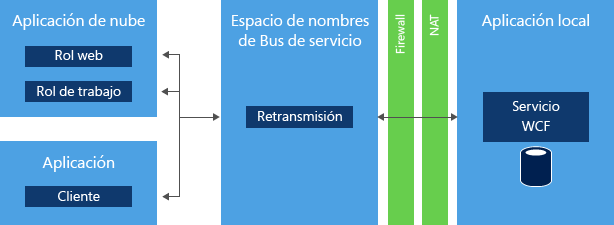
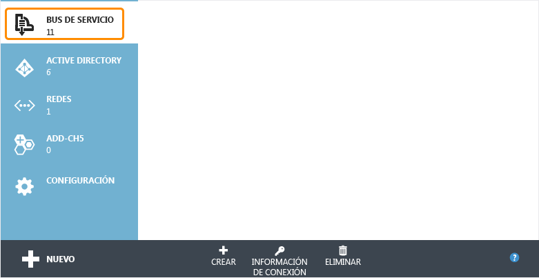
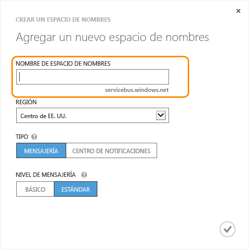
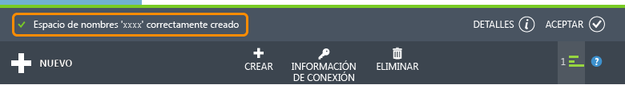

<properties
	pageTitle="Uso de Retransmisión de bus de servicio (.NET) | Microsoft Azure"
	description="Obtenga información acerca de cómo usar el servicio de retransmisión del Bus de servicio de Azure para conectar dos aplicaciones hospedadas en diferentes ubicaciones."
	services="service-bus"
	documentationCenter=".net"
	authors="sethmanheim"
	manager="timlt"
	editor=""/>

<tags
	ms.service="service-bus"
	ms.workload="na"
	ms.tgt_pltfrm="na"
	ms.devlang="dotnet"
	ms.topic="get-started-article"
	ms.date="01/26/2016"
	ms.author="sethm"/>


# Uso del servicio de Retransmisión de bus de servicio de Azure

En este artículo se describe cómo usar el servicio de Retransmisión de bus de servicio. Los ejemplos se escriben en C# y usan la API de Windows Communication Foundation (WCF) con extensiones contenidas en el conjunto del bus de servicio. Para obtener más información sobre la Retransmisión de bus de servicio, consulte la información general de [Mensajería retransmitida de Bus de servicio](service-bus-relay-overview.md).

[AZURE.INCLUDE [create-account-note](../../includes/create-account-note.md)]

## ¿Qué es la retransmisión de bus de servicio?

El servicio [*Retransmisión* de bus de servicio](service-bus-relay-overview.md) permite crear aplicaciones híbridas que se pueden ejecutar en los centros de datos de Azure y en un entorno empresarial local. La Retransmisión de bus de servicio facilita esta posibilidad, ya que permite exponer de forma segura los servicios Windows Communication Foundation (WCF) que se encuentran en una red corporativa en la nube pública sin tener que abrir una conexión de firewall y sin que sea necesario realizar cambios molestos en una infraestructura de red corporativa.



La Retransmisión de bus de servicio le permite hospedar servicios WCF en su entorno empresarial existente. A continuación, puede delegar la escucha de las sesiones entrantes y las solicitudes a esos servicios WCF al bus de servicio que se ejecuta en Azure. Esto le permite exponer esos servicios en el código de aplicación que se ejecuta en Azure o en entornos móviles de trabajo o asociados de extranet. El Bus de servicio permite controlar de forma segura quién puede obtener acceso a estos servicios en un nivel específico. Proporciona una forma segura y eficaz de exponer los datos y la funcionalidad de aplicaciones de las soluciones empresariales existentes y aprovecharlos desde la nube.

En este artículo se muestra cómo usar la Retransmisión de bus de servicio para crear un servicio web de WCF, expuesto mediante el enlace de canales TCP, que implementa una conversación segura entre dos partes.

## Creación de un espacio de nombres de servicio

Para comenzar a usar el relé del bus de servicio en Azure, primero debe crear un espacio de nombres de servicio. Un espacio de nombres proporciona un contenedor con un ámbito para el desvío de recursos del bus de servicio en la aplicación.

Para crear un nombre de espacio de servicio:

1.  Inicie sesión en el [Portal de Azure clásico][].

2.  En el panel de navegación izquierdo del Portal, haga clic en **Bus de servicio**.

3.  En el panel inferior del Portal, haga clic en **Crear**.

	

4.  En el cuadro de diálogo **Agregar un nuevo espacio de nombres**, escriba un nombre de espacio de nombres. El sistema realiza la comprobación automáticamente para ver si el nombre está disponible.

	

5.  Después de asegurarse de que el nombre de espacio de nombres está disponible, seleccione el país o región en el que debe hospedarse el espacio de nombres (asegúrese de que usa el mismo país o la misma región en los que está realizando la implementación de los recursos de proceso).

	> [AZURE.IMPORTANT] seleccione la *misma región* que vaya a seleccionar para la implementación de la aplicación. Con esto conseguirá el máximo rendimiento.

6.	Deje los demás campos del cuadro de diálogo con los valores predeterminados (**Mensajería** y **Nivel estándar**) y, a continuación, haga clic en la marca de verificación. El sistema crea ahora el espacio de nombres del servicio y lo habilita. Es posible que tenga que esperar algunos minutos mientras el sistema realiza el aprovisionamiento de los recursos para la cuenta.

	

	El espacio de nombres que creó aparecerá a continuación en el Portal y tardará un poco en activarse. Espere hasta que el estado sea **Active** antes de continuar.

## Obtención de credenciales de administración predeterminadas para el espacio de nombres

Para realizar operaciones de administración, como la creación de una conexión de relé, en el espacio de nombres nuevo, debe configurar la regla de autorización de la Firma de acceso compartido (SAS) para el espacio de nombres. Para obtener más información sobre SAS, consulte [Autenticación con firma de acceso compartido en Bus de servicio][].

1.  En el panel de navegación izquierdo, haga clic en el nodo **Bus de servicio** para ver la lista de espacios de nombres disponibles: 

2.  Haga doble clic en el nombre del espacio de nombres que acaba de crear en la lista que se muestra:

3.  Haga clic en la pestaña **Configurar** en la parte superior de la página.

4.  Cuando se aprovisiona un espacio de nombres del Bus de servicio, se crea de forma predeterminada **SharedAccessAuthorizationRule**, con **KeyName** establecido en **RootManageSharedAccessKey**. Esta página muestra esa clave, así como las claves principales y secundarias para la regla predeterminada.

## Obtenga el paquete NuGet del bus de servicio

El [paquete NuGet del bus de servicio](https://www.nuget.org/packages/WindowsAzure.ServiceBus) es la forma más sencilla de obtener la API del bus de servicio y configurar su aplicación con todas las dependencias del bus de servicio. La extensión NuGet Visual Studio facilita la instalación y la actualización de las bibliotecas y las herramientas en Visual Studio y Visual Studio Express. El paquete NuGet del bus de servicio es la forma más sencilla de obtener la API del bus de servicio y configurar su aplicación con todas las dependencias del bus de servicio.

Realice los pasos siguientes para instalar el paquete NuGet en su aplicación:

1.  En el Explorador de soluciones, haga clic con el botón secundario en **References** y, a continuación, en **Manage NuGet Packages**.
2.  Busque "Bus de servicio" y seleccione el elemento **Bus de servicio de Microsoft Azure**. Haga clic en **Instalar** para completar la instalación y, a continuación, cierre este cuadro de diálogo.

	


## Uso de Bus de servicio para exponer y consumir un servicio web SOAP con TCP

Para exponer un servicio web WCF (SOAP) para consumo externo, debe realizar cambios en las direcciones y enlaces de los servicios. Esto puede requerir cambios en el archivo de configuración o en el código, según la forma en la que se hayan establecido y configurado los servicios WCF. Tenga en cuenta que WCF le permite disponer de varios extremos de red en el mismo servicio, por lo que puede retener los extremos internos existentes mientras agrega extremos del bus de servicio para el acceso externo al mismo tiempo.

En esta tarea, creará un servicio WCF simple y le agregará un agente de escucha del bus de servicio. En este ejercicio se presupone que está familiarizado con Visual Studio y, por lo tanto, no se proporcionarán todos los detalles relacionados con la creación de un proyecto. El ejercicio se centra en el código.

Antes comenzar a realizar los pasos siguientes, complete el procedimiento que aparece a continuación para configurar su entorno:

1.  En Visual Studio, cree una aplicación de consola que contenga dos proyectos en la solución: "Client" y "Service".
2.  Agregue el paquete NuGet de Bus de servicio de Microsoft Azure a ambos proyectos. De esa forma, se agregarán todas las referencias necesarias del conjunto a los proyectos.

### Creación del servicio

Primero cree el servicio. Los servicios WCF cuentan con al menos tres partes distintas:

-   Definición de un contrato que describe qué mensajes se intercambian y qué operaciones se van a invocar.
-   Implementación del contrato establecido.
-   Host que hospeda el servicio WCF y expone una serie de extremos.

Los ejemplos de código de esta sección están relacionados con cada uno de estos componentes.

El contrato define una única operación, `AddNumbers`, que agrega dos números y devuelve el resultado. La interfaz de `IProblemSolverChannel` permite al cliente administrar más fácilmente la duración del proxy. La creación de esta interfaz se considera una práctica recomendada. Es buena idea poner la definición del contrato en un archivo independiente para poder hacer referencia a ese archivo desde los proyectos "Client" y "Service". También puede copiar el código en los dos proyectos:

```
using System.ServiceModel;

[ServiceContract(Namespace = "urn:ps")]
interface IProblemSolver
{
    [OperationContract]
    int AddNumbers(int a, int b);
}

interface IProblemSolverChannel : IProblemSolver, IClientChannel {}
```

Con el contrato en su lugar, la implementación es trivial:

```
class ProblemSolver : IProblemSolver
{
    public int AddNumbers(int a, int b)
    {
        return a + b;
    }
}
```

### Configuración de un host de servicio mediante programación

Con el contrato y la implementación en su lugar, puede hospedar el servicio. El hospedaje se produce dentro de un objeto [System.ServiceModel.ServiceHost](https://msdn.microsoft.com/library/azure/system.servicemodel.servicehost.aspx), que se encarga de administrar las instancias del servicio y hospeda los extremos que escuchan mensajes. El código siguiente configura el servicio con un extremo local normal y un extremo del Bus de servicio para mostrar la apariencia, en paralelo, de los extremos internos y externos. Reemplace la cadena *namespace* por el nombre del espacio de nombres y *yourKey* por la clave SAS obtenida en el paso anterior de la configuración.

```
ServiceHost sh = new ServiceHost(typeof(ProblemSolver));

sh.AddServiceEndpoint(
   typeof (IProblemSolver), new NetTcpBinding(),
   "net.tcp://localhost:9358/solver");

sh.AddServiceEndpoint(
   typeof(IProblemSolver), new NetTcpRelayBinding(),
   ServiceBusEnvironment.CreateServiceUri("sb", "namespace", "solver"))
    .Behaviors.Add(new TransportClientEndpointBehavior {
          TokenProvider = TokenProvider.CreateSharedAccessSignatureTokenProvider("RootManageSharedAccessKey", "yourKey")});

sh.Open();

Console.WriteLine("Press ENTER to close");
Console.ReadLine();

sh.Close();
```

En el ejemplo, se crean dos extremos que se encuentran en la misma implementación del contrato. Uno es local y el otro se proyecta a través del Bus de servicio. Las principales diferencias entre ellos son los enlaces; [NetTcpBinding](https://msdn.microsoft.com/library/azure/system.servicemodel.nettcpbinding.aspx) para el local y [NetTcpRelayBinding](https://msdn.microsoft.com/library/azure/microsoft.servicebus.nettcprelaybinding.aspx) para el extremo del Bus de servicio y las direcciones. El extremo local dispone de una dirección de red local con un puerto distinto. El extremo del Bus de servicio cuenta con una dirección del extremo compuesta por la cadena `sb`, el nombre del espacio de nombres y la ruta "solver". Esto genera el URI `sb://[serviceNamespace].servicebus.windows.net/solver`, que identifica el extremo de servicio como extremo TCP del Bus de servicio con un nombre de DNS externo completo. Si coloca el código en lugar de los marcadores de posición, tal como se explicó anteriormente, en la función `Main` de la aplicación **Service**, tendrá un servicio funcional. Si quiere que el servicio escuche exclusivamente en el bus de servicio, quite la declaración del extremo local.

### Configuración de un host de servicio en el archivo App.config

También puede configurar el host con el archivo App.config. El servicio que aloja el código en este caso aparece en el ejemplo siguiente.

```
ServiceHost sh = new ServiceHost(typeof(ProblemSolver));
sh.Open();
Console.WriteLine("Press ENTER to close");
Console.ReadLine();
sh.Close();
```

Las definiciones del extremo se trasladan al archivo App.config. Tenga en cuenta que el paquete NuGet ya agregó un rango de definiciones al archivo App.config, que son las extensiones de configuración requeridas para el Bus de servicio. El siguiente ejemplo, que es el equivalente exacto del ejemplo anterior, debe aparecer directamente debajo del elemento **system.serviceModel**. Este ejemplo de código presupone que el espacio de nombres C# del proyecto tiene el nombre de **Service**. Reemplace los marcadores de posición por el espacio de nombres del servicio de Bus de servicio y la clave SAS.

```
<services>
    <service name="Service.ProblemSolver">
        <endpoint contract="Service.IProblemSolver"
                  binding="netTcpBinding"
                  address="net.tcp://localhost:9358/solver"/>
        <endpoint contract="Service.IProblemSolver"
                  binding="netTcpRelayBinding"
                  address="sb://namespace.servicebus.windows.net/solver"
                  behaviorConfiguration="sbTokenProvider"/>
    </service>
</services>
<behaviors>
    <endpointBehaviors>
        <behavior name="sbTokenProvider">
            <transportClientEndpointBehavior>
                <tokenProvider>
                    <sharedAccessSignature keyName="RootManageSharedAccessKey" key="yourKey" />
                </tokenProvider>
            </transportClientEndpointBehavior>
        </behavior>
    </endpointBehaviors>
</behaviors>
```

Una vez que realice estos cambios, el servicio se iniciará como antes, pero con dos extremos activos: uno local y otro que escucha en la nube.

### Creación del cliente

#### Configuración de un cliente mediante programación

Para consumir el servicio, puede construir un cliente WCF mediante un objeto [ChannelFactory](https://msdn.microsoft.com/library/system.servicemodel.channelfactory.aspx). El Bus de servicio usa un modelo basado en tokens de seguridad implementado mediante SAS. La clase [TokenProvider](https://msdn.microsoft.com/library/azure/microsoft.servicebus.tokenprovider.aspx) representa un proveedor de tokens de seguridad con patrones de diseño Factory Method integrados que devuelven algunos proveedores de tokens conocidos. El ejemplo siguiente usa el método [CreateSharedAccessSignatureTokenProvider](https://msdn.microsoft.com/library/azure/microsoft.servicebus.tokenprovider.createsharedaccesssignaturetokenprovider.aspx) para controlar la adquisición del token SAS adecuado. El nombre y la clave son los que se obtienen del portal tal y como se describió en la sección anterior.

Primero, haga referencia al código del contrato `IProblemSolver` o cópielo del servicio en el proyecto del cliente.

A continuación, reemplace el código del método `Main` del cliente, y vuelva a reemplazar el texto del marcador de posición por el espacio de nombres del Bus de servicio y la clave SAS.

```
var cf = new ChannelFactory<IProblemSolverChannel>(
    new NetTcpRelayBinding(),
    new EndpointAddress(ServiceBusEnvironment.CreateServiceUri("sb", "namespace", "solver")));

cf.Endpoint.Behaviors.Add(new TransportClientEndpointBehavior
            { TokenProvider = TokenProvider.CreateSharedAccessSignatureTokenProvider("RootManageSharedAccessKey","yourKey") });

using (var ch = cf.CreateChannel())
{
    Console.WriteLine(ch.AddNumbers(4, 5));
}
```

Ya puede compilar el cliente y el servicio y ejecutarlos (ejecute primero el servicio), y el cliente llamará al servicio e imprimirá **9**. Puede ejecutar el cliente y el servidor en distintas máquinas, incluso entre redes, y la comunicación seguirá funcionando. El código de cliente también puede ejecutarse en la nube o localmente.

#### Configuración de un cliente en el archivo App.config

El siguiente código muestra cómo configurar el cliente con el archivo App.config.

```
var cf = new ChannelFactory<IProblemSolverChannel>("solver");
using (var ch = cf.CreateChannel())
{
    Console.WriteLine(ch.AddNumbers(4, 5));
}
```

Las definiciones del extremo se trasladan al archivo App.config. El siguiente ejemplo, que es el mismo que el código anterior, debe aparecer directamente debajo del elemento **system.serviceModel**. Aquí, como antes, debe reemplazar los marcadores de posición por el espacio de nombres del Bus de servicio y la clave SAS.

```
<client>
    <endpoint name="solver" contract="Service.IProblemSolver"
              binding="netTcpRelayBinding"
              address="sb://namespace.servicebus.windows.net/solver"
              behaviorConfiguration="sbTokenProvider"/>
</client>
<behaviors>
    <endpointBehaviors>
        <behavior name="sbTokenProvider">
            <transportClientEndpointBehavior>
                <tokenProvider>
                    <sharedAccessSignature keyName="RootManageSharedAccessKey" key="yourKey" />
                </tokenProvider>
            </transportClientEndpointBehavior>
        </behavior>
    </endpointBehaviors>
</behaviors>
```

## Pasos siguientes

Ahora que conoce los fundamentos del servicio Retransmisión de bus de servicio, siga estos vínculos para obtener más información.

- [Información general sobre la arquitectura de Azure Service Bus](service-bus-fundamentals-hybrid-solutions.md)
- [Cómo usar el servicio de retransmisión del Bus de servicio](service-bus-dotnet-how-to-use-relay.md)
- Descargue ejemplos de Bus de servicio en [Ejemplos de Azure][] o consulte la [información general de ejemplos de Bus de servicio][].

  [Portal de Azure clásico]: http://manage.windowsazure.com
  [Autenticación con firma de acceso compartido en Bus de servicio]: service-bus-shared-access-signature-authentication.md
  [Ejemplos de Azure]: https://code.msdn.microsoft.com/site/search?query=service%20bus&f%5B0%5D.Value=service%20bus&f%5B0%5D.Type=SearchText&ac=2
  [información general de ejemplos de Bus de servicio]: service-bus-samples.md

<!---HONumber=AcomDC_0128_2016-->