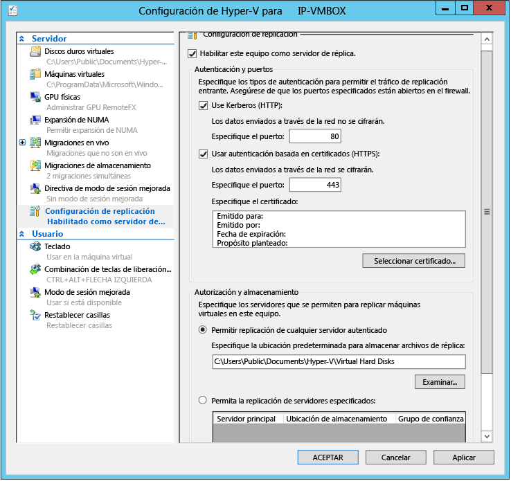

<properties
	pageTitle="Ejecución de la herramienta de planeación de capacidad de Hyper-V para Site Recovery | Microsoft Azure"
	description="Este artículo contiene instrucciones sobre cómo usar la herramienta de planeación de capacidad de Hyper-V en Azure Site Recovery"
	services="site-recovery"
	documentationCenter="na"
	authors="rayne-wiselman"
	manager="jwhit"
	editor="" />
<tags
	ms.service="site-recovery"
	ms.devlang="na"
	ms.topic="article"
	ms.tgt_pltfrm="na"
	ms.workload="storage-backup-recovery"
	ms.date="02/15/2016"
	ms.author="raynew" />

# Ejecución de la herramienta de planeación de capacidad de Hyper-V para Site Recovery

Como parte de la implementación de Azure Site Recovery, debe averiguar los requisitos de ancho de banda y replicación. La herramienta de planeación de capacidad de Hyper-V para Site Recovery lo ayuda a averiguar los requisitos de replicación y ancho de banda necesarios para replicar máquinas virtuales de Hyper-V.

En este artículo se describe cómo ejecutar esta herramienta. Esta herramienta debe utilizarse junto con la otras herramientas de planeación de capacidad y la información que se describe en [Planeación de la capacidad para la protección de la máquina virtual y del servidor físico en Azure Site Recovery](site-recovery-capacity-planner.md).

## Antes de comenzar

Ejecute la herramienta en un servidor de Hyper-V o el nodo de un clúster en su sitio principal. Para ejecutar la herramienta, los servidores host de Hyper-V necesitan:

- Sistema operativo: Windows Server ® 2012 o Windows Server ® 2012 R2
- Memoria: 20 MB (mínimo)
- CPU: sobrecarga del 5 por ciento (mínimo)
- Espacio en disco: 5 MB (mínimo)

Antes de ejecutar la herramienta, debe preparar el sitio principal. Si va a replicar entre dos sitios locales y desea comprobar el ancho de banda, debe preparar también un servidor de réplica.

## Paso 1: Preparar el sitio primario
1. En el sitio principal, confeccione una lista de todas las máquinas virtuales de Hyper-V que desee replicar y los hosts de Hyper-V o clústeres donde estén ubicadas. Se puede ejecutar la herramienta cada vez para varios hosts independientes o para un único clúster, pero no ambos juntos. Además, se debe ejecutar por separado para cada sistema operativo, por lo que debe agrupar los servidores de Hyper-V de la forma siguiente:

  - Servidores independientes de Windows Server® 2012
  - Clústeres de Windows Server® 2012
  - Servidores independientes de Windows Server® 2012 R2
  - Clústeres de Windows Server® 2012 R2

3. Habilite el acceso remoto a WMI en todos los hosts de Hyper-V y los clústeres. Ejecute este comando en cada servidor o clúster para asegurarse de que las reglas de firewall y los permisos de usuario estén establecidos:

        netsh firewall set service RemoteAdmin enable

5. Habilite la supervisión del rendimiento en servidores y clústeres, de la siguiente forma:

  - Abra el complemento Firewall de Windows con **seguridad avanzada** y después habilite las siguientes reglas de entrada: **Acceso a red COM+ (DCOM de entrada)** y todas las reglas en el **grupo Administración remota de registro de eventos**.

## Paso 2: Preparar un servidor de réplica (replicación entre dos sitios locales)

No es necesario hacer esto si va a replicar en Azure.

Se recomienda que configure un único host de Hyper-V como servidor de recuperación para que se pueda replicar una máquina virtual ficticia y así comprobar el ancho de banda. Puede pasar por alto esta acción pero no podrá medir el ancho de banda a menos que la complete.

1. Si desea usar un nodo de clúster como réplica, configure el agente de réplicas de Hyper-V:

	- En **Administrador del servidor**, abra **Administrador de clúster de conmutación por error**.
	- Conéctese al clúster, resalte el nombre del clúster y haga clic en **Acciones** > **Configurar rol** para abrir el Asistente para alta disponibilidad.
	- En **Seleccionar rol**, haga clic en **Agente de réplicas de Hyper-V**. En el asistente, proporcione la información de **Nombre de NetBIOS** y **Dirección IP** que se usará como punto de conexión con el clúster (denominado punto de acceso cliente). Se configurará el **Agente de réplicas de Hyper-V**, lo que proporciona un nombre de punto de acceso cliente que debe anotar.
	- Compruebe que el rol del agente de Réplica de Hyper-V se conecte correctamente y puede conmutar por error entre todos los nodos del clúster. Para ello, haga clic con el botón derecho del ratón en el rol, seleccione **Mover**, y, a continuación, haga clic en **Seleccionar nodo**. Seleccione un nodo > **Aceptar**.
	- Si usa la autenticación basada en certificados, asegúrese de que todos los nodos del clúster y el punto de acceso cliente tengan instalado el certificado.
2.  Habilite un servidor de réplica:

	- Para un clúster, abra el Administrador de clústeres de conmutación por error, conéctese al clúster y haga clic en **Roles** > seleccione el rol > **Configuración de la replicación** > **Habilitar este equipo como servidor de réplicas**. Tenga en cuenta que, si usa un clúster como réplica, el rol de Agente de réplicas de Hyper-V debe estar presente también en el clúster del sitio principal.
	- Para un servidor independiente, abra el Administrador de Hyper-V. En el panel **Acciones**, haga clic en **Configuración de Hyper-V** para el servidor que desea habilitar y, en **Configuración de replicación**, haga clic en **Habilitar este equipo como servidor de réplicas**.
3. Configure la autenticación:

	- En **Autenticación y puertos**, seleccione cómo autenticar el servidor principal y los puertos de autenticación. Si usa certificados, haga clic en **Seleccionar certificado** para seleccionar uno. Use Kerberos si el host de Hyper-V principal y el de recuperación se encuentran en el mismo dominio o en dominios de confianza. Use certificados si los dominios son diferentes o si la implementación es para un grupo de trabajo.
	- En la sección **Autorización y almacenamiento**, especifique si se permite que **cualquier** servidor autenticado (principal) envíe datos de replicación a este servidor de réplica. Haga clic en **Aceptar** o **Aplicar**.

	

	- Ejecute **netsh http show servicestate** para comprobar que el agente de escucha se esté ejecutando para el puerto y el protocolo especificados:  
4. Configure los firewalls. Durante la instalación de Hyper-V, se crean reglas de firewall para permitir el tráfico en los puertos predeterminados (HTTPS en 443, Kerberos en 80). Habilite estas reglas como se indica:

		- Certificate authentication on cluster (443): **Get-ClusterNode | ForEach-Object {Invoke-command -computername \$\_.name -scriptblock {Enable-Netfirewallrule -displayname "Hyper-V Replica HTTPS Listener (TCP-In)"}}**
		- Kerberos authentication on cluster (80): **Get-ClusterNode | ForEach-Object {Invoke-command -computername \$\_.name -scriptblock {Enable-Netfirewallrule -displayname "Hyper-V Replica HTTP Listener (TCP-In)"}}**
		- Certificate authentication on standalone server: **Enable-Netfirewallrule -displayname "Hyper-V Replica HTTPS Listener (TCP-In)"**
		- Kerberos authentication on standalone server: **Enable-Netfirewallrule -displayname "Hyper-V Replica HTTP Listener (TCP-In)"**

## Paso 3: Ejecutar la herramienta de programación de capacidad

Después de preparar el sitio principal y configurar un servidor de recuperación, puede ejecutar la herramienta.

1. [Descargue](https://www.microsoft.com/download/details.aspx?id=39057) la herramienta del Centro de descarga de Microsoft.
2. Ejecute la herramienta desde uno de los servidores principales (o uno de los nodos del clúster principal). Haga clic con el botón derecho del ratón en el archivo .exe y, a continuación, elija **Ejecutar como administrador**.
3. En **Before you begin** (Antes de comenzar), especifique durante cuánto tiempo desea recopilar datos. Se recomienda que ejecute la herramienta durante las horas de producción para asegurarse de que los datos sean representativos. Si solo desea validar la conectividad de red, puede recopilarlos solo durante un minuto.

	

4. En **Primary Site Details** (Detalles del sitio principal), especifique el nombre del servidor o el FQDN de un host independiente o, para un clúster, especifique el FQDN del punto de acceso cliente, el nombre de clúster o cualquier nodo del clúster y después haga clic en **Next** (Siguiente). La herramienta detecta automáticamente el nombre del servidor donde se ejecuta. La herramienta detecta las máquinas virtuales que se pueden supervisar para los servidores especificados.

	

5. En **Replica Site Details** (Detalles del sitio de réplica), si va a replicar en Azure o en un centro de datos secundario y aún no ha configurado un servidor de réplica, seleccione **Skip tests involving replica site** (Omitir pruebas con el sitio de réplica). Si va a replicar en un centro de datos secundario y ha configurado una réplica, escriba el FQDN del servidor independiente o el punto de acceso cliente para el clúster en **Server name (or) Hyper-V Replica Broker CAP** (Nombre de servidor o punto de acceso cliente del Agente de réplicas de Hyper-V).

	

6. En **Extended Replica Details** (Detalles de réplica extendida), habilite **Skip the tests involving Extended Replica site** (Omitir pruebas con el sitio de réplica extendida). No son compatibles con Site Recovery.
7. En **Choose VMs to Replicate** (Elegir máquinas virtuales para replicar), la herramienta se conecta al servidor o clúster y muestra las máquinas virtuales y los discos que se ejecutan en el servidor principal, según la configuración especificada en la página **Primary Site Details** (Detalles del sitio principal). Tenga en cuenta que no se mostrarán las máquinas virtuales que ya estén habilitadas para la replicación o que no se estén ejecutando. Seleccione las máquinas virtuales para las que desea recopilar métricas. Si selecciona los discos duros virtuales, se recopilan también los datos de las máquinas virtuales automáticamente.
9. Si ha configurado un servidor de réplica o un clúster, en **Network information** (Información de red), especifique el ancho de banda de WAN aproximado que cree que se usará entre el sitio principal y el de réplica, y seleccione los certificados si ha configurado la autenticación basada en certificados.

	

10. En **Summary** (Resumen), compruebe la configuración y haga clic en **Next** (Siguiente) para empezar a recopilar métricas. El progreso de la herramienta y el estado se muestran en la página **Calculate Capacity** (Calcular capacidad). Cuando se termine de ejecutar la herramienta, haga clic en **View Report** (Ver informe) para ver los resultados. De forma predeterminada, los informes y los registros se almacenan en **%systemdrive%\\Users\\Public\\Documents\\Capacity Planner**.

	

## Paso 4: Interpretar los resultados
Estas son las métricas importantes. Puede pasar por alto las que no aparezcan aquí, porque no son relevantes para Site Recovery.

### Replicación entre dos sitios locales
  - Impacto de la replicación en el proceso del host principal, memoria
  - Impacto de la replicación en el servidor principal, espacio de almacenamiento de hosts de recuperación, IOPS
  - Ancho de banda total necesario para la replicación delta (Mbps)
  - Ancho de banda de red observado entre el host primario y el host de recuperación (Mbps)
  - Sugerencia para el número ideal de transferencias paralelas activas entre dos hosts/clústeres

### Replicación desde un sitio local en Azure
  - Impacto de la replicación en el proceso del host principal, memoria
  - Impacto de la replicación en espacio de almacenamiento del host principal, IOPS
  - Ancho de banda total necesario para la replicación delta (Mbps)

## Más recursos

- Para ver información detallada acerca de la herramienta, lea el documento que acompaña a la descarga de la herramienta.
- Vea un tutorial de la herramienta en el [blog de TechNet](http://blogs.technet.com/b/keithmayer/archive/2014/02/27/guided-hands-on-lab-capacity-planner-for-windows-server-2012-hyper-v-replica.aspx) de Keith Mayer.
- [Obtenga los resultados](site-recovery-performance-and-scaling-testing-on-premises-to-on-premises.md) de nuestra prueba de rendimiento para la replicación de Hyper-V entre sitios locales.

## Pasos siguientes

Cuando haya terminado de planear la capacidad, puede comenzar a implementar Site Recovery:

- [Configuración de la protección entre un sitio de VMM local y Azure](site-recovery-vmm-to-azure.md)
- [Configuración de la protección entre un sitio de Hyper-V local y Azure](site-recovery-hyper-v-site-to-azure.md)
- [Configuración de la protección entre dos sitios VMM locales](site-recovery-vmm-to-vmm.md)
- [Configuración de la protección entre dos sitios de VMM locales con SAN](site-recovery-vmm-san.md)
- [Configuración de la protección con un único servidor VMM](site-recovery-single-vmm.md)

<!---HONumber=AcomDC_0218_2016-->