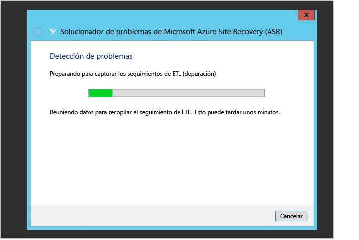

<properties
	pageTitle="Protección de supervisión y solución de problemas para las máquinas virtuales y los servidores físicos | Microsoft Auzre" 
	description="Azure Site Recovery coordina la replicación, la conmutación por error y la recuperación de máquinas virtuales ubicadas en servidores locales de Azure o en un centro de datos secundario. Use este artículo para supervisar y solucionar problemas de protección de sitios VMM o Hyper-V." 
	services="site-recovery" 
	documentationCenter="" 
	authors="anbacker" 
	manager="mkjain" 
	editor=""/>

<tags 
	ms.service="site-recovery" 
	ms.devlang="na"
	ms.topic="article"
	ms.tgt_pltfrm="na"
	ms.workload="storage-backup-recovery" 
	ms.date="12/14/2015" 
	ms.author="anbacker"/>
	
# Protección de supervisión y solución de problemas para las máquinas virtuales y los servidores físicos

Esta guía de solución de problemas y supervisión le permite aprender el seguimiento del estado de replicación y técnicas de solución de recuperación de Azure Site Recovery.

## Descripción de los componentes

### Implementación del sitio de VMware/físico para la replicación entre una ubicación local y Azure.
Para configurar la recuperación ante desastres entre la máquina de VMware/físicas local; es necesario configurar el servidor de configuración, el destino maestro y el servidor en proceso. Al habilitar la protección del servidor de origen, Azure Site Recovery instalará el servicio de movilidad. Tras la interrupción local, en cuanto el servidor de origen efectúa la conmutación por error en Azure, el cliente necesita configurar un servidor en proceso en Azure y un servidor de destino maestro localmente para proteger al servidor de origen para que se reconstruya localmente.

### Implementación del sitio de VMM para la replicación entre el sitio local.

Como parte de la configuración de la recuperación ante desastres entre dos ubicaciones locales, es necesario descargar el proveedor de Azure Site Recovery Provider e instalarlo en el servidor VMM. El proveedor necesita conectividad a Internet para asegurarse de que todas las operaciones desencadenadas desde el Portal de Azure se traducen en operaciones locales como habilitar la protección, el apagado de máquinas de lado principal como parte de las conmutaciones por error etc.

### Implementación del sitio de VMM para la replicación entre el sitio local y Azure.

Como parte de la configuración de la recuperación ante desastres entre el sitio local local y Azure; es necesario descargar e instalar el proveedor de Azure Site Recovery Provider en el servidor VMM junto con el agente de Servicios de recuperación de Azure que debe instalarse en cada host de Hyper-V. Consulte [Descripción de la protección del sitio de Azure](./site-recovery-understanding-site-to-azure-protection.md) para obtener más información.

### Implementación del sitio de Hyper-V para la replicación entre el sitio local y Azure

Es igual que el de implementación de VMM, con la única diferencia de que los proveedores y agentes se instalan en el propio host de Hyper-V. Consulte [Descripción de la protección del sitio de Azure](./site-recovery-understanding-site-to-azure-protection.md) para obtener más información.

## Supervisar las operaciones de configuración, protección y recuperación

Cada operación de ASR se audita y se rastre en la ficha "TRABAJOS". En el caso de cualquier error de configuración, protección o recuperación, navegue hasta la ficha TRABAJOS y consulte si hay errores.

Una vez que encuentre errores en la vista de TRABAJOS, seleccione el TRABAJO y haga clic en DETALLES DEL ERROR correspondiente a ese trabajo.

Los detalles del error le ayudarán a identificar la causa posible y la recomendación para el problema.

En el caso anterior parece haber otra operación que está en curso debido a la que la falla la configuración de protección. Asegúrese de resolver el problema según la recomendación: a continuación, haga clic en REINICIAR para volver a iniciar la operación.

La opción de REINICIAR no está disponible para todas las operaciones: para las que no tienen la opción de REINICIAR, regrese al objeto y vuelva a realizar la operación. Cada TRABAJO se puede cancelar en cualquier momento mientras se ejecuta mediante el botón de CANCELAR.

## Supervisar el estado de replicación de la máquina virtual

Supervisión central y remota del proveedor ASR a través del Portal de Azure para cada una de las entidades protegidas. Desplácese hasta los ELEMENTOS PROTEGIDOS. A continuación, seleccione NUBES de VMM o GRUPOS DE PROTECCIÓN. La pestaña NUBES de VMM es solo para implementaciones de VMM y todos los demás escenarios tienen las entidades protegidas en la ficha GRUPOS DE PROTECCIÓN.

A continuación, seleccione la entidad protegida en la nube correspondiente o en el grupo de protección. Una vez seleccionada la entidad protegida, se muestran todas las operaciones permitidas en el panel inferior.

Como se indicó anteriormente en «El ESTADO de la máquina virtual es crítico», puede hacer clic en el botón DETALLES DEL ERROR de la parte inferior para ver el error. Resuelva el problemas en función de lo indicado en "Causas posibles" y "Recomendaciones".

Nota: Si hay operaciones activas que están en curso o con errores, a continuación, navegue a la vista de TRABAJOS como se mencionó anteriormente, para ver el error específico del TRABAJO.

## Solucionar problemas de Hyper-V locales

Conéctese a la consola del administrador de Hyper-V local, seleccione la máquina virtual y visualice el estado de replicación.

En este caso *Estado de replicación* se indica como crítico: *Ver el estado de replicación* para ver los detalles.

En los casos en los que la replicación se pause para la máquina virtual, haga clic con el botón derecho en *Seleccionar replicación*->*Reanudar replicación* 

En el caso de que la máquina virtual se migre a un nuevo host de Hyper-V (dentro del clúster o una máquina independiente), que se configuró a través de ASR, la replicación de la máquina virtual no se verá afectada. Asegúrese de que el nuevo host de Hyper-V cumple todos los requisitos previos y se configura mediante ASR.

### Registro de eventos

| Orígenes de eventos | Detalles |
|-------------------------	|:------------------------------------------------------------------------------------------------------------------------------------------------------------------------------------------------------	|
| **Registros de aplicaciones y servicios/Microsoft/VirtualMachineManager/Server/Admin** (Servidor VMM) | Ofrece un registro útil para solucionar muchos problemas distintos de VMM. |
| **Registros de aplicaciones y servicios/MicrosoftAzureRecoveryServices/Replication** (Host de Hyper-V) | Ofrece un registro útil para solucionar muchos problemas del agente de Servicios de recuperación de Microsoft Azure.    |
| **Registros de aplicaciones y servicios/Microsoft/Azure Site Recovery/Provider/Operational** (Host de Hyper-V) | Ofrece un registro útil para solucionar muchos problemas del servicio Microsoft Azure Site Recovery.    |
| **Registros de aplicaciones y servicios/Microsoft/Windows/Hyper-V-VMMS/Admin** (Host de Hyper-V) | Ofrece un registro útil para solucionar muchos problemas de administración de máquinas virtuales de Hyper-V.    |

### Opciones de registro de Replicación de Hyper-V

Todos los eventos relacionados con la Réplica de Hyper-V se registran en el registro de Hyper-V-VMMS\\Admin ubicado en **Registros de aplicaciones y servicios\\Microsoft\\Windows**. Además, puede habilitarse un registro analítico para Hyper-V-VMMS. Para habilitar este registro, asegúrese primero de que los registros analíticos y de depuración puedan verse en el Visor de eventos. Abra el Visor de eventos y, a continuación, en el **menú Ver**, haga clic en **Mostrar registros analíticos y de depuración**.

Puede verse un registro analítico en Hyper-V-VMMS

En el panel **Acciones**, haga clic en **Habilitar registro**. Una vez habilitado, aparece en **Monitor de rendimiento** como una sesión de seguimiento de eventos situada en **Conjuntos de recopiladores de datos.**

Para ver la información recopilada, primero detenga la sesión de seguimiento deshabilitando el registro y, a continuación, guarde el registro y vuelva a abrirlo en el Visor de eventos o use otras herramientas para convertirlo según sea necesario.

## Contacto con el soporte técnico de Microsoft

### Recopilación de registros

Para Protección de sitios VMM, consulte [Recopilación del registro de ASR usando la herramienta de diagnóstico de soporte técnico (SDP)](http://social.technet.microsoft.com/wiki/contents/articles/28198.asr-data-collection-and-analysis-using-the-vmm-support-diagnostics-platform-sdp-tool.aspx) para recopilar los registros necesarios.

Para la protección del sitio de Hyper-V, descargue la [herramienta](https://dcupload.microsoft.com/tools/win7files/DIAG_ASRHyperV_global.DiagCab) y ejecútela en el host de Hyper-V para recopilar los registros.

Para escenarios de VMware/físicos, consulte [Colección de registros de Azure Site Recovery para la protección de sitios de VMware y físicos](http://social.technet.microsoft.com/wiki/contents/articles/30677.azure-site-recovery-log-collection-for-vmware-and-physical-site-protection.aspx) para recopilar los registros necesarios.

La herramienta recopila los registros localmente en una subcarpeta de nombre aleatorio que se sitúa en **%LocalAppData%\\ElevatedDiagnostics**

### Apertura de una incidencia de soporte técnico

Para elevar la incidencia de soporte técnico para ASR, contacte con el soporte técnico de Azure a través de la dirección URL <http://aka.ms/getazuresupport>

## Artículos de Knowledge Base

-   [Conservación de la letra de la unidad para máquinas virtuales protegidas que se conmutaron por error o se migraron a Azure](http://support.microsoft.com/kb/3031135)
-   [Administración del uso de ancho de banda de red de protección de instalaciones locales a Azure](https://support.microsoft.com/kb/3056159)
-   [ASR: Error "No se encontró el recurso de clúster" al intentar habilitar la protección de una máquina virtual](http://support.microsoft.com/kb/3010979)
-   [Guía de descripción y solución de problemas de Réplica de Hyper-V](http://www.microsoft.com/en-in/download/details.aspx?id=29016) 

## Errores de ASR comunes y sus soluciones

A continuación se muestran los errores comunes con los que se puede encontrar y sus soluciones. Cada uno de los errores se documenta en una página WIKI independiente.

### General
-   NUEVO [Trabajos que presentan el error "Operación en curso". Error 505, 514, 532](http://social.technet.microsoft.com/wiki/contents/articles/32190.azure-site-recovery-jobs-failing-with-error-an-operation-is-in-progress-error-505-514-532.aspx)
-   NUEVO [Trabajos que presentan el error "Servidor no conectado a Internet". Error 25018](http://social.technet.microsoft.com/wiki/contents/articles/32192.azure-site-recovery-jobs-failing-with-error-server-isn-t-connected-to-the-internet-error-25018.aspx)

### Configuración
-   [No se puede registrar el servidor VMM debido a un error interno. Consulte la vista de trabajos en el Portal de Site Recovery para obtener más detalles sobre el error. Ejecute el programa de instalación para registrar el servidor.](http://social.technet.microsoft.com/wiki/contents/articles/25570.the-vmm-server-cannot-be-registered-due-to-an-internal-error-please-refer-to-the-jobs-view-in-the-site-recovery-portal-for-more-details-on-the-error-run-setup-again-to-register-the-server.aspx)
-   [No se puede establecer una conexión con el almacén del Administrador de recuperación de Hyper-V. Compruebe la configuración de proxy o inténtelo de nuevo más tarde.](http://social.technet.microsoft.com/wiki/contents/articles/25571.a-connection-cant-be-established-to-the-hyper-v-recovery-manager-vault-verify-the-proxy-settings-or-try-again-later.aspx)

### Configuración
-   [No se puede crear el grupo de protección: hubo un error al recuperar la lista de servidores](http://blogs.technet.com/b/somaning/archive/2015/08/12/unable-to-create-the-protection-group-in-azure-site-recovery-portal.aspx).
-   [El clúster de hosts de Hyper-V contiene al menos un adaptador de red estático o no hay adaptadores conectados configurados para usar DHCP.](http://social.technet.microsoft.com/wiki/contents/articles/25498.hyper-v-host-cluster-contains-at-least-one-static-network-adapter-or-no-connected-adapters-are-configured-to-use-dhcp.aspx)
-   [VMM no dispone de permisos para completar una acción](http://social.technet.microsoft.com/wiki/contents/articles/31110.vmm-does-not-have-permissions-to-complete-an-action.aspx)
-   [Imposible seleccionar la cuenta de almacenamiento dentro de la suscripción durante la configuración de protección](http://social.technet.microsoft.com/wiki/contents/articles/32027.can-t-select-the-storage-account-within-the-subscription-while-configuring-protection.aspx)

### Protección
- NUEVO [Habilitar protección presenta el error "No se pudo configurar la protección para la máquina virtual". Error 60007, 40003](http://social.technet.microsoft.com/wiki/contents/articles/32194.azure-site-recovery-enable-protection-failing-with-error-protection-couldn-t-be-configured-for-the-virtual-machine-error-60007-40003.aspx)
- NUEVO [Habilitar protección presenta el error "No se pudo habilitar la protección para la máquina virtual". Error 70094](http://social.technet.microsoft.com/wiki/contents/articles/32195.azure-site-recovery-enable-protection-failing-with-error-protection-couldn-t-be-enabled-for-the-virtual-machine-error-70094.aspx)
- NEW [Error de migración en vivo 23848: La máquina virtual se va a mover con el tipo Live. Esto podría afectar al estado de protección de la recuperación de la máquina virtual.](http://social.technet.microsoft.com/wiki/contents/articles/32021.live-migration-error-23848-the-virtual-machine-is-going-to-be-moved-using-type-live-this-could-break-the-recovery-protection-status-of-the-virtual-machine.aspx) 
- [Error en la habilitación de la protección, ya que el agente no está instalado en el equipo host](http://social.technet.microsoft.com/wiki/contents/articles/31105.enable-protection-failed-since-agent-not-installed-on-host-machine.aspx)
- [No se puede encontrar un host adecuado para la máquina virtual de réplica debido a unos recursos de proceso bajos](http://social.technet.microsoft.com/wiki/contents/articles/25501.a-suitable-host-for-the-replica-virtual-machine-can-t-be-found-due-to-low-compute-resources.aspx)
- [No se puede encontrar un host adecuado para la máquina virtual de réplica debido a que no se conectó una red lógica](http://social.technet.microsoft.com/wiki/contents/articles/25502.a-suitable-host-for-the-replica-virtual-machine-can-t-be-found-due-to-no-logical-network-attached.aspx)
- [No se puede conectar a la máquina host de réplica: no se pudo establecer la conexión](http://social.technet.microsoft.com/wiki/contents/articles/31106.cannot-connect-to-the-replica-host-machine-connection-could-not-be-established.aspx)

### Recuperación
- VMM no puede completar la operación de host:
    -   [Conmutación por error en el punto de recuperación seleccionado para la máquina virtual: error de acceso general denegado.](http://social.technet.microsoft.com/wiki/contents/articles/25504.fail-over-to-the-selected-recovery-point-for-virtual-machine-general-access-denied-error.aspx)
    -   [No se pudo conmutar por error Hyper-V al punto de recuperación seleccionado para la máquina virtual: operación anulada, pruebe un punto de recuperación más reciente. (0x80004004)](http://social.technet.microsoft.com/wiki/contents/articles/25503.hyper-v-failed-to-fail-over-to-the-selected-recovery-point-for-virtual-machine-operation-aborted-try-a-more-recent-recovery-point-0x80004004.aspx)
    -   No se pudo establecer una conexión con el servidor (0x00002EFD)
        -   [Error de Hyper-V al habilitar la replicación inversa para la máquina virtual](http://social.technet.microsoft.com/wiki/contents/articles/25505.a-connection-with-the-server-could-not-be-established-0x00002efd-hyper-v-failed-to-enable-reverse-replication-for-virtual-machine.aspx)
        -   [Error de Hyper-V al habilitar la replicación para la máquina virtual](http://social.technet.microsoft.com/wiki/contents/articles/25506.a-connection-with-the-server-could-not-be-established-0x00002efd-hyper-v-failed-to-enable-replication-for-virtual-machine-virtual-machine.aspx)
    -   [No se puede confirmar la conmutación por error de la máquina virtual](http://social.technet.microsoft.com/wiki/contents/articles/25508.could-not-commit-failover-for-virtual-machine.aspx)
-   [El plan de recuperación contiene máquinas virtuales que no están listas para la conmutación por error planeada](http://social.technet.microsoft.com/wiki/contents/articles/25509.the-recovery-plan-contains-virtual-machines-which-are-not-ready-for-planned-failover.aspx)
-   [La máquina virtual no está lista para la conmutación por error planeada](http://social.technet.microsoft.com/wiki/contents/articles/25507.the-virtual-machine-isn-t-ready-for-planned-failover.aspx)
-   [La máquina virtual no se está ejecutando y no está apagada](http://social.technet.microsoft.com/wiki/contents/articles/25510.virtual-machine-is-not-running-and-is-not-powered-off.aspx)
-   [Se produjo una operación fuera de banda en una máquina virtual y no se realizó la conmutación por error](http://social.technet.microsoft.com/wiki/contents/articles/25507.the-virtual-machine-isn-t-ready-for-planned-failover.aspx).
-   Test Failover
    -   [No se pudo iniciar la conmutación por error ya que la conmutación por error de prueba está en curso](http://social.technet.microsoft.com/wiki/contents/articles/31111.failover-could-not-be-initiated-since-test-failover-is-in-progress.aspx)

### Servidor de configuración, Servidor de proceso y Destino principal
Servidor de configuración (CS), Servidor de procesos (PS) y Destino maestro (MT): [el host ESXi en el que se hospeda el PS/CS como máquina virtual produce un error con una pantalla morada.](http://social.technet.microsoft.com/wiki/contents/articles/31107.vmware-esxi-host-experiences-a-purple-screen-of-death.aspx)

### Solución de problemas del escritorio remoto después de la conmutación por error
-   Muchos clientes tienen que afrontar problemas para conectarse a máquina virtual con conmutación por error en Azure. [Uso del documento de solución de problemas para RDP en la máquina virtual](http://social.technet.microsoft.com/wiki/contents/articles/31666.troubleshooting-remote-desktop-connection-after-failover-using-asr.aspx)

<!-----HONumber=AcomDC_1217_2015-->