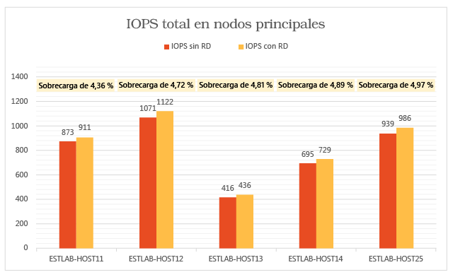
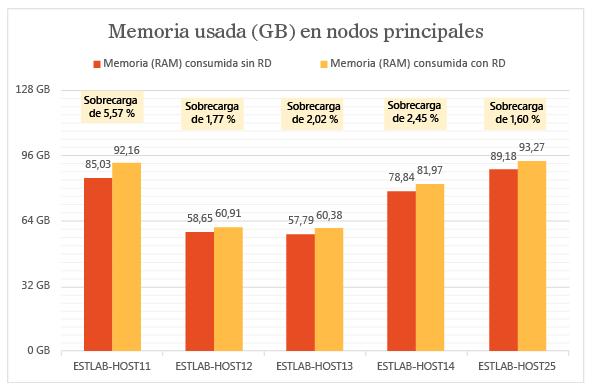
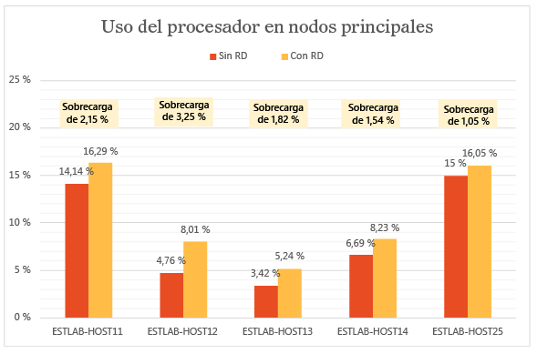
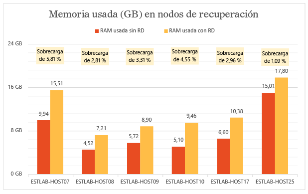
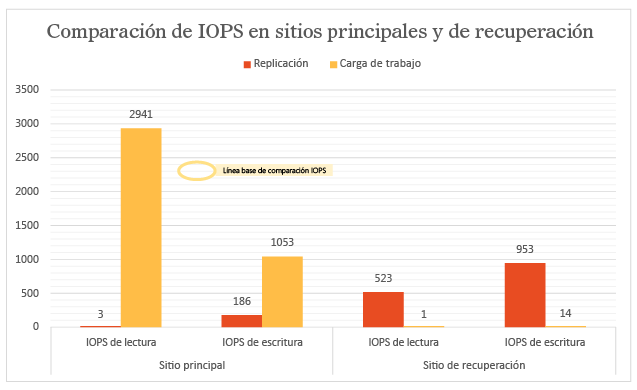
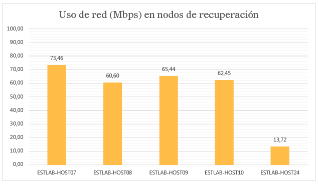
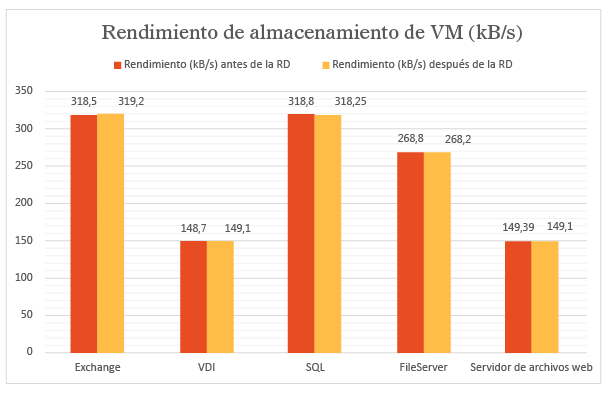
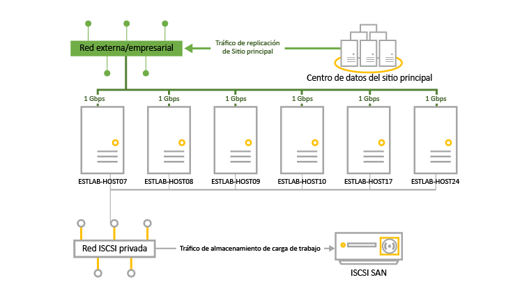

<properties
	pageTitle="Resultados de escalado y pruebas de rendimiento de la replicación de Hyper-V entre sitios locales con Site Recovery | Microsoft Azure"
	description="Este artículo proporciona información acerca de la prueba de rendimiento de replicación entre dos sitios locales con Azure Site Recovery."
	services="site-recovery"
	documentationCenter=""
	authors="rayne-wiselman"
	manager="jwhit"
	editor="tysonn"/>

<tags
	ms.service="site-recovery"
	ms.devlang="na"
	ms.topic="article"
	ms.tgt_pltfrm="na"
	ms.workload="storage-backup-recovery"
	ms.date="12/14/2015"
	ms.author="raynew"/>

# Resultados de escalado y pruebas de rendimiento de la replicación de Hyper-V entre sitios locales con Site Recovery.

Puede usar Microsoft Azure Site Recovery para organizar y administrar la replicación de máquinas virtuales y servidores físicos en Azure, o en un centro de datos secundario. Este artículo proporciona los resultados de pruebas de rendimiento que obtuvimos al replicar máquinas virtuales de Hyper-V entre dos centros de datos locales.

## Información general

El objetivo de la prueba era examinar cómo funciona Azure Site Recovery durante la replicación de estado estable. La replicación de estado estable se produce cuando se ha completado la replicación inicial de máquinas virtuales y se sincronizan los cambios diferenciales. Es importante medir el rendimiento mediante el estado estable porque es el estado en el que la mayoría de las máquinas virtuales permanece, a menos que se produzcan interrupciones inesperadas.

La implementación de prueba estaba formada por dos sitios locales con un servidor VMM en cada sitio. Esta implementación de prueba es típica de una implementación de la oficina central y sucursales, donde la oficina central actúa como el sitio principal y la sucursal como el sitio secundario o de recuperación.

### ¿Qué hicimos?

Aquí está lo que hicimos en la prueba superada:

1. Cree máquinas virtuales mediante plantillas de VMM.

1. Inicie las máquinas virtuales y capture las métricas de rendimiento de línea de base más de 12 horas.

1. Nubes creadas en servidores VMM principal y de recuperación.

1. Configure la protección de la nube en Azure Site Recovery, incluida la asignación de nubes de origen y de recuperación.

1. Habilite la protección de las máquinas virtuales y permitirles completar la replicación inicial.

1. Espere un par de horas a que se haga la estabilización del sistema.

1. Capture las métricas de rendimiento más de 12 horas para asegurarse de que todas las máquinas virtuales permanecen en un estado de replicación previsto durante esas 12 horas.

1. Mida la diferencia entre las métricas de rendimiento de línea de base y las métricas de rendimiento de replicación.

## Resultados de la implementación de prueba

### Rendimiento del servidor principal

- La réplica de Hyper-V realiza un seguimiento asincrónico de los cambios en un archivo de registro con una sobrecarga de almacenamiento mínima en el servidor principal.

- La réplica de Hyper-V utiliza la memoria caché de mantenimiento automático para minimizar la sobrecarga de IOPS para el seguimiento. Almacena escrituras en el VHDX en la memoria y las vacía en el archivo de registro antes de que el registro se envíe al sitio de recuperación. También se produce un vaciado en disco si las escrituras alcanzan un límite predeterminado.

- El gráfico siguiente muestra la sobrecarga IOPS del estado estable para la replicación. Podemos ver que, debido a la replicación, la sobrecarga IOPS es aproximadamente un 5%, que es bastante bajo.

La réplica de Hyper-V utiliza la memoria del servidor principal para optimizar el rendimiento de disco. Como se muestra en el siguiente gráfico, la sobrecarga de memoria en todos los servidores del clúster principal es marginal. La sobrecarga de memoria mostrada es el porcentaje de memoria utilizado por la replicación con respecto a la memoria total instalada en el servidor de Hyper-V.

La réplica de Hyper-V tiene una sobrecarga de CPU como mínimo. Como se muestra en el gráfico, la sobrecarga de replicación está en el intervalo de % 2-3%.

### Rendimiento del servidor secundario (recuperación)

La réplica de Hyper-V usa una pequeña cantidad de memoria en el servidor de recuperación para optimizar el número de operaciones de almacenamiento. El gráfico resume el uso de la memoria en el servidor de recuperación. La sobrecarga de memoria mostrada es el porcentaje de memoria utilizado por la replicación con respecto a la memoria total instalada en el servidor de Hyper-V.

La cantidad de operaciones de E/S en el sitio de recuperación es una función del número de operaciones de escritura en el sitio principal. Veamos el total de operaciones de E/S en el sitio de recuperación en comparación con el total de operaciones de E/S y las operaciones de escritura en el sitio principal. Los gráficos muestran que el total de IOPS en el sitio de recuperación es

- Alrededor de 1,5 veces la IOPS de escritura en el servidor principal.

- Alrededor del 37% del número total de IOPS en el sitio principal.

### Efecto de la replicación en la utilización de la red

Se usó un promedio de 275 MB por segundo de ancho de banda de la red entre los nodos principal y de recuperación (con compresión habilitada) con un ancho de banda existente de 5 GB por segundo.

### Efecto de la replicación en el rendimiento de la máquina virtual

Una consideración importante es el impacto de la replicación en las cargas de trabajo de producción que se ejecutan en las máquinas virtuales. Si el sitio principal está adecuadamente aprovisionado para replicación, no debe haber ningún impacto en las cargas de trabajo. El mecanismo de seguimiento ligero de la réplica de Hyper-V garantiza que las cargas de trabajo que se ejecutan en las máquinas virtuales no se vean afectadas durante la replicación en estado estable. Esto se muestra en los siguientes gráficos.

Este gráfico muestra el IOPS realizado por máquinas virtuales que ejecutan distintas cargas de trabajo antes y después de habilitar la replicación. Puede observar que no hay ninguna diferencia entre los dos.

El siguiente gráfico muestra el rendimiento de las máquinas virtuales que ejecutan distintas cargas de trabajo antes y después de habilitar la replicación. Puede observar que la replicación no tiene ningún impacto significativo.

### Conclusión

Los resultados muestran claramente que Azure Site Recovery, junto con la réplica de Hyper-V, se escala bien con una sobrecarga mínima para un clúster grande. Azure Site Recovery proporciona una implementación, replicación, administración y supervisión simples. La réplica de Hyper-V proporciona la infraestructura necesaria para el escalado de replicación correcta. Para planear una implementación óptima, sugerimos descargar el [Programador de capacidad de la réplica de Hyper-V](https://www.microsoft.com/download/details.aspx?id=39057).

## Detalles del entorno de la prueba

### Sitio principal

- El sitio principal tiene un clúster que contiene cinco servidores de Hyper-V que ejecutan 470 máquinas virtuales.

- Las máquinas virtuales ejecutan distintas cargas de trabajo y todas tienen habilitada la protección de Azure Site Recovery.

- Un SAN iSCSI proporciona el almacenamiento para el nodo de clúster. Modelo: Hitachi HUS130.

- Cada servidor del clúster tiene cuatro tarjetas de red (NIC) de un Gbps cada una.

- Dos de las tarjetas de red están conectadas a una red privada iSCSI y dos están conectadas a una red de empresa externa. Una de las redes externas está reservada solo para las comunicaciones del clúster.

|Server|RAM|Modelo|Procesador|Número de procesadores|NIC|Software|
|---|---|---|---|---|---|---|
|Servidores de Hyper-V en clúster:  ESTLAB-HOST11 ESTLAB-HOST12 ESTLAB-HOST13 ESTLAB-HOST14 ESTLAB-HOST25|128ESTLAB-HOST25 tiene 256|Dell ™ PowerEdge ™ R820|Intel(R) Xeon(R) CPU E5-4620 0 a 2,20 GHz|4|I Gbps x 4|Windows Server Datacenter 2012 R2 (x64) + rol de Hyper-V|
|Servidor VMM|2|||2|1 Gbps|Windows Server Database 2012 R2 (x 64) + VMM 2012 R2|

### Sitio secundario (recuperación)

- El sitio secundario tiene un clúster de conmutación por error de seis nodos.

- Un SAN iSCSI proporciona el almacenamiento para el nodo de clúster. Modelo: Hitachi HUS130.

|Server|RAM|Modelo|Procesador|Número de procesadores|NIC|Software|
|---|---|---|---|---|---|---|
|Servidores de Hyper-V en clúster:  ESTLAB-HOST07 ESTLAB-HOST08 ESTLAB-HOST09 ESTLAB-HOST10|96|Dell ™ PowerEdge ™ R720|Intel(R) Xeon(R) CPU E5-2630 0 a 2,30 GHz|2|I Gbps x 4|Windows Server Datacenter 2012 R2 (x64) + rol de Hyper-V|
|ESTLAB-HOST17|128|Dell ™ PowerEdge ™ R820|Intel(R) Xeon(R) CPU E5-4620 0 a 2,20 GHz|4||Windows Server Datacenter 2012 R2 (x64) + rol de Hyper-V|
|ESTLAB-HOST24|256|Dell ™ PowerEdge ™ R820|Intel(R) Xeon(R) CPU E5-4620 0 a 2,20 GHz|2||Windows Server Datacenter 2012 R2 (x64) + rol de Hyper-V|
|Servidor VMM|2|||2|1 Gbps|Windows Server Database 2012 R2 (x 64) + VMM 2012 R2|

### Cargas de trabajo del servidor

- Para fines de prueba, elegimos cargas de trabajo que se utilizan normalmente en escenarios de clientes de empresa.

- Utilizamos [IOMeter](http://www.iometer.org) con la característica de carga de trabajo resumida en la tabla para la simulación.

- Todos los perfiles de IOMeter se establecen para escribir bytes aleatorios para simular el peor de los patrones de escritura de las cargas de trabajo.

|Carga de trabajo|Tamaño de E/S (KB)|% de acceso|% de lectura|Operaciones de E/s pendientes|Patrón de E/S|
|---|---|---|---|---|---|
|Servidor de archivos|48163264|60% 20 %5 %5% 10%|80% de 80 80% 80% 80%|88888|Todos 100% aleatorios|
|SQL Server (volumen 1) SQL Server (volumen 2)|864|100% 100%|70% %0|88|100% aleatorio 100% secuencial|
|Exchange|32|100%|67%|8|100% aleatorio|
|Estación de trabajo/VDI|464|66% 34%|70% 95%|11|Los dos 100% aleatorios|
|Servidor de archivos web|4864|33% 34% 33%|95% 95 95%|888|Todos 75% aleatorios|

### Configuración de la máquina virtual

- 470 máquinas virtuales en el clúster principal.

- Todas las máquinas virtuales con disco VHDX.

- Máquinas virtuales que ejecutan cargas de trabajo resumidas en la tabla. Todas se crearon con plantillas de VMM.

|Carga de trabajo|N.º de máquinas virtuales|RAM mínima (GB)|RAM máxima (GB)|Tamaño de disco lógico (GB) por máquina virtual|Número máximo de IOPS|
|---|---|---|---|---|---|
|SQL Server|51|1|4|167|10|
|Exchange Server|71|1|4|552|10|
|Servidor de archivos|50|1|2|552|22|
|VDI|149|0,5|1|80|6|
|Servidor Web|149|0,5|1|80|6|
|TOTAL|470|||96,83 TB|4108|

### Configuración de Azure Site Recovery

- Azure Site Recovery se configuró para la protección de local a local

- El servidor VMM tiene configuradas cuatro nubes, que contienen los servidores del clúster de Hyper-V y sus máquinas virtuales.

|Nube de VMM principal|Máquinas virtuales protegidas en la nube|Frecuencia de replicación|Puntos de recuperación adicionales|
|---|---|---|---|
|PrimaryCloudRpo15m|142|15 minutos|None|
|PrimaryCloudRpo30s|47|30 segundos|None|
|PrimaryCloudRpo30sArp1|47|30 segundos|1|
|PrimaryCloudRpo5m|235|5 minutos|None|

### Métricas de rendimiento

La tabla resume las métricas de rendimiento y contadores que se midieron en la implementación.

|Métrica|Contador|
|---|---|
|CPU|\\Procesador(\_Total)\\% Hora del procesador|
|Memoria disponible|\\Memoria\\MB disponibles|
|E/S|\\Disco físico(\_Total)\\Transferencias de disco/s|
|Operaciones de lectura de VM por segundo (E/S)/s|\\Dispositivo de almacenamiento virtual de Hyper-V(<VHD>)\\Operaciones de lectura/s|
|Operaciones de escritura de VM por segundo (E/S)/s|\\Dispositivo de almacenamiento virtual de Hyper-V(<VHD>)\\Operaciones de escritura/s|
|Rendimiento de lectura de VM|\\Dispositivo de almacenamiento virtual de Hyper-V(<VHD>)\\Bytes leídos/s|
|Rendimiento de escritura de VM|\\Dispositivo de almacenamiento virtual de Hyper-V(<VHD>)\\Bytes escritos/s|

## Pasos siguientes

- [Configuración de la protección entre dos sitios VMM locales](site-recovery-vmm-to-vmm.md)

<!---HONumber=AcomDC_0218_2016-->