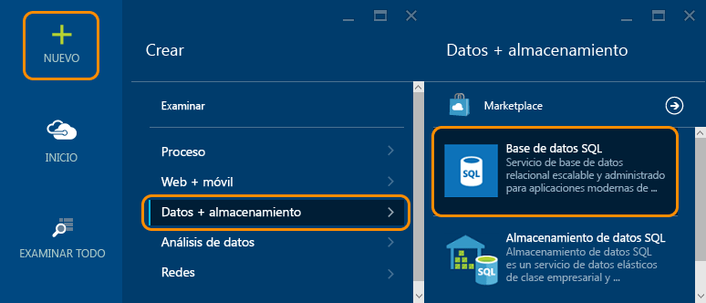
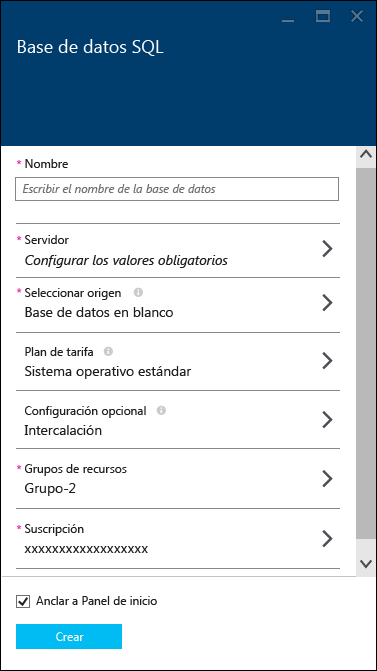
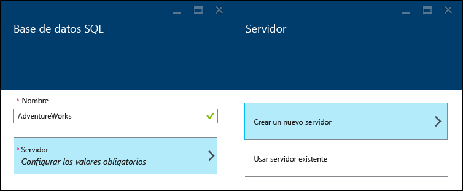
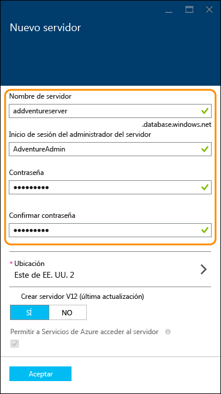
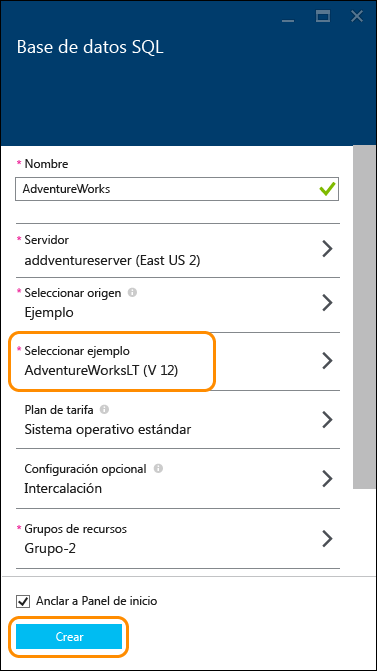
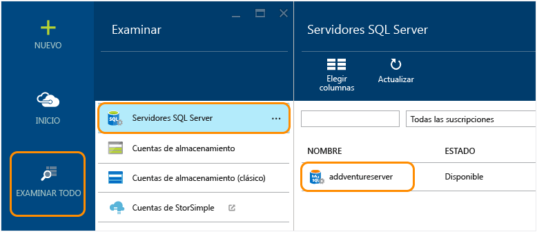
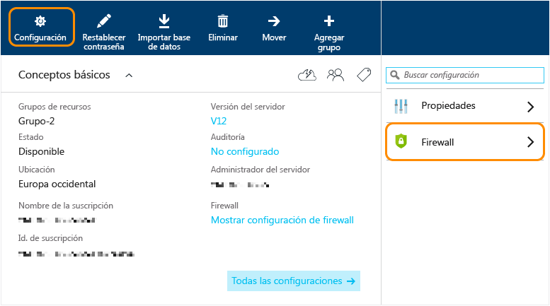
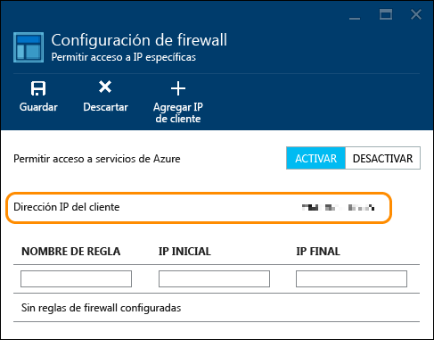
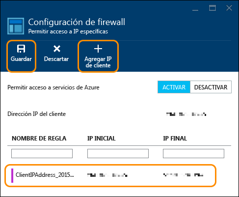

<properties
	pageTitle="Tutorial de Base de datos SQL: creación de una base de datos SQL | Microsoft Azure"
	description="Tutorial de Base de datos SQL: creación de una primera Base de datos SQL en cuestión de minutos en el Portal de Azure con datos de ejemplo. Aprenda cómo configurar una regla de firewall y el servidor de hospedaje."
	keywords="tutorial de base de datos SQL,creación de una base de datos SQL"
	services="sql-database"
	documentationCenter=""
	authors="jeffgoll"
	manager="jeffreyg"
	editor="cgronlun"/>

<tags
	ms.service="sql-database"
	ms.workload="data-management"
	ms.tgt_pltfrm="na"
	ms.devlang="na"
	ms.topic="hero-article"
	ms.date="12/01/2015"
	ms.author="jeffreyg"/>

# Tutorial de Base de datos SQL: creación de una Base de datos SQL en cuestión de minutos con datos de ejemplo y el Portal de Azure

**Base de datos única**

> [AZURE.SELECTOR]
- [Azure portal](sql-database-get-started.md)
- [C#](sql-database-get-started-csharp.md)
- [PowerShell](sql-database-get-started-powershell.md)

Este tutorial de Base de datos SQL muestra cómo crear una primera Base de datos SQL en solo unos minutos con datos de ejemplo en el Portal de Azure. Aprenderá a:

- Crear un servidor para hospedar la base de datos que cree y, luego, configurar una regla de firewall para él.
- Crear una Base de datos SQL a partir de un ejemplo de AdventureWorks, que tiene datos con los que puede jugar.

Necesitará una cuenta de Azure y una suscripción antes de empezar. Si no tiene una, suscríbase para [una prueba gratuita](https://azure.microsoft.com/pricing/free-trial/).

> [AZURE.NOTE] Este tutorial de Base de datos SQL describe la configuración de la base de datos mediante el sistema de administración de base de datos relacional de Microsoft (RDBMS) en la nube, Base de datos SQL de Azure. Otra opción consiste en ejecutar un servidor SQL Server en una máquina virtual de Azure. Consulte en [Descripción de Base de datos SQL de Azure y SQL Server en Máquinas virtuales de Azure](data-management-azure-sql-database-and-sql-server-iaas.md) una comparación rápida, o bien consulte [Aprovisionamiento de una máquina virtual de SQL Server](virtual-machines-provision-sql-server.md) para comenzar a usar una máquina virtual.

## Paso 1: Iniciar sesión y comenzar a configurar la Base de datos SQL.
1. Inicie sesión en el [Portal de Azure](https://portal.azure.com/).
2. Haga clic en **Nuevo** > **Datos + almacenamiento** > **Base de datos SQL**.

	

	En la hoja de configuración **Base de datos SQL** que aparece podrá configurar la información del servidor y de la base de datos.

	

## Paso 2: Seleccionar la configuración del servidor.
Una base de datos SQL de Azure reside en un servidor de base de datos. Un servidor puede hospedar varias bases de datos. Al configurar una base de datos, también puede crear y configurar el servidor que va a hospedarla, o puede usar uno que creó anteriormente. Configuraremos uno nuevo.

1. Escriba un **Nombre** para la base de datos (usaremos **AdventureWorks**). Volveremos a tratar la configuración de la base de datos más adelante.
2. En **Servidor**, haga clic en **Configurar los valores obligatorios** y, luego, haga clic en **Crear un nuevo servidor**.

	

3. En la hoja **Nuevo servidor**, escriba un **Nombre de servidor** que sea único en todo Azure y que sea fácil de recordar. Necesitará este nombre más adelante al conectarse y trabajar con la base de datos.
4. Escriba un **Inicio de sesión de administrador de servidor** que sea fácil de recordar (usaremos **AdventureAdmin**). A continuación, escriba una **contraseña** segura y escríbala de nuevo en **Confirmar contraseña**.

	

	 En **Crear servidor V12 (última actualización)**, seleccione **Sí** para usar las características más recientes. La **Ubicación** determina la región del centro de datos donde se crea el servidor.

	>[AZURE.TIP] Cree los servidores de base de datos en una ubicación cercana a las aplicaciones que van a usar la base de datos. Si desea cambiar la ubicación, haga clic en **Ubicación**, seleccione otra distinta y, luego, haga clic en **Aceptar**.

5. Haga clic en **Aceptar** para volver a la hoja **Base de datos SQL**.

La base de datos y el servidor todavía no están creados. Para ello, es necesario realizar el paso siguiente, donde elige crear la base de datos partir del ejemplo de AdventureWorks y confirmar la configuración.

## Paso 3: Configurar y crear una Base de datos SQL.
1. En la hoja **Base de datos SQL**, haga clic en **Seleccionar origen** y, luego, haga clic en **Ejemplo**.

	

2. Vuelva a la hoja **Base de datos SQL**, donde **Seleccionar ejemplo** muestra ahora **AdventureWorks LT [V12]**. Haga clic en **Crear** para comenzar la creación del servidor y la base de datos.

	

	>[AZURE.NOTE] Para este procedimiento rápido, no cambiamos la configuración de **Plan de tarifa**, **Intercalación** y **Grupo de recursos**. Puede cambiar el nivel de precios de una base de datos y escalar y reducir verticalmente en cualquier momento, sin tiempo de inactividad. Consulte [Precios de Base de datos SQL](https://azure.microsoft.com/pricing/details/sql-database/) y [Planes de tarifas de Base de datos SQL](sql-database-service-tiers.md) para obtener más información. No se podrá cambiar la intercalación de una base de datos una vez ahí configurada. Vea [Compatibilidad con la intercalación y Unicode](https://msdn.microsoft.com/library/ms143726.aspx) para obtener más información sobre la intercalación. Consulte [Información general del Administrador de recursos de Azure](resource-group-overview.md) para obtener más información sobre los grupos de recursos de Azure.

Volverá al panel de inicio de Azure, donde un icono muestra el progreso hasta que se crea la base de datos y está en línea. También puede hacer clic en **Examinar todo** y, luego, en **Base de datos SQL** para confirmar que la base de datos está en línea.

¡Enhorabuena! Ahora dispone de una Base de datos SQL que se ejecuta en la nube. Ya casi ha terminado. Queda aún un paso importante. Deberá crear una regla en el servidor de base de datos para que pueda conectarse a la base de datos.

## Paso 4: Configurar el firewall

Deberá configurar una regla de firewall en el servidor, que permita realizar conexiones desde la dirección IP del equipo cliente para que pueda trabajar con la base de datos. De esta forma, no solo se asegura de que puede conectarse, sino que es una excelente manera de ver el área donde puede obtener otros detalles sobre los servidores SQL en Azure.

1. Haga clic en **Examinar todo**, desplácese hacia abajo y haga clic en **Servidores SQL Server** y, finalmente, haga clic en el nombre del servidor que creó anteriormente en la lista de **Servidores SQL Server**.

	

3. En la hoja de propiedades de base de datos que aparece a la derecha, haga clic en **Configuración** y, luego, haga clic en **Firewall** en la lista.

	

	La **Configuración del firewall** muestra su **Dirección IP de cliente** actual.

	

4. Haga clic en **Agregar IP de cliente** para que Azure cree una regla para esa dirección IP y, luego, haga clic en **Guardar**.

	

	>[AZURE.IMPORTANT] Probablemente la dirección IP de su cliente cambie de vez en cuando, y es posible que no pueda acceder al servidor hasta que cree una regla de firewall. Puede comprobar la dirección IP con [Bing](http://www.bing.com/search?q=my%20ip%20address) y, después, agregue una dirección IP o un intervalo de direcciones IP. Consulte [Configuración del firewall](sql-database-configure-firewall-settings.md) para obtener más detalles.

## Pasos siguientes
Ahora que completó este tutorial de Base de datos SQL y que creó una base de datos con algunos datos de ejemplo, está listo para explorar con sus herramientas favoritas.

- Si está familiarizado con Transact-SQL y SQL Server Management Studio, consulte [Conexión y consulta de una Base de datos SQL con SSMS](sql-database-connect-query-ssms.md).

- Si conoce Excel, consulte [Conexión a Base de datos SQL con Excel](sql-database-connect-excel.md).

- Si está listo para comenzar a codificar, consulte [Conexión y realización de consultas de la Base de datos SQL con C#](sql-database-connect-query.md) y [Uso de Bases de datos SQL de .NET (C#)](sql-database-develop-dotnet-simple.md). Consulte los [ejemplos de código de inicio rápido para Base de datos SQL](sql-database-develop-quick-start-client-code-samples.md) para Node.js, Python, Ruby, Java, PHP y C++ y los procedimientos al margen de C#.

- Si desea mover las bases de datos de SQL Server locales a Azure, consulte [Migrar una base de datos a Base de datos SQL de Azure](sql-database-cloud-migrate.md) para obtener más información.

<!---HONumber=AcomDC_0128_2016-->