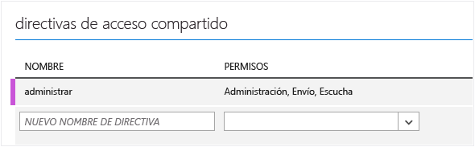
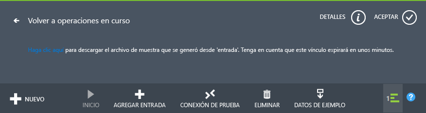
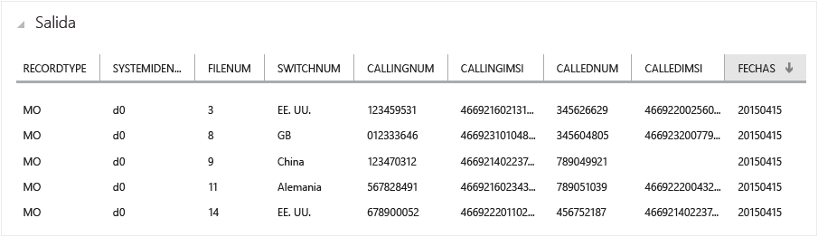
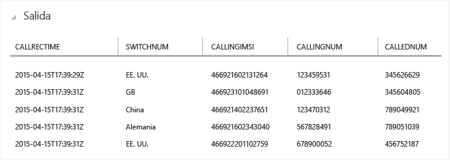
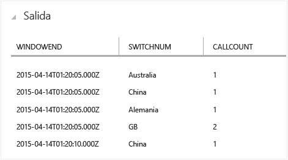
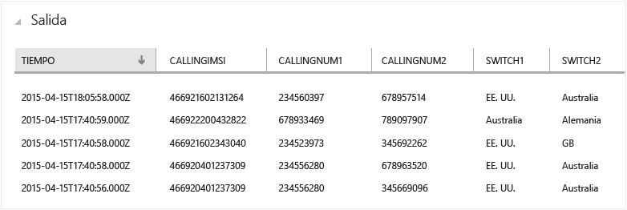
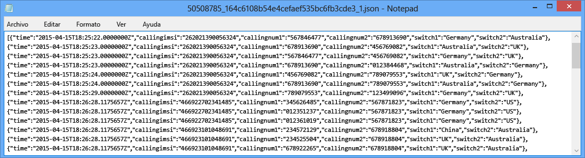

<properties
	pageTitle="Introducción al Análisis de transmisiones: detección de fraudes en tiempo real | Microsoft Azure"
	description="Aprenda a crear una solución para la detección de fraudes en tiempo real con Análisis de transmisiones. Use un centro de eventos para el procesamiento de eventos en tiempo real."
	keywords="detección de anomalías, detección de fraudes, detección de anomalías en tiempo real"
	services="stream-analytics"
	documentationCenter=""
	authors="jeffstokes72"
	manager="paulettm"
	editor="cgronlun" />

<tags
	ms.service="stream-analytics"
	ms.devlang="na"
	ms.topic="article"
	ms.tgt_pltfrm="na"
	ms.workload="data-services"
	ms.date="02/04/2016"
	ms.author="jeffstok" />

# Introducción al uso de Análisis de transmisiones de Azure: detección de fraudes en tiempo real

Aprenda a crear una solución de extremo a extremo para la detección de fraudes en tiempo real con Análisis de transmisiones de Azure. Lleve eventos al centro de eventos de Azure, escriba consultas de Análisis de transmisiones para agregación o alertas y envíe los resultados a un receptor de salida para obtener información detallada sobre los datos con procesamiento en tiempo real. Se describe la detección de anomalías en tiempo real para telecomunicaciones, pero la técnica de ejemplo es igualmente adecuada para otros tipos de detección de fraudes, tales como los escenarios de robo de la tarjeta de crédito o de identidad.

Análisis de transmisiones es un servicio totalmente administrado que proporciona un procesamiento completo de eventos de baja latencia, alta disponibilidad y escalable a través de la transmisión de datos en la nube. Para obtener más información, consulte [Introducción a Análisis de transmisiones de Azure](stream-analytics-introduction.md).

## Escenario: telecomunicaciones y detección de fraudes de SIM en tiempo real

Una empresa de telecomunicaciones tiene un gran volumen de datos en llamadas entrantes. Desean obtener lo siguiente a partir de sus datos: * Reducir estos datos hasta un volumen manejable y obtener información detallada sobre el uso del cliente por tiempo y regiones geográficas. * Detectar el fraude de SIM (varias procedentes de la misma identidad aproximadamente al mismo tiempo, pero en ubicaciones geográficamente diferentes) en tiempo real para que puedan responder fácilmente notificando a los clientes o cerrando el servicio.

En escenarios convencionales de Internet de las cosas (IoT) se genera gran cantidad de datos de telemetría o de sensor, y los clientes quieren que se agreguen o se avise de las anomalías en tiempo real.

## Requisitos previos

- Descargue [TelcoGenerator.zip](http://download.microsoft.com/download/8/B/D/8BD50991-8D54-4F59-AB83-3354B69C8A7E/TelcoGenerator.zip) del Centro de descarga de Microsoft. 
- Opcional: código fuente del generador de eventos desde [GitHub](https://github.com/Azure/azure-stream-analytics/tree/master/DataGenerators/TelcoGenerator)

## Creación de un Grupo de consumidores y una entrada de Centros de eventos de Azure

La aplicación de ejemplo generará eventos y los insertará en una instancia de Centros de eventos para el procesamiento en tiempo real. Los Centros de eventos de Bus de servicio son el método preferido de introducción de eventos en Análisis de transmisiones; puede obtener más información sobre Centros de eventos en [Documentación sobre Bus de servicio de Azure](/documentation/services/service-bus/).

Para crear un Centro de eventos:

1.	En el [Portal de Azure](https://manage.windowsazure.com/) haga clic en **Nuevo** > **Servicios de aplicaciones** > **Bus de servicio** > **Centro de eventos** > **Creación rápida**. Indique un nombre, una región y un espacio de nombres nuevo o existente para crear un Centro de eventos.  
2.	Como práctica recomendada, cada trabajo de Análisis de transmisiones debe leer en un solo grupo de consumidores de Centro de eventos. A continuación, le guiaremos a través del proceso de creación de un grupo de consumidores y podrá [obtener más información sobre grupos de consumidores](https://msdn.microsoft.com/library/azure/dn836025.aspx). Para crear un grupo de consumidores, vaya al Centro de eventos recién creado y haga clic en la pestaña **Grupos de consumidores**. Después, haga clic en **Crear** en la parte inferior de la página e indique un nombre para el grupo de consumidores.
3.	Para otorgar acceso al centro de eventos, necesitamos crear una directiva de acceso compartido. Haga clic en la pestaña **CONFIGURAR** de su Centro de eventos.
4.	En **Directivas de acceso compartido**, cree una directiva con permisos para **Administrar**.

	

5.	Haga clic en **Guardar** en la parte inferior de la página.
6.	Navegue al **Panel** y haga clic en **Información de conexión** en la parte inferior de la página y luego copie y guarde la información de conexión.

## Configuración e inicio de la aplicación del generador de eventos

Proporcionamos una aplicación cliente que generará los metadatos de llamada entrante de ejemplo y los insertará en el Centro de eventos. Siga los pasos que se indican a continuación para configurar esta aplicación.

1.	Descargue el [archivo TelcoGenerator.zip](http://download.microsoft.com/download/8/B/D/8BD50991-8D54-4F59-AB83-3354B69C8A7E/TelcoGenerator.zip)
2.	Reemplace los valores de Microsoft.ServiceBus.ConnectionString y EventHubName en el archivo **telcodatagen.exe.config** con la cadena de conexión del Centro de eventos y el nombre.
3.	Inicie la aplicación. El uso es como sigue:

   telcodatagen.exe [#NumCDRsPerHour] [SIM Card Fraud Probability] [#DurationHours]

En el ejemplo siguiente, se generarán 1000 eventos con una probabilidad de fraude del 20 % en el transcurso de 2 horas.

    telcodatagen.exe 1000 .2 2

Podrá ver los registros que se envían al Centro de eventos. Aquí se definen algunos campos clave que se van a usar en esta aplicación de detección de fraudes en tiempo real:

| Registro | Definición |
| ------------- | ------------- |
| CallrecTime | Marca de tiempo para la hora de inicio de la llamada. |
| SwitchNum | Conmutador de teléfono que se usa para conectar la llamada. |
| CallingNum | Número de teléfono del autor de la llamada. |
| CallingIMSI | Identidad del suscriptor móvil internacional (IMSI). Identificador único del autor de la llamada. |
| CalledNum | Número de teléfono del destinatario de la llamada. |
| CalledIMSI | Identidad del suscriptor móvil internacional (IMSI). Identificador único del destinatario de la llamada. |

## Creación de un Análisis de transmisiones
Ahora que tenemos un flujo de eventos de telecomunicaciones, podemos configurar un trabajo de Análisis de transmisiones para analizar estos eventos en tiempo real.

### Aprovisionamiento de un trabajo de Stream Analytics

1.	En el Portal de Azure, haga clic en **Nuevo > Servicios de datos > Análisis de transmisiones > Creación rápida**.
2.	Especifique los valores siguientes y haga clic en **Crear trabajo de Análisis de transmisiones**:

	* **Nombre del trabajo**: escriba un nombre del trabajo.

	* **Región**: seleccione la región donde desea ejecutar el trabajo. Considere la posibilidad de colocar el trabajo y el centro de eventos en la misma región para garantizar un mejor rendimiento y asegurarse de no pagar la transferencia de datos entre regiones.

	* **Cuenta de almacenamiento**: elija la cuenta de almacenamiento de Azure que desea usar para almacenar los datos de supervisión de todos los trabajos de Análisis de transmisiones que se ejecutan en esta región. Tiene la opción de elegir una cuenta de almacenamiento existente o crear uno nuevo.

3.	Haga clic en **Análisis de transmisiones** en el panel izquierdo para ver una lista de los trabajos de Análisis de transmisiones.

	

4.	Se mostrará el nuevo trabajo con el estado **Creado**. Tenga en cuenta que el botón **Iniciar** en la parte inferior de la página está deshabilitado. Debe configurar la entrada, la salida y la consulta del trabajo antes de iniciar el trabajo.

### Especificación de la entrada del trabajo
1.	En el trabajo de Análisis de transmisiones, haga clic en **Entradas** en la parte superior de la página y luego en **Agregar entrada**. El cuadro de diálogo que se abre le guiará a través de una serie de pasos para configurar la entrada.
2.	Seleccione **Flujo de datos** y, a continuación, haga clic con el botón secundario.
3.	Seleccione **Centro de eventos** y, a continuación, haga clic con el botón secundario.
4.	Escriba o seleccione los valores siguientes en la tercera página:

	* **Alias de entrada**: escriba un nombre descriptivo para esta entrada del trabajo, como *CallStream*. Tenga en cuenta que va a utilizar este nombre en la consulta más adelante.
	* **Centro de eventos**: si el Centro de eventos que creó está en la misma suscripción que el trabajo de Análisis de transmisiones, seleccione el espacio de nombres en el que está el Centro de eventos.

	Si el centro de eventos está en otra suscripción, seleccione **Usar centro de eventos de otra suscripción** y escriba manualmente la información de **Espacio de nombres de servicio de Bus**, **Nombre de centro de eventos**, **Nombre de directiva de centro de eventos**, **Clave de directiva de centro de eventos** y **Recuento de particiones de centro de eventos**.

	* **Nombre de Centro de eventos**: seleccione el nombre del Centro de eventos.

	* **Nombre de directiva de Centro de eventos**: seleccione la directiva del Centro de eventos que creó anteriormente en este tutorial.

	* **Grupo de consumidores del Centro de eventos**: escriba el grupo de consumidores que creó anteriormente en este tutorial.
5.	Haga clic con el botón derecho.
6.	Especifique los siguientes valores:

	* **Formato del serializador de eventos**: JSON
	* **Codificación**: UTF8
7.	Haga clic en el botón de comprobación para agregar este origen y comprobar que Stream Analytics puede conectarse correctamente al centro de eventos.

### Especificación de la consulta de trabajo

Análisis de secuencias admite un modelo de consulta declarativo sencillo para describir las transformaciones para el procesamiento en tiempo real. Para obtener más información sobre el lenguaje, consulte la [Referencia de lenguaje de consulta de Azure Stream Analytics](https://msdn.microsoft.com/library/dn834998.aspx). Este tutorial le ayudará a crear y probar varias consultas sobre el streaming de datos de llamada en tiempo real.

#### Opcional: Datos de entrada de ejemplo
Para validar la consulta con datos de trabajo reales, puede usar la característica **Datos de ejemplo** para extraer los eventos del streaming y crear un archivo .JSON de los eventos para las pruebas. Los pasos siguientes muestran cómo hacerlo y también hemos proporcionado un archivo de ejemplo [telco.json](https://github.com/Azure/azure-stream-analytics/blob/master/Sample%20Data/telco.json) con fines de prueba.

1.	Seleccione la entrada del Centro de eventos y haga clic en **Datos de ejemplo** en la parte inferior de la página.
2.	En el cuadro de diálogo que aparece, especifique una **Hora de inicio** para empezar a recopilar datos y una **Duración** para indicar la cantidad de datos adicionales que se consumirá.
3.	Haga clic en el botón de comprobación para empezar a muestrear datos de la entrada. El archivo de datos puede tardar un minuto o dos en crearse. Una vez finalizado el proceso, haga clic en **Detalles**, descargue el archivo .JSON que se genera y guárdelo.

	

#### Consulta de paso a través

Si desea archivar todos los eventos, puede usar una consulta de paso a través para leer todos los campos de la carga del evento o mensaje. Para empezar, haremos una consulta de paso a través simple que proyecta todos los campos de un evento.

1.	Haga clic en **Consulta** en la parte superior de la página de trabajo de Análisis de transmisiones.
2.	Agregue lo siguiente al editor de código:

		SELECT * FROM CallStream

	> Asegúrese de que el nombre del origen de entrada coincida con el nombre de la entrada que especificó anteriormente.

3.	Haga clic en **Prueba** en el editor de consultas.
4.	Proporcione un archivo de prueba, bien uno creado siguiendo los pasos anteriores o use [telco.json](https://github.com/Azure/azure-stream-analytics/blob/master/Sample%20Data/telco.json)
5.	Haga clic en el botón de comprobación y vea los resultados que aparecen debajo de la definición de consulta.

	

### Proyección de columna

Ahora reduciremos los campos devueltos a un conjunto más pequeño.

1.	Cambie la consulta en el editor de código a:

		SELECT CallRecTime, SwitchNum, CallingIMSI, CallingNum, CalledNum
		FROM CallStream

2.	Haga clic en **Volver a ejecutar** en el editor de consultas para ver los resultados de la consulta.

	

### Recuento de llamadas entrantes por región: ventana de saltos de tamaño constante con agregación

Para comparar la cantidad de llamadas entrantes por región se aprovechará una [TumblingWindow](https://msdn.microsoft.com/library/azure/dn835055.aspx) para obtener el recuento de llamadas entrantes agrupado por SwitchNum cada cinco segundos.

1.	Cambie la consulta en el editor de código a:

		SELECT System.Timestamp as WindowEnd, SwitchNum, COUNT(*) as CallCount
		FROM CallStream TIMESTAMP BY CallRecTime
		GROUP BY TUMBLINGWINDOW(s, 5), SwitchNum

	Esta consulta usa la palabra clave **Timestamp By** para especificar un campo de marca de tiempo en la carga que se usará en el cálculo temporal. Si no se ha especificado este campo, la operación de ventana se realizará usando el tiempo de cada evento llegado al centro de eventos. Obtenga más información en "Tiempo de llegada frente a tiempo de aplicación" en la [Referencia de consulta de Análisis de transmisiones](https://msdn.microsoft.com/library/azure/dn834998.aspx).

	Tenga en cuenta que puede tener acceso a una marca de tiempo para el final de cada ventana con la propiedad **System.Timestamp**.

2.	Haga clic en **Volver a ejecutar** en el editor de consultas para ver los resultados de la consulta.

	

### Detección de fraudes de SIM con una autocombinación

Para identificar un uso posiblemente fraudulento buscaremos las llamadas que se originan en el mismo usuario pero en diferentes ubicaciones en menos de 5 segundos. Vamos a [combinar](https://msdn.microsoft.com/library/azure/dn835026.aspx) el streaming de eventos de llamada consigo mismo para buscar estos casos.

1.	Cambie la consulta en el editor de código a:

		SELECT System.Timestamp as Time, CS1.CallingIMSI, CS1.CallingNum as CallingNum1,
		CS2.CallingNum as CallingNum2, CS1.SwitchNum as Switch1, CS2.SwitchNum as Switch2
		FROM CallStream CS1 TIMESTAMP BY CallRecTime
		JOIN CallStream CS2 TIMESTAMP BY CallRecTime
		ON CS1.CallingIMSI = CS2.CallingIMSI
		AND DATEDIFF(ss, CS1, CS2) BETWEEN 1 AND 5
		WHERE CS1.SwitchNum != CS2.SwitchNum

2.	Haga clic en **Volver a ejecutar** en el editor de consultas para ver los resultados de la consulta.

	

### Creación de receptores de salida

Ahora que hemos definido una secuencia de eventos, una entrada de centro de eventos para introducir eventos y una consulta para realizar una transformación en la secuencia, el último paso es definir un receptor de salida para el trabajo. Escribiremos los eventos de comportamiento fraudulento en el Almacenamiento de blobs.

Si todavía no tiene un contenedor para el almacenamiento de blobs, siga estos pasos para crear uno:

1.	Use una cuenta de almacenamiento existente o cree una nueva; para ello, haga clic en **NUEVO > SERVICIOS DE DATOS > ALMACENAMIENTO > CREACIÓN RÁPIDA** y siga las instrucciones.
2.	Seleccione la cuenta de almacenamiento, haga clic en **CONTENEDORES** en la parte superior de la página y luego haga clic en **AGREGAR**.
3.	Especifique un **NOMBRE** para el contenedor y establezca su **ACCESO** al blob público.

## Especificación de la salida del trabajo

1.	En el trabajo de Análisis de transmisiones, haga clic en **SALIDA** en la parte superior de la página y luego en **AGREGAR SALIDA**. El cuadro de diálogo que se abre le guiará a través de una serie de pasos para configurar la salida.
2.	Seleccione **ALMACENAMIENTO DE BLOBS** y, a continuación, haga clic con el botón secundario.
3.	Escriba o seleccione los valores siguientes en la tercera página:

	* **Alias de salida**: escriba un nombre descriptivo para esta salida de trabajo.
	* **SUSCRIPCIÓN**: si el Almacenamiento de blobs que creó está en la misma suscripción que el trabajo de Análisis de transmisiones, seleccione **Usar cuenta de almacenamiento de la suscripción actual**. Si el almacenamiento está en otra suscripción, seleccione **Utilizar almacenamiento de otra suscripción** y especifique manualmente la información de **CUENTA DE ALMACENAMIENTO**, **CLAVE DE LA CUENTA DE ALMACENAMIENTO**, **CONTENEDOR**.
	* **Cuenta de almacenamiento**: seleccione el nombre de la cuenta de almacenamiento
	* **Contenedor**: seleccione el nombre del contenedor
	* **Prefijo de nombre de archivo**: escriba un prefijo de archivo que se usará al escribir la salida del blob

4.	Haga clic con el botón secundario.
5.	Especifique los siguientes valores:

	* **FORMATO DEL SERIALIZADOR DE EVENTOS**: JSON
	* **CODIFICACIÓN**: UTF8

6.	Haga clic en el botón de comprobación para agregar este origen y comprobar que Análisis de transmisiones puede conectarse correctamente a la cuenta de almacenamiento.

## Inicio del trabajo para el procesamiento en tiempo real

Puesto que ya se han especificado la entrada, la consulta y la salida del trabajo, estamos preparados para iniciar el trabajo de Análisis de transmisiones para la detección de fraudes en tiempo real.

1.	Desde **PANEL** del trabajo, haga clic en **INICIAR** en la parte inferior de la página.
2.	En el cuadro de diálogo que aparece, seleccione **HORA DE INICIO DEL TRABAJO** y luego haga clic en el botón de comprobación en la parte inferior del cuadro de diálogo. El estado del trabajo cambiará a **Iniciando** y en breve pasará a **En ejecución**.

## Consulta de la salida de la detección de fraudes

Use una herramienta como [Explorador de almacenamiento de Azure](https://azurestorageexplorer.codeplex.com/) o [Explorador de Azure](http://www.cerebrata.com/products/azure-explorer/introduction) para ver eventos fraudulentos a medida que se escriben en la salida en tiempo real.

## Obtención de soporte técnico
Para obtener más ayuda, pruebe nuestro [foro de Análisis de transmisiones de Azure](https://social.msdn.microsoft.com/Forums/es-ES/home?forum=AzureStreamAnalytics).

## Pasos siguientes

- [Introducción al Análisis de transmisiones de Azure](stream-analytics-introduction.md)
- [Introducción al uso de Análisis de transmisiones de Azure](stream-analytics-get-started.md)
- [Escalación de trabajos de Análisis de transmisiones de Azure](stream-analytics-scale-jobs.md)
- [Referencia del lenguaje de consulta de Análisis de transmisiones de Azure](https://msdn.microsoft.com/library/azure/dn834998.aspx)
- [Referencia de API de REST de administración de Análisis de transmisiones de Azure](https://msdn.microsoft.com/library/azure/dn835031.aspx)

<!---HONumber=AcomDC_0224_2016-->