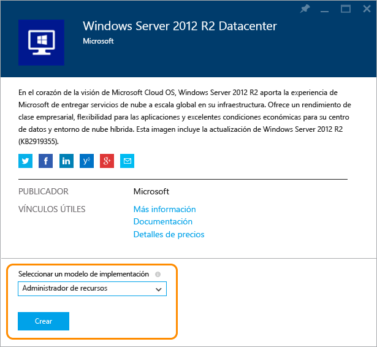
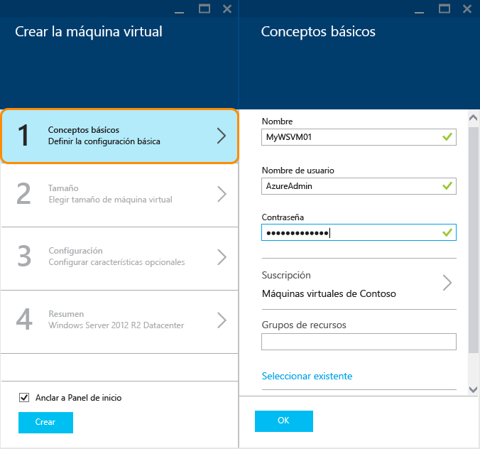
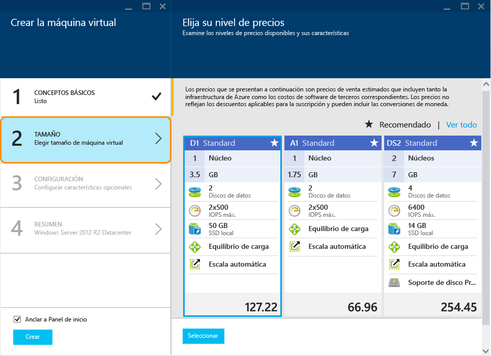
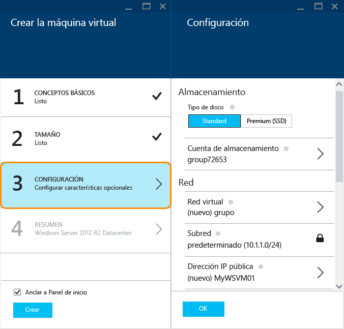
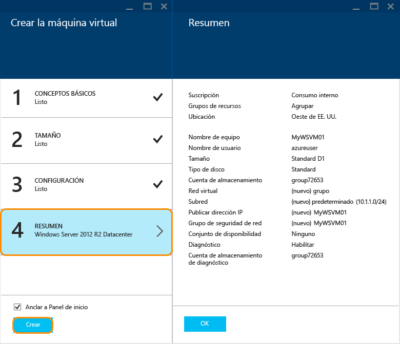
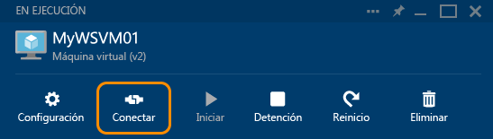

<properties
	pageTitle="Creación de una máquina virtual de Windows en el Portal de Azure | Microsoft Azure"
	description="Aprenda a crear una máquina virtual de Windows o un equipo virtual mediante Azure Marketplace en el Portal de Azure"
	keywords="máquina virtual de Windows, crear una máquina virtual, equipo virtual, configurar una máquina virtual"
	services="virtual-machines"
	documentationCenter=""
	authors="cynthn"
	manager="timlt"
	editor=""
	tags="azure-resource-manager"/>
<tags
	ms.service="virtual-machines"
	ms.workload="infrastructure-services"
	ms.tgt_pltfrm="vm-windows"
	ms.devlang="na"
	ms.topic="hero-article"
	ms.date="01/07/2016"
	ms.author="cynthn"/>

# Creación de una máquina virtual de Windows en el Portal de Azure.#

> [AZURE.SELECTOR]
- [Portal: Windows](virtual-machines-windows-tutorial.md)
- [PowerShell](virtual-machines-ps-create-preconfigure-windows-resource-manager-vms.md)
- [PowerShell: plantilla](virtual-machines-create-windows-powershell-resource-manager-template.md)
- [Portal: Linux](virtual-machines-linux-tutorial-portal-rm.md)
- [CLI](virtual-machines-linux-tutorial.md)

Este tutorial muestra lo fácil que resulta crear una máquina virtual de Windows en unos minutos en el Portal de Azure. Usaremos una imagen de Windows Server 2012 R2 Datacenter como ejemplo para crear la máquina virtual, pero esa es solo una de las muchas imágenes que Azure ofrece. Las imágenes disponibles dependen de su suscripción. Por ejemplo, las imágenes de escritorio pueden estar disponibles para los suscriptores MSDN.

[AZURE.INCLUDE [learn-about-deployment-models](../../includes/learn-about-deployment-models-rm-include.md)]modelo de implementación clásica.

 

>[AZURE.TIP] Cuando usa el portal, si quiere que la máquina virtual forme parte de un conjunto de disponibilidad, necesitará crear el conjunto antes o durante la creación de la primera máquina virtual en el conjunto de disponibilidad. Para más información sobre la creación y uso de los conjuntos de disponibilidad, consulte [Administración de la disponibilidad de las máquinas virtuales](virtual-machines-manage-availability.md).

También puede crear máquinas virtuales con sus propias imágenes, con plantillas del Administrador de recursos o con herramientas de automatización. Para obtener información sobre los diferentes métodos, consulte [Diferentes formas de crear una máquina virtual de Windows](virtual-machines-windows-choices-create-vm.md).

[AZURE.INCLUDE [free-trial-note](../../includes/free-trial-note.md)]

## Tutorial en vídeo

Se trata del tutorial en formato de vídeo.

[AZURE.VIDEO create-a-virtual-machine-running-windows-in-the-azure-preview-portal]

## Seleccione la imagen de la máquina virtual de Windows.

1. Inicie sesión en el Portal de Azure.

2. En el menú Base de datos central, haga clic en **Nuevo** > **Proceso** > **Windows Server 2012 R2 Datacenter**.

	

	>[AZURE.TIP] Para encontrar otras imágenes, haga clic en **Marketplace** y luego busque o filtre los elementos disponibles.

3. En la página **Windows Server 2012 R2 Datacenter**, en **Seleccionar un modelo de implementación**, seleccione **Administrador de recursos**. Haga clic en **Crear**.

	

## Creación de la máquina virtual de Windows

Después de seleccionar la imagen, puede usar los valores predeterminados de Azure en la mayor parte de la configuración y crear rápidamente la máquina virtual.

1. En la hoja **Crear máquina virtual**, haga clic en **Conceptos básicos**.

2. Escriba el **nombre** que desee para la máquina virtual. El nombre no puede contener caracteres especiales.

3. Escriba un **nombre de usuario** administrador y una **contraseña** segura. La contraseña debe tener entre 8 y 123 caracteres y al menos tres de los siguientes valores: una minúscula, una mayúscula, un número y un carácter especial. **Necesitará el nombre de usuario y la contraseña para iniciar sesión en la máquina virtual**.

4. Si tiene más de una suscripción, especifique una de ellas para la nueva máquina virtual, así como un nuevo **Grupo de recursos** o uno existente y la **Ubicación** de un centro de datos de Azure.

	

	
2. Haga clic en **Tamaño** y seleccione un tamaño de máquina virtual apropiado para sus necesidades. Cada tamaño especifica el número de núcleos de proceso, la memoria y otras características, como la compatibilidad con el Almacenamiento premium, lo que afectará al precio. Azure recomienda automáticamente determinados tamaños según la imagen que se elija.

	

	>[AZURE.NOTE] El almacenamiento Premium está disponible para las máquinas virtuales de la serie DS en determinadas regiones. El almacenamiento Premium es la mejor opción de almacenamiento para cargas de trabajo intensivas de datos como una base de datos. Para obtener más información, consulte [Almacenamiento Premium: Almacenamiento de alto rendimiento para cargas de trabajo de máquina virtual de Azure](storage-premium-storage.md)

3. Haga clic en **Configuración** para ver la configuración de red y de almacenamiento de la nueva máquina virtual. En la primera máquina virtual, por lo general podrá aceptar la configuración predeterminada. Si ha seleccionado un tamaño de máquina virtual que lo admita, puede probar Almacenamiento premium, para lo que debe seleccionar **Premium (SSD)** en **Tipo de disco**.

	

6. Haga clic en **Resumen** para revisar las opciones de configuración. Cuando haya terminado de revisar o actualizar la configuración, haga clic en **Crear**.

	

8. Mientras Azure crea la máquina virtual, puede realizar un seguimiento del progreso en **Máquinas virtuales**, en el menú del centro.

## Inicio de sesión en una máquina virtual de Windows

Una vez creada la máquina virtual, podrá iniciar sesión en ella para administrar su configuración y las aplicaciones que va a ejecutar en ella.

>[AZURE.NOTE] Para obtener consejos acerca de los requisitos y la solución de problemas, vea [Conectar a una máquina virtual de Azure con RDP o SSH](https://msdn.microsoft.com/library/azure/dn535788.aspx).

1. Si aún no lo ha hecho, inicie sesión en el Portal de Azure.

2. Haga clic en la máquina virtual en el panel o haga clic en Máquinas virtuales y seleccione la que desea de la lista.

3. En la hoja de la máquina virtual, haga clic en **Conectar**.

	

4. Haga clic en **Abrir** para usar el archivo de protocolo de escritorio remoto que se creó automáticamente para la máquina virtual de Windows Server.

5. Haga clic en **Conectar**.

6. Escriba el nombre de usuario y la contraseña que estableció al crear la máquina virtual y, a continuación, haga clic en **Aceptar**.

7. Haga clic en **Sí** para comprobar la identidad de la máquina virtual.

Ahora puede trabajar con la máquina virtual igual que hace con cualquier otro servidor.

## Pasos siguientes

* Use Azure PowerShell y la CLI de Azure para [buscar y seleccionar imágenes de máquina virtual](resource-groups-vm-searching.md).
* Automatice la implementación y administración de máquinas virtuales y cargas de trabajo con las [plantillas de Azure Resource Manager](https://azure.microsoft.com/documentation/templates/).

<!---HONumber=AcomDC_0302_2016-->