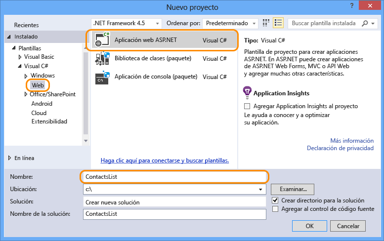
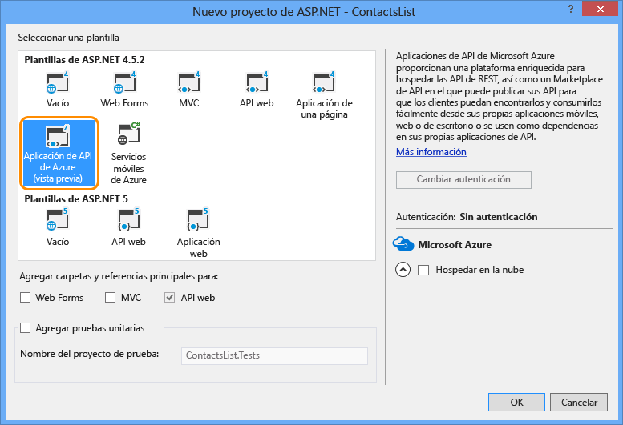

1. Abra Visual Studio 2015 o Visual Studio 2013.

2. Seleccione **Archivo > Nuevo proyecto**.

3. Seleccione la plantilla **Aplicación Web ASP.NET**.

4. Asegúrese de que la casilla **Agregar Application Insights al proyecto** está desactivada.

4. Escriba un nombre para el proyecto.

	

5. Haga clic en **Aceptar**.

6. En el cuadro de diálogo **Nuevo proyecto de ASP.NET**, seleccione la plantilla de proyecto **Aplicación de API de Azure**.

	

7. Haga clic en **Aceptar** para generar el proyecto.

Visual Studio crea un proyecto de API web configurado para implementarlo como aplicación de API.

<!---HONumber=Oct15_HO3-->