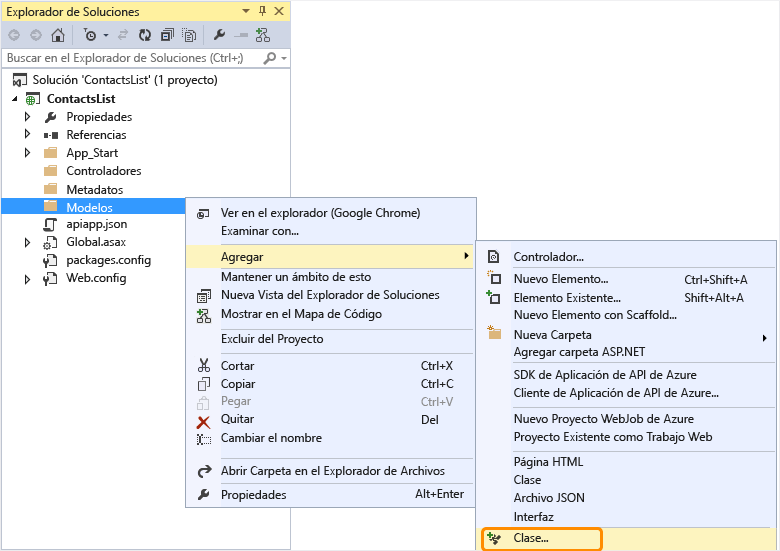
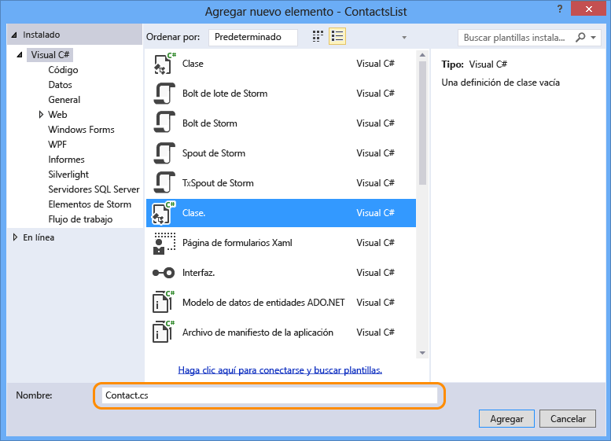
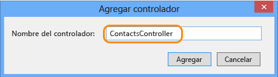

## Adición de código de API web

En los pasos siguientes se agrega código para un método HTTP Get simple que devuelve una lista de contactos codificada de forma rígida.

1. En el Explorador de soluciones, haga clic con el botón secundario en la carpeta **Modelos** y seleccione **Agregar > Clase**. 

	

2. Asigne el nombre *Contact.cs* al archivo nuevo.

	

3. Haga clic en **Agregar**.

4. Una vez creado el archivo *Contact.cs*, reemplace todo el contenido de este por el código siguiente.

		namespace ContactsList.Models
		{
			public class Contact
			{
				public int Id { get; set; }
				public string Name { get; set; }
				public string EmailAddress { get; set; }
			}
		}

5. Haga clic con el botón secundario en la carpeta **Controladores** y seleccione **Agregar > Controlador**.

	

6. En el cuadro de diálogo **Agregar scaffold**, seleccione la opción **Controlador de Web API 2 - Vacío** y haga clic en **Agregar**.

	

7. Asigne el nombre **ContactsController** al controlador y haga clic en **Agregar**.

	

8. Una vez creado el archivo ContactsController.cs, reemplace todo el contenido de este por el código siguiente.

		using ContactsList.Models;
		using System;
		using System.Collections.Generic;
		using System.Linq;
		using System.Net;
		using System.Net.Http;
		using System.Threading.Tasks;
		using System.Web.Http;
		
		namespace ContactsList.Controllers
		{
		    public class ContactsController : ApiController
		    {
		        [HttpGet]
		        public IEnumerable<Contact> Get()
		        {
		            return new Contact[]{
						new Contact { Id = 1, EmailAddress = "barney@contoso.com", Name = "Barney Poland"},
						new Contact { Id = 2, EmailAddress = "lacy@contoso.com", Name = "Lacy Barrera"},
	                	new Contact { Id = 3, EmailAddress = "lora@microsoft.com", Name = "Lora Riggs"}
		            };
		        }
		    }
		}

## Habilitación de la IU de Swagger

De forma predeterminada, los proyectos de aplicaciones de API se habilitan con la generación automática de metadatos [Swagger](http://swagger.io/ "Información oficial de Swagger"); además, cuando se usa la entrada de menú **Agregar SDK de aplicaciones de API** para convertir un proyecto de API web, también se habilita de forma predeterminada una página de prueba de API.

Sin embargo, la plantilla de proyecto nuevo de la aplicación de API de Azure deshabilita la página de prueba de la API. Si para crear el proyecto de aplicación de API ha usado la plantilla de proyecto Aplicación de API, debe realizar los pasos siguientes para habilitar la página de prueba.

**Nota:** si implementa la aplicación de API como *public anonymous* y con Swagger UI activado, cualquier persona podrá usar dicha Swagger UI para detectar las API y hacer llamadas a ellas.

1. Abra el archivo *App\_Start/SwaggerConfig.cs* y busque **EnableSwaggerUI**:

	

2. Quite la marca de comentario de las líneas de código siguientes:

	        })
	    .EnableSwaggerUi(c =>
	        {

3. Cuando haya terminado, el archivo debe tener este aspecto:

	

## Prueba de la API web

Para ver la página de prueba de la API, realice los pasos siguientes.

1. Ejecute la aplicación de forma local (CTRL+F5)

	El explorador se abre y muestra un error HTTP 403 porque la dirección URL base no es una página web o una URL de método de API válida para este proyecto.
 
3.  Para ir a la página Swagger, agregue `/swagger` al final de la dirección URL base.

	

2. Haga clic en **Contacts (Contactos) > Get (Obtener) > Try it out (Probarlo)**. Verá que la API funciona y devuelve el resultado esperado.

	

3. En Visual Studio, haga clic en **Depurar > Detener depuración**.

<!---HONumber=Oct15_HO3-->