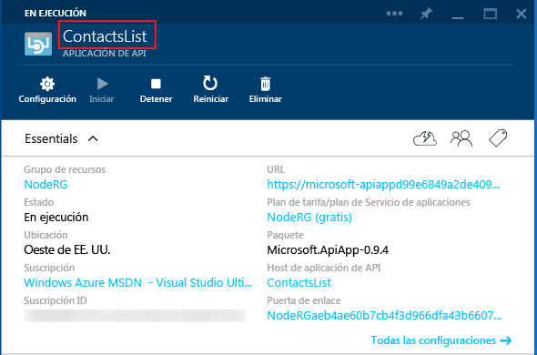

## Metadatos de la aplicación de API

Esta sección proporciona información adicional acerca de los metadatos de la aplicación de API que se pueden personalizar.

La mayoría de las propiedades del archivo *apiapp.json* y los archivos de la carpeta *Metadatos* afectan al modo en que se presenta un paquete de aplicaciones de API en Azure Marketplace. En las secciones siguientes se explica qué propiedades y archivos afectan a las aplicaciones de API al implementar el código en una aplicación de API de su suscripción de Azure.

### Id. de aplicación de API 

La propiedad `id` determina el nombre de la aplicación de API. Por ejemplo:

		"id": "ContactsList",

### Espacio de nombres

Establezca la propiedad `namespace` en el dominio de su inquilino de Azure Active Directory. Para buscar el dominio, abra el explorador en el [Portal clásico de Azure](https://manage.windowsazure.com/), examine **Active Directory** y seleccione la pestaña **Dominios**. Por ejemplo:

		"namespace": "contoso.onmicrosoft.com",

### Definición de la API de Swagger dinámica

Si la aplicación de API puede devolver una definición de API de [Swagger](http://swagger.io/) dinámica, almacene la URL relativa de una solicitud GET que devuelva la definición de API JSON en la propiedad `endpoints.apiDefinition`. Por ejemplo:

		"endpoints": {
		    "apiDefinition": "/swagger/docs/v1"
		}

> **Nota:** si usa Swashbuckle para generar una definición de API de Swagger, las sobrecargas del método HTTP en los controladores de la API web dan lugar a identificadores de operación duplicados. Para obtener más información, consulte [Personalización de identificadores de operación generados por Swashbuckle](../article/app-service-api/app-service-api-dotnet-swashbuckle-customize.md).
  
### Definición de la API de Swagger estática

Para proporcionar un archivo de definición de la API de [Swagger](http://swagger.io/) 2.0 estática, almacene el archivo en la carpeta *Metadatos* y asigne al archivo el nombre *apiDefinition.swagger.json*

Deje `endpoints.apiDefinition` fuera del archivo *apiapp.json* o establezca su valor en null. Si incluye tanto una URL de `endpoints.apiDefinition` como un archivo *apiDefinition.swagger.json*, la URL tendrá prioridad y se omitirá el archivo.

<!---HONumber=Oct15_HO3-->