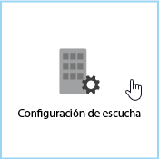
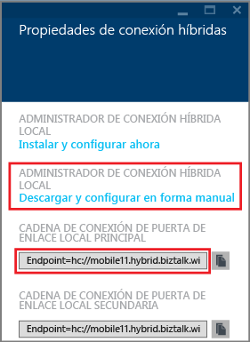
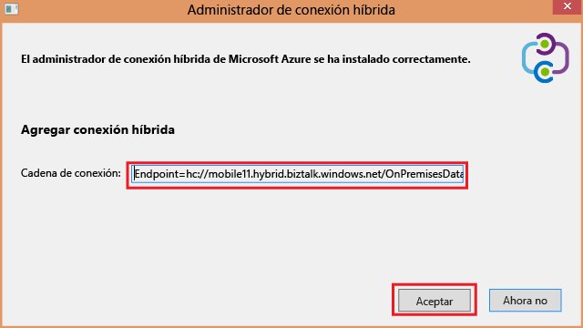
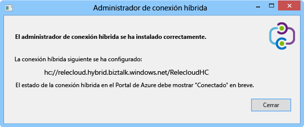
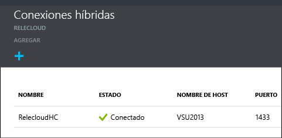

1. En la hoja **Conexiones híbridas**, haga clic en la conexión híbrida que acaba de crear y, a continuación, en **Configuración del agente de escucha**.
	
	
	
4. Se abre la hoja **Propiedades de conexión híbrida**. En **Administrador de conexiones híbridas local**, seleccione **Descargar y configurar manualmente**, guarde el paquete HybridConnectionManager.msi descargado y copie la cadena de conexión de puerta de enlace.
	
	
	
5. Desde un símbolo del sistema de administrador, escriba el siguiente comando para iniciar el instalador:

		start HybridConnectionManager.msi
 
7. Después de ejecutarlo, haga clic en **Ahora no**; a continuación, busque la carpeta %Archivos de programa%\\Microsoft\\HybridConnectionManager, ejecute HCMConfigWizard.exe y haga clic en **Sí** en el cuadro de diálogo **Control de cuentas de usuario**.
		
7. Pegue la cadena de conexión híbrida que ha copiado anteriormente y haga clic en **Aceptar**.
	
	
	
8. Cuando finalice la instalación, haga clic en **Cerrar**.
	
	
	
	En la hoja **Conexiones híbridas**, la columna **Estado** ahora muestra **Conectado**.
	
	

<!---HONumber=AcomDC_1125_2015-->