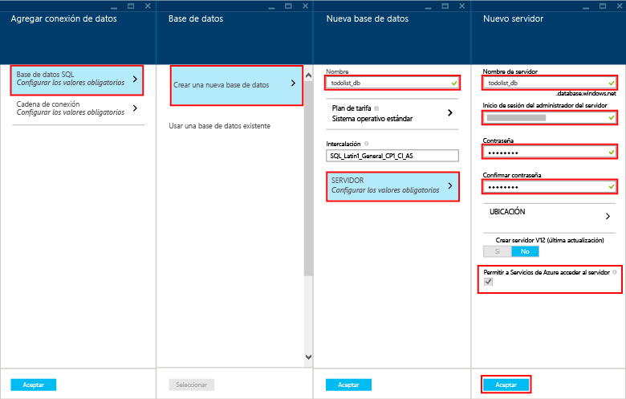

Siga estos pasos para crear un nuevo back-end de aplicación móvil.

1. Inicie sesión en el [Portal de Azure].

2. En la esquina superior izquierda de la ventana, haga clic en el botón **+NUEVO** > **Web + Móvil** > **Aplicación móvil** e indique un nombre para el back-end de la aplicación móvil.

3. En el cuadro **Grupo de recursos**, escriba el mismo nombre que la aplicación.

4. Se seleccionará el Plan del Servicio de aplicaciones predeterminado. Si desea cambiar el Plan del Servicio de aplicaciones, haga clic en el Plan del Servicio de aplicaciones > **+ Crear nuevo**. Proporcione un nombre al Plan del Servicio de aplicaciones nuevo y seleccione una ubicación adecuada. Haga clic en el nivel de precios y seleccione un nivel de precios adecuado para el servicio. Seleccione **Ver todos** para ver más opciones de precios, como **Gratis** y **Compartido**. Una vez haya seleccionado el nivel de precios, haga clic en el botón **Seleccionar** botón. De nuevo en la hoja **Plan del Servicio de aplicaciones**, haga clic en **Aceptar**.

5. Haga clic en **Crear**. Se crea un back-end de la aplicación móvil, donde implementará después el proyecto de servidor. El aprovisionamiento de un back-end de la aplicación móvil puede tardar unos minutos. Cuando se aprovisiona el back-end de la aplicación móvil, el portal abrirá la hoja **Configuración** para el back-end de la aplicación móvil. En el paso siguiente, creará una nueva Base de datos SQL.

    > [AZURE.NOTE]Como parte de este tutorial, va a crear una instancia y un nuevo servidor de Base de datos SQL. Puede reutilizar esta nueva base de datos y administrarla como lo haría con cualquier otra instancia de Base de datos SQL. Si ya hay una base de datos en la misma ubicación que el nuevo back-end de la aplicación móvil, puede elegir **Usar una base de datos existente** y después seleccionar dicha base de datos. No se recomienda el uso de una base de datos en una ubicación diferente debido a los costos adicionales de ancho de banda y las elevadas latencias.

6. En el nuevo back-end de la aplicación móvil, haga clic en **Configuración** > **Aplicación móvil** > **Datos** > **+Agregar**.

7. En la hoja **Agregar conexión de datos**, haga clic en **base de datos SQL- Configurar valores necesarios** > **Crear una base de datos nueva**. Escriba el nombre de la base de datos nueva en el campo **Nombre**.

8. Haga clic en **Servidor**. En la hoja **Nuevo servidor**, escriba un nombre de servidor único en el campo **Nombre del servidor** y proporcione un **inicio de sesión de administrador de servidor** y una **contraseña** adecuados. Asegúrese de **Permitir que los servicios de Azure accedan al servidor** está activado. Haga clic en **Aceptar**.

    

9. En la hoja **Nueva base de datos**, haga clic en **Aceptar**.

10. En la hoja **Agregar conexión de datos**, seleccione **Cadena de conexión**, y especifique el inicio de sesión y la contraseña que proporcionó al crear la base de datos. Si usa una base de datos existente, indique las credenciales de inicio de sesión de esa base de datos. Una vez escritas, haga clic en **Aceptar**.

11. En la hoja **Agregar conexión de datos**, haga clic en **Aceptar** para crear la base de datos.

La creación de la base de datos puede tardar unos minutos. Use el área de **notificaciones** para supervisar el progreso de la implementación. No continúe hasta que la base de datos se haya implementado correctamente.

Ahora ha aprovisionado un back-end de aplicación móvil de Azure que puede usarse por las aplicaciones del cliente móvil. Después, descargará un proyecto de servidor para un back-end de "lista de tareas" sencillo y lo publicará en Azure.

<!-- URLs. -->
[Portal de Azure]: https://portal.azure.com/

<!---HONumber=Oct15_HO3-->