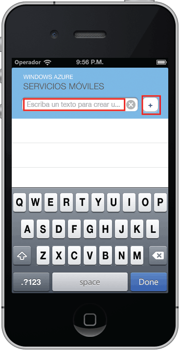

1. En el Mac, visite el [Portal de Azure]. Haga clic en **Examinar todo** > **Aplicaciones móviles** > el back-end que acaba de crear. En la configuración de la aplicación móvil, haga clic en **Inicio rápido** > **iOS (Objective-C)**. Si prefiere Swift, haga clic en **Inicio rápido** > **iOS (Swift)**. En **Descargar y ejecutar el proyecto de iOS**, haga clic en **Descargar**. Esto descarga un proyecto de Xcode completo para una aplicación previamente configurada para conectarse a su back-end. Abra el proyecto con Xcode.

2. Presione el botón **Ejecutar** para compilar el proyecto e iniciar la aplicación en el simulador de iOS.

3. En la aplicación, escriba un texto significativo, como _Realice el tutorial_. A continuación, haga clic en el icono de suma (**+**). Esto envía una solicitud POST al back-end de Azure implementado anteriormente. El back-end inserta datos de la solicitud que está en la tabla TodoItem SQL y devuelve información acerca de los elementos recién almacenados a la aplicación móvil. La aplicación móvil muestra estos datos en la lista.

   	

[Portal de Azure]: https://portal.azure.com/

<!---HONumber=Nov15_HO1-->