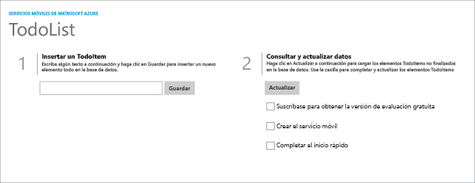

A continuación se muestran las capturas de pantalla de la aplicación completada:

  Aplicación de la Tienda Windows

  Aplicación de la Tienda de Windows Phone

La finalización de este tutorial es un requisito previo para los restantes tutoriales de aplicaciones móviles para las aplicaciones de Tienda Windows y Tienda de Windows Phone.

<!----HONumber=Nov15_HO1-->