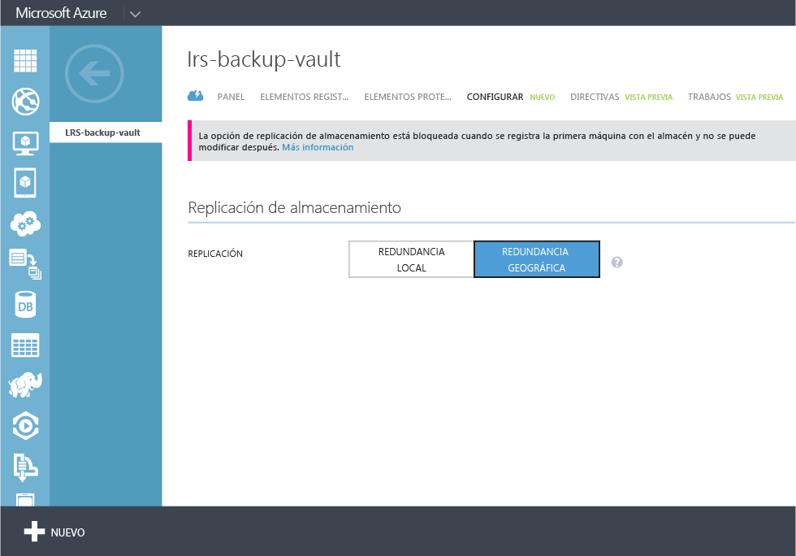
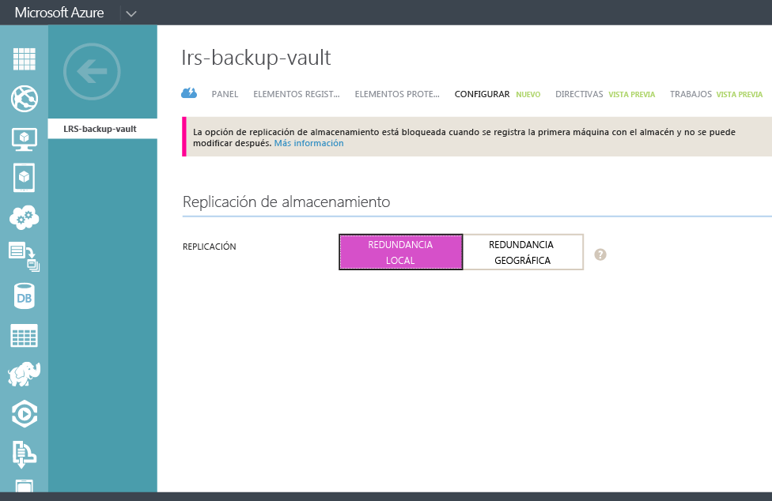

## Creación de un almacén de copia de seguridad
Para hacer una copia de seguridad de archivos y datos desde Windows Server o desde Data Protection Manager (DPM) en Azure o al realizar copias de seguridad de máquinas virtuales de IaaS en Azure, debe crear un almacén de copia de seguridad en la región geográfica donde quiera almacenar los datos.

Los siguientes pasos lo guiarán por la creación del almacén usado para guardar copias de seguridad.

1. Inicie sesión en el [Portal de administración](https://manage.windowsazure.com/).
2. Haga clic en **Nuevo** > **Servicios de datos** > **Servicios de recuperación** > **Almacén de copia de seguridad** y elija **Creación rápida**.

    

3. Para el parámetro **Nombre**, escriba un nombre descriptivo para identificar el almacén de copia de seguridad. Esto debe ser único para cada suscripción.

4. Para el parámetro **Región**, seleccione la región geográfica para el almacén de credenciales de copia de seguridad. La elección determina la región geográfica a la que se envían los datos de copia de seguridad. Si elige una región geográfica cerca de su ubicación, puede reducir la latencia de red al hacer una copia de seguridad en Azure.

5. Haga clic en **Crear almacén** para completar el flujo de trabajo. La creación del almacén de credenciales de copia de seguridad puede tardar unos minutos. Para revisar el estado, puede supervisar las notificaciones en la parte inferior del portal.

    

6. Después de crear el almacén de copia de seguridad, un mensaje indica que el almacén se ha creado correctamente. El almacén aparece también en los recursos de Servicios de recuperación como**Activo**.

    

### Copia de seguridad de Microsoft Azure: Opciones de redundancia de almacenamiento

> AZURE.IMPORTANTE El mejor momento para identificar la opción de redundancia de almacenamiento es justo después de la creación del almacén, y antes de que las máquinas se registren en este. Una vez que un elemento se ha registrado en el almacén, la opción de redundancia de almacenamiento está bloqueada y no se puede modificar.

Sus necesidades empresariales determinarían la redundancia de almacenamiento del almacenamiento backend de Copia de seguridad de Azure. Si está usando Azure como un extremo de almacenamiento de copia de seguridad principal (por ejemplo, copia de seguridad en Azure desde un servidor de Windows), debe considerar seleccionar la opción de almacenamiento con redundancia geográfica (valor predeterminado). Esto se ve en la opción **Configurar** de su almacén de copia de seguridad.

#### Almacenamiento con redundancia geográfica (GRS)
GRS mantiene seis copias de sus datos. Con GRS, sus datos se replican tres veces dentro de la región principal, y se replican también tres veces en una región secundaria a cientos de kilómetros de distancia de la región principal, proporcionando el nivel más alto de durabilidad. Si se produce un error en la región principal, al almacenar datos en GRS, la Copia de seguridad de Azure garantiza que los datos perduren en dos regiones independientes.

#### Almacenamiento con redundancia local (LRS)
El almacenamiento con redundancia local (LRS) mantiene tres copias de sus datos. LRS se replica tres veces dentro de una única instalación de una sola región. LRS protege los datos frente a errores comunes del hardware, pero no frente a errores de una instalación de Azure completa.

Si está usando Azure como un extremo de almacenamiento de copia de seguridad terciaria (por ejemplo, usa SCDPM para tener una copia de seguridad local y usa Azure para sus necesidades de retención a largo plazo), debería considerar elegir el almacenamiento redundante local en la opción **Configurar** de su almacén de copia de seguridad. Esto reduce el costo de almacenamiento de datos en Azure, a la vez que ofrece un menor nivel de durabilidad de los datos, el cual podría ser aceptable para copias terciarias.

<!---HONumber=AcomDC_1203_2015-->