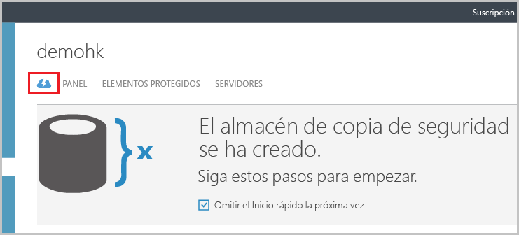
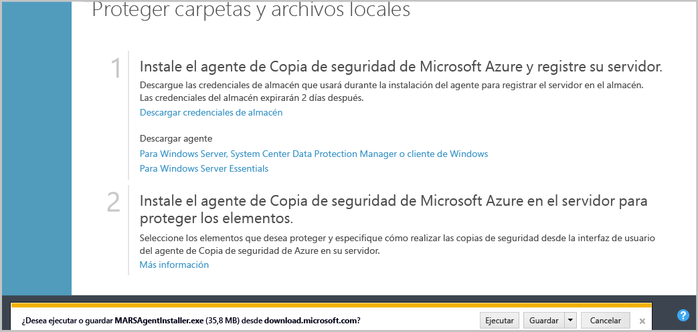
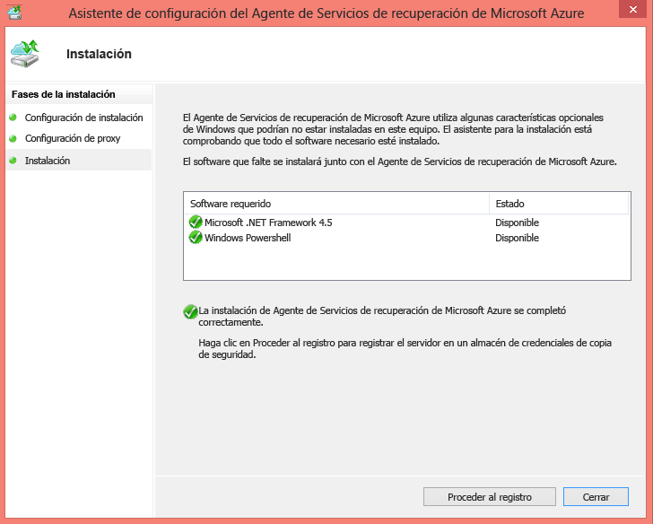
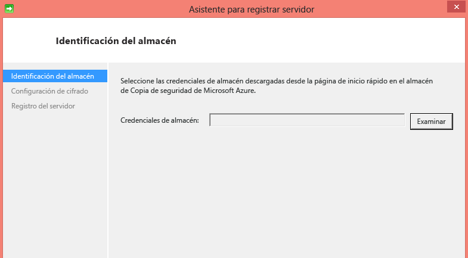
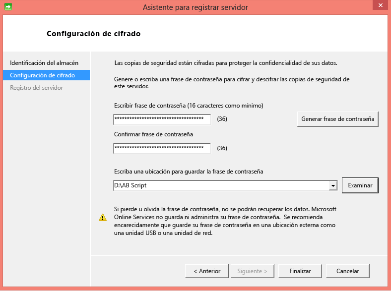
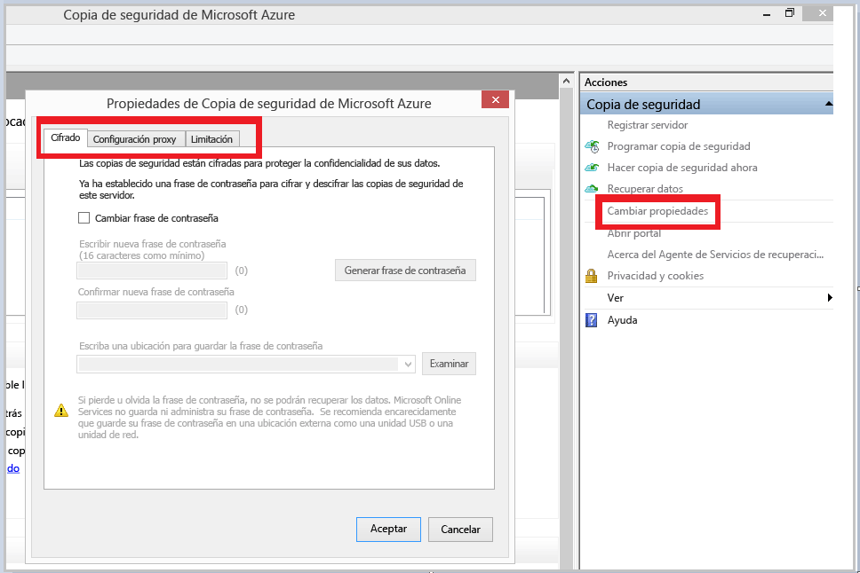
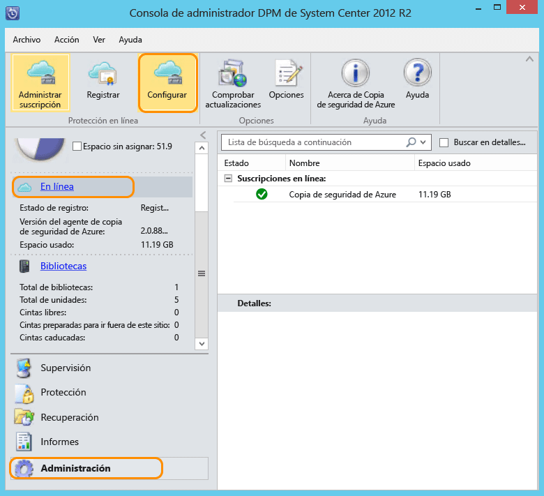

## Descarga, instalación y registro del agente de Copia de seguridad de Azure

Después de crear el almacén de Copia de seguridad de Azure, se debe instalar un agente en cada una de las máquinas de Windows (servidor de Windows Server, cliente de Windows, servidor de System Center Data Protection Manager o la máquina del Servidor de copia de seguridad de Azure) que habilite la copia de seguridad de los datos y las aplicaciones en Azure.

1. Inicie sesión en el [Portal de administración](https://manage.windowsazure.com/).

2. Haga clic en **Servicios de recuperación** y seleccione el almacén de copia de seguridad que desee registrar en un servidor. Aparecerá la página de inicio rápido del almacén de copia de seguridad.

    

3. En la página Inicio rápido, haga clic en **Para Windows Server, System Center Data Protection Manager o cliente de Windows** en la opción **Descargar agente**. Haga clic en **Guardar** para copiarlo en la máquina local.

    

4. Una vez instalado el agente, haga doble clic en MARSAgentInstaller.exe para iniciar la instalación del agente de Copia de seguridad de Azure. Elija la carpeta de instalación y la carpeta temporal requerido para el agente. La ubicación de caché especificada debe tener un espacio libre de al menos el 5% de los datos de copia de seguridad.

5.	Si usa un servidor proxy para conectarse a Internet, en la pantalla **Configuración de proxy**, especifique los detalles del servidor proxy. Si utiliza a un servidor proxy autenticado, escriba los detalles de nombre y la contraseña del usuario en esta pantalla.

6.	El agente de Copia de seguridad de Azure instala .NET Framework 4.5 y Windows PowerShell (si aún no está disponible) para completar la instalación.

7.	Una vez que el agente esté instalado, haga clic en el botón **Continuar con el registro** para continuar con el flujo de trabajo.

    

8. En la pantalla de credenciales del almacén, busque y seleccione el archivo de credenciales del almacén que se descargó anteriormente.

    

    El archivo de almacén de credenciales solo es válido durante 48 horas (después de descargarlo desde el portal). Si encuentra algún error en esta pantalla (por ejemplo "El archivo de credenciales de almacén proporcionado ha caducado"), inicie sesión en el portal de Azure y vuelva a descargar el archivo de almacén de credenciales.

    Asegúrese de que el archivo de almacén de credenciales está disponible en una ubicación a la que puede tener acceso la aplicación de instalación. Si encuentra errores relacionados con el acceso, copie el archivo de almacén de credenciales en una ubicación temporal en esta máquina y vuelva a intentar la operación.

    Si se produce un error de credenciales de almacén no válidas (por ejemplo, "Las credenciales del almacén no son válidas"), el archivo está dañado o no tiene asociadas las credenciales más recientes para el Servicio de recuperación. Vuelva a intentar la operación después de descargar un nuevo archivo de credenciales de almacén desde el portal. Este error suele aparecer si el usuario hace clic en la opción **Descargar credenciales de almacén** en el Portal de Azure, en sucesión rápida. En este caso, solo es válido el segundo archivo de credenciales de almacén.

9. En la pantalla **Configuración de cifrado**, puede generar una frase de contraseña o proporcionarla (mínimo de 16 caracteres). Recuerde guardar la frase de contraseña en una ubicación segura.

    

    > [AZURE.WARNING]Si la frase de contraseña se pierde u olvida; Microsoft no puede ayudar a recuperar los datos de copia de seguridad. El usuario final posee la frase de contraseña de cifrado y Microsoft no puede ver la frase de contraseña que usa el usuario final. Guarde el archivo en una ubicación segura, ya que puede ser necesario durante una operación de recuperación.

10. Al hacer clic en el botón **Finalizar**, la máquina se ha registrado correctamente en el almacén y ahora está lista para iniciar la copia de seguridad en Microsoft Azure.

11. Cuando use Copia de seguridad de Microsoft Azure de forma independiente, puede modificar la configuración especificada durante el flujo de trabajo de registro haciendo clic en la opción **Cambiar propiedades** en el complemento mmc de Copia de seguridad de Azure.

    

    Como alternativa, cuando use Data Protection Manager, puede modificar la configuración especificada durante el flujo de trabajo de registro haciendo clic en la opción **Configurar** y seleccionando **En línea** en la pestaña **Administración**.

    

<!---HONumber=AcomDC_1203_2015-->