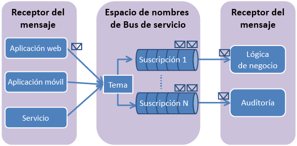

## Qué son los temas y las suscripciones del Bus de servicio

Las suscripciones y los temas del Bus de servicio son compatibles con el modelo de comunicación de mensajería de *publicación/suscripción*. Cuando se usan temas y suscripciones, los componentes de una aplicación distribuida no se comunican directamente entre sí, sino que intercambian mensajes a través de un tema, que actúa como un intermediario.

A diferencia de las colas del Bus de servicio, en las que un solo destinatario procesa cada mensaje, los temas y las suscripciones proporcionan una forma de comunicación de uno a varios mediante un patrón de publicación/suscripción. Es posible registrar varias suscripciones en un tema. Cuando un mensaje se envía a un tema, pasa a estar disponible para cada suscripción para la administración o el procesamiento de manera independiente.

Una suscripción a un tema se asemeja a una cola virtual que recibe copias de los mensajes que se enviaron al tema. Opcionalmente, puede registrar reglas de filtros para un tema por suscripción, lo que le permite filtrar/restringir qué mensajes para un tema reciben las suscripciones a un tema.

Las suscripciones y temas del Bus de servicio le permiten escalar y procesar un número bastante elevado de mensajes en una serie muy amplia de usuarios y aplicaciones.

## Creación de un espacio de nombres de servicio

Para comenzar a usar suscripciones y temas del Bus de servicio en Azure, primero debe crear un espacio de nombres de servicio. Un espacio de nombres proporciona un contenedor con un ámbito para el desvío de recursos del bus de servicio en la aplicación.

Para crear un nombre de espacio de servicio:

1.  Inicie sesión en el [Portal de Azure clásico][].

2.  En el panel de navegación izquierdo del Portal, haga clic en **Bus de servicio**.

3.  En el panel inferior del Portal, haga clic en **Crear**. ![][0]

4.  En el cuadro de diálogo **Agregar un nuevo espacio de nombres**, escriba un nombre de espacio de nombres. El sistema realiza la comprobación automáticamente para ver si el nombre está disponible. ![][2]

5.  Después de asegurarse de que el nombre de espacio de nombres está disponible, seleccione el país o región en el que debe hospedarse el espacio de nombres (asegúrese de que usa el mismo país o la misma región en los que está realizando la implementación de los recursos de proceso).

	> [AZURE.IMPORTANT] seleccione la **misma región** que vaya a seleccionar para la implementación de la aplicación. Con esto conseguirá el máximo rendimiento.

6. 	Deje los demás campos del cuadro de diálogo con los valores predeterminados (**Mensajería** y **Nivel estándar**) y, a continuación, haga clic en la marca de verificación. El sistema crea ahora el espacio de nombres del servicio y lo habilita. Es posible que tenga que esperar algunos minutos mientras el sistema realiza el aprovisionamiento de los recursos para la cuenta.

	![][6]

## Obtención de credenciales de administración predeterminadas para el espacio de nombres

Para realizar operaciones de administración (como la creación de un tema o una suscripción) en el nuevo espacio de nombres, debe obtener las credenciales de administración para el espacio de nombres. Puede obtener estas credenciales en el Portal de Azure.

### Obtención de credenciales de administración en el Portal

1.  En el panel de navegación izquierdo, haga clic en el nodo **Bus de servicio** para ver la lista de espacios de nombres disponibles: ![][0]

2.  Seleccione el espacio de nombres que acaba de crear en la lista desplegable: ![][3]

3.  Haga clic en **Información de conexión**. ![][4]

4.  En el cuadro de diálogo **Información de conexión de acceso**, busque la cadena de conexión que contiene la clave SAS y el nombre de la clave. Anote estos valores, ya que usará la información más adelante para realizar operaciones con el espacio de nombres.

  [Portal de Azure clásico]: http://manage.windowsazure.com
  [0]: ./media/howto-service-bus-topics/sb-queues-13.png
  [2]: ./media/howto-service-bus-topics/sb-queues-04.png
  [3]: ./media/howto-service-bus-topics/sb-queues-09.png
  [4]: ./media/howto-service-bus-topics/sb-queues-06.png
  
  [6]: ./media/howto-service-bus-topics/getting-started-multi-tier-27.png

<!---HONumber=AcomDC_0128_2016-->