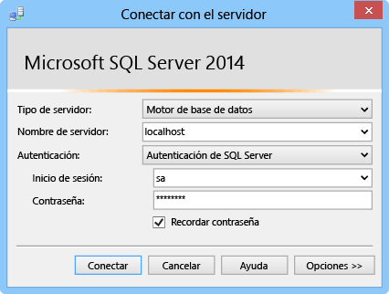

En esta sección se muestra cómo instalar SQL Server Express, habilitar TCP/IP, definir un puerto estático y crear una base de datos que se pueda utilizar con conexiones híbridas.

###Instalación de SQL Server Express

Para usar una base de datos de SQL Server o SQL Server Express local con una conexión híbrida, es necesario habilitar TCP/IP en un puerto estático. Las instancias predeterminadas de SQL Server usan el puerto estático 1433, mientras que las instancias con nombre no. Por eso se instalará la instancia predeterminada. Si ya tiene la instancia predeterminada de SQL Server Express instalada, puede omitir esta sección.

1. Para instalar SQL Server Express, ejecute el archivo **SQLEXPRWT\_x64\_ENU.exe** o **SQLEXPR\_x86\_ENU.exe** que descargó. Aparecerá el asistente Centro de instalación de SQL Server.
	
2. Elija **Instalación independiente del nuevo servidor SQL Server o agregar funciones a una instalación existente**, siga las instrucciones y acepte las opciones y configuración predeterminadas hasta llegar a la página **Configuración de la instancia**.
	
3. En la página **Configuración de la instancia**, elija **Instancia predeterminada** y, a continuación, acepte la configuración predeterminada en la página **Configuración del servidor**.

	>[AZURE.NOTE]Si ya tiene una instancia predeterminada de SQL Server instalada, puede pasar a la siguiente sección y usar esta instancia con conexiones híbridas.
	
5. En la página **Configuración del Motor de base de datos**, en **Modo de autenticación**, elija **Modo mixto (autenticación de SQL Server y de Windows)** y proporcione una contraseña segura para la cuenta de administrador **sa** integrada.
	
	En este tutorial se usará la autenticación de SQL Server. Asegúrese de recordar la contraseña proporcionada, ya que la necesitará más tarde.
	
6. Finalice el asistente para completar la instalación.

###Habilitar TCP/IP y configuración de un puerto estático

En esta sección se usa SQL Server Configuration Manager, que se instaló al instalar SQL Server Express para habilitar TCP/IP y establecer una dirección IP estática.

1. Siga los pasos que se indican en [Habilitar el protocolo de red TCP/IP para SQL Server](http://technet.microsoft.com/library/hh231672%28v=sql.110%29.aspx) para habilitar el acceso de TCP/IP a la instancia.

2. (Opcional) Si no se puede usar la instancia predeterminada, debe seguir los pasos descritos en [Configurar un servidor para que escuche en un puerto TCP específico ](https://msdn.microsoft.com/library/ms177440.aspx) para establecer un puerto estático para la instancia. Si completa este paso, se conectará con el nuevo puerto que defina, en lugar del puerto 1433.

3. (Opcional) Si es necesario, agregue las excepciones en el firewall para permitir el acceso remoto para el proceso de SQL Server (sqlservr.exe).

###Crear una nueva base de datos en la instancia local de SQL Server

1. En SQL Server Management Studio, conéctese al servidor SQL Server que acaba de instalar. (Si el cuadro de diálogo **Conectar al servidor** no se abre automáticamente, vaya al **Explorador de objetos** en el panel izquierdo, haga clic en **Conectar** y, a continuación, haga clic en **Motor de la base de datos**.) 	

	
	
	En **Tipo de servidor**, elija **Motor de la base de datos**. En **Nombre del servidor**, puede usar **localhost** o el nombre del equipo en el que haya instalado SQL Server. Elija **Autenticación de SQL Server** y escriba la contraseña del inicio de sesión sa que creó anteriormente.
	
2. Para crear una nueva base de datos usando SQL Server Management Studio, haga clic con el botón derecho en **Base de datos** en el Explorador de objetos y, a continuación, haga clic en **Nueva base de datos**.
	
3. En el cuadro de diálogo **Nueva base de datos**, escriba `OnPremisesDB` y, a continuación, haga clic en **Aceptar**.
	
4. En el Explorador de objetos, si expande **Bases de datos**, verá que se ha creado la nueva base de datos.

###Creación de un nuevo inicio de sesión de SQL Server y establecimiento de permisos

Por último, creará un nuevo inicio de sesión de SQL Server con permisos restringidos. El servicio de Azure se conectará al servidor SQL Server local con este inicio de sesión en lugar del inicio de sesión sa integrado, que tiene permisos totales en el servidor.

1. En el Explorador de objetos de SQL Server Management Studio, haga clic con el botón derecho en la base de datos **OnPremisesDB** y haga clic en **Nueva consulta**.

2.  Pegue la siguiente consulta TSQL en la ventana de consulta.

		USE [master]
		GO
		
		/* Replace the PASSWORD in the following statement with a secure password. 
		   If you save this script, make sure that you secure the file to 
		   securely maintain the password. */ 
		CREATE LOGIN [HybridConnectionLogin] WITH PASSWORD=N'<**secure_password**>', 
			DEFAULT_DATABASE=[OnPremisesDB], DEFAULT_LANGUAGE=[us_english], 
			CHECK_EXPIRATION=OFF, CHECK_POLICY=ON
		GO
	
		USE [OnPremisesDB]
		GO
	
		CREATE USER [HybridConnectionLogin] FOR LOGIN [HybridConnectionLogin] 
		WITH DEFAULT_SCHEMA=[dbo]
		GO

		GRANT CONNECT TO [HybridConnectionLogin]
		GRANT CREATE TABLE TO [HybridConnectionLogin]
		GRANT CREATE SCHEMA TO [HybridConnectionLogin]
		GO  
   
3. En el script anterior, reemplace la cadena `<**secure_password**>` por una contraseña segura para el nuevo *HybridConnectionsLogin*.

4. **Ejecute** la consulta para crear el nuevo inicio de sesión y conceder los permisos necesarios en la base de datos local.

<!---HONumber=Oct15_HO3-->