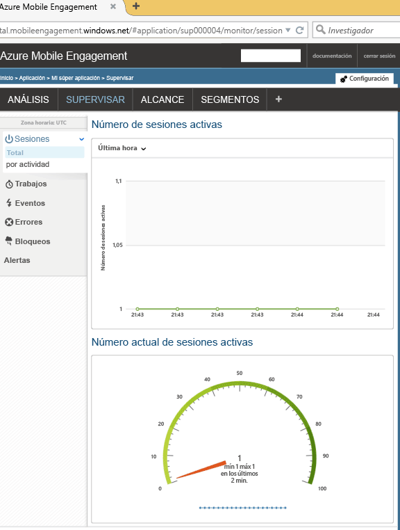

En esta sección se muestra cómo conectar la aplicación al back-end de Mobile Engagement mediante la característica de supervisión en tiempo real de Mobile Engagement.

1. En la cuenta de **Azure Mobile Engagement**, asegúrese de seleccionar la aplicación que desea supervisar y administrar en el portal de **Mobile Engagement**. Navegue al portal de Mobile Engagement haciendo clic en el botón **Interactuar** situado en la parte inferior. 

	 

2. Entrará en el portal de Mobile Engagement. Si la pestaña Monitor no está seleccionada, haga clic en el **Monitor**.

3. El monitor está listo para mostrar en tiempo real cualquier dispositivo que iniciará su aplicación.
	 
4. Inicie su aplicación en el emulador/simulador o en un dispositivo conectado. Debería ver una sesión en el monitor si su integración es correcta, lo que significa que la aplicación está ahora conectada al back-end de Mobile Engagement y le está enviando datos.
	
	 

<!---HONumber=AcomDC_1203_2015-->