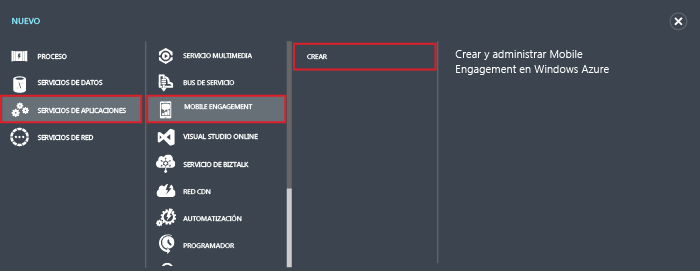
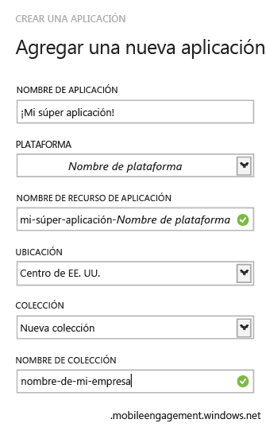

1. Inicie sesión en el [Portal de Azure clásico](https://manage.windowsazure.com) y, luego, haga clic en **+NUEVO** en la parte inferior de la pantalla.

2. Haga clic en **Servicios de aplicaciones**, en **Mobile Engagement** y, luego, en **Crear**.

   	

3. En el menú emergente que aparece, escriba la siguiente información:

   	

	- **Nombre de la aplicación**: nombre de la aplicación. 
	- **Plataforma**: plataforma de destino de la aplicación. Debe crear una aplicación de Mobile Engagement por plataforma de destino para su aplicación móvil. 
	- **Nombre del recurso de aplicación**: este es el nombre por el que la aplicación será accesible mediante API y direcciones URL. 
	- **Ubicación**: centro de región/datos donde se hospedará esta aplicación y la colección de aplicaciones.
	- **Colección**: seleccione una colección creada anteriormente o "Nueva colección".
	- **Nombre de la colección**: representa el grupo de aplicaciones. Esto garantiza que todas las aplicaciones están en un grupo que permitirá realizar cálculos agregados de métricas. Debe usar el nombre de la empresa o departamento aquí si es aplicable.

4. Seleccione la aplicación que acaba de crear en la pestaña **Aplicación**:

5. Haga clic en **INFORMACIÓN DE CONEXIÓN** para mostrar la configuración de la conexión que se debe incluir en la integración del SDK en su aplicación móvil.

6. Copie la **CADENA DE CONEXIÓN**: la necesitará para identificar esta aplicación en el código de aplicación y conectarse con Mobile Engagement desde su aplicación.

   	

<!---HONumber=AcomDC_0128_2016-->