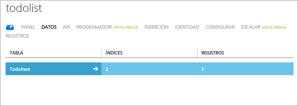

La etapa final de este tutorial consiste en crear y ejecutar la aplicación nueva.

### Carga del proyecto en Studio Android y sincronización con Gradle

1. Vaya a la ubicación donde guardó los archivos del proyecto comprimidos y expanda los archivos del equipo en el directorio de proyectos de Android Studio.

2. Abra Android Studio. Si está trabajando con un proyecto y aparece, cierre el proyecto (Archivo => Cerrar proyecto).

3. Seleccione **Abrir un proyecto de Android Studio existente**, vaya a la ubicación del proyecto y, a continuación, haga clic en **Aceptar**. Se cargará el proyecto y se iniciará la sincronización con Gradle.

 	

4. Espere a que la actividad de sincronización Gradle se complete. Si ve un error de que no se pudo encontrar el destino, es debido a que la versión usada en Android Studio no coincide con la del ejemplo. Para solucionar este problema, lo más sencillo es hacer clic en el vínculo **Install missing platform(s) and sync project** (Instalar plataformas que faltan y sincronizar proyecto) en el mensaje de error. Si recibe otros mensajes de error relativos a la versión, simplemente repita este proceso hasta que no aparezca ningún error.
    - Hay otra manera de solucionar este problema si desea ejecutar el proyecto con la versión "más reciente y mayor" de Android. Puede actualizar el **targetSdkVersion** en el archivo *build.gradle* del directorio *app* para que coincida con la versión instalada en el equipo. Para obtenerla, haga clic en el icono del **administrador de SDK** y vea la versión que se muestra. Después, haga clic en **Sync Project with Gradle Files** (Sincronizar proyecto con archivos de Gradle). Quizás obtenga un mensaje de error para la versión de las herramientas de compilación, que puede corregir del mismo modo.

### Ejecución de la aplicación

Puede ejecutar la aplicación con el emulador o un dispositivo real.

1. Para ejecutarla desde un dispositivo, conéctelo al equipo mediante un cable USB. Debe [configurar el dispositivo para desarrollo](https://developer.android.com/training/basics/firstapp/running-app.html). Si está desarrollando en un equipo de Windows, también debe descargar e instalar un controlador USB.

2. Para ejecutar el emulador de Android, debe definir por lo menos un dispositivo virtual Android (AVD). Haga clic en el icono del administrador de AVD para crear y administrar estos dispositivos.

3. En el menú **Ejecutar**, haga clic en **Ejecutar** para iniciar el proyecto. Elija después un dispositivo o emulador en el cuadro de diálogo que aparece.

4. Cuando aparezca la aplicación, escriba texto significativo, como _Completar el tutorial_ y, a continuación, haga clic en **Agregar**.

   	

   	Esta acción envía una solicitud POST al nuevo servicio móvil hospedado en Azure. Los datos de la solicitud se insertan en la tabla TodoItem. El servicio móvil devuelve los elementos almacenados en la tabla y los datos se muestran en la lista.

	> [AZURE.NOTE]Puede revisar el código de acceso al servicio móvil para consultar e insertar datos; este se encuentra en el archivo ToDoActivity.java.

8. De nuevo en el Portal de Azure clásico, haga clic en la pestaña **Datos** y luego en la tabla **TodoItems**.

   	

   	Esto le permite examinar los datos que la aplicación inserta en la tabla.

   	

<!---HONumber=AcomDC_1203_2015-->