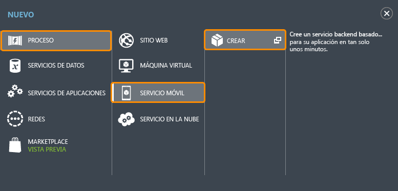

Siga los pasos siguientes para crear un servicio móvil nuevo.

1.	Inicie sesión en el [Portal de Azure clásico](https://manage.windowsazure.com/). En la parte inferior del panel de navegación, haga clic en **+NUEVO**. Expanda **Proceso** y **Servicio móvil** y luego haga clic en **Crear**.

	

	Esto muestra el cuadro de diálogo **Crear un servicio móvil**.

2.	En el cuadro de diálogo **Crear un servicio móvil**, seleccione **Crear una base de datos SQL de 20 MB gratuita**, seleccione el tiempo de ejecución **JavaScript**, escriba un nombre de subdominio para el nuevo servicio móvil en el cuadro de texto de **dirección URL**. Haga clic en el botón de flecha derecha para ir a la página siguiente.

	

	Se muestra la página **Especificar configuración de base de datos**.
	
	>[AZURE.NOTE]Como parte de este tutorial, va a crear una instancia y un nuevo servidor de Base de datos SQL. Puede reutilizar esta nueva base de datos y administrarla como lo haría con cualquier otra instancia de Base de datos SQL. Si ya tiene una base de datos en la misma región que el nuevo servicio móvil, también puede elegir **Use existing Database** y, a continuación, seleccionar la base de datos. No se recomienda el uso de una base de datos en una región diferente debido a los costes adicionales de ancho de banda y las elevadas latencias.

3.	En **Nombre**, escriba el nombre de la base de datos nueva, luego escriba el **nombre de inicio de sesión**, que es el nombre de inicio de sesión de administrador para el nuevo servidor de Base de datos SQL, escriba y confirme la contraseña y haga clic en el botón de comprobación para completar el proceso. 

Ahora ha creado un servicio móvil que pueden usar sus aplicaciones móviles.

<!---HONumber=AcomDC_1203_2015-->