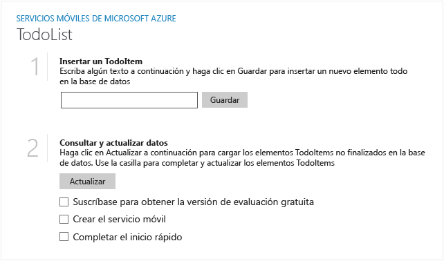

A continuación se muestran las capturas de pantalla de la aplicación completada:

  Aplicación de la Tienda Windows

  Aplicación de la Tienda de Windows Phone

Completar este tutorial es un requisito previo para todos los tutoriales de Servicios móviles para aplicaciones de la Tienda Windows y de la Tienda Windows Phone.

<!---HONumber=Oct15_HO3-->