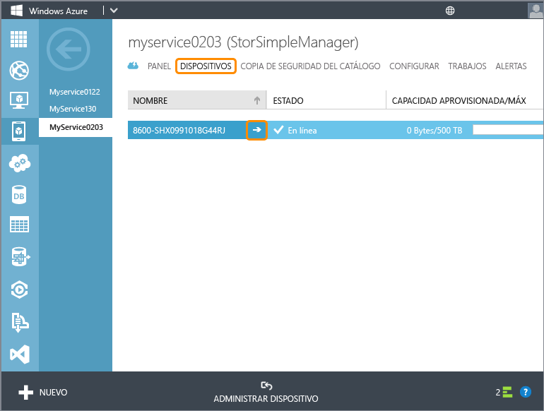

<!--author=alkohli last changed: 12/01/15-->

#### Para configurar y registrar el dispositivo

1. Acceder a la interfaz de Windows PowerShell en la consola serie del dispositivo StorSimple. Consulte [Uso de PuTTY para conectarse a la consola serie del dispositivo](#use-putty-to-connect-to-the-device-serial-console) para obtener instrucciones. **Siga el procedimiento exactamente como se indica o no podrá acceder a la consola.**

2. En la sesión que se abre, presione ENTRAR una vez para obtener un símbolo del sistema.

3. Se le pedirá que elija el idioma que desee establecer para el dispositivo. Especifique el idioma y, a continuación, presione ENTRAR.

    

4. En el menú de la consola serie que se muestra, seleccione la opción 1 para iniciar sesión con acceso completo.

    
  
     Complete los pasos 5-12 para configurar las opciones de red necesarias mínimas para el dispositivo. **Estos pasos de configuración deben realizarse en el controlador activo del dispositivo.** El menú de la consola serie indica el estado del controlador en el mensaje del banner. Si no está conectado al controlador activo, desconéctese y, a continuación, conéctese al controlador activo.

5. En el símbolo del sistema, escriba su contraseña. La contraseña predeterminada del dispositivo es **Password1**.

6. Escriba el siguiente comando:

     `Invoke-HcsSetupWizard`

7. Aparecerá un Asistente para instalación que le ayudará a configurar las opciones de red para el dispositivo. Proporcione la siguiente información:
   - Dirección IP para la interfaz de red DATA 0
   - Máscara de subred
   - Puerta de enlace
   - Dirección IP para el servidor DNS principal
   - Dirección IP para el servidor NTP principal
   
      > [AZURE.NOTE] Tendrá que esperar unos minutos para que se apliquen la máscara de subred y la configuración de DNS. Si recibe el mensaje de error «El dispositivo no está listo», compruebe la conexión de red física en la interfaz de red DATA 0 de su controlador activo.

8. (Opcional) Configure el servidor proxy web. Aunque la configuración del proxy web es opcional, **tenga en cuenta que, si usa un proxy web, solo puede configurarlo aquí**. Para obtener más información, vaya a [Configurar el proxy web para el dispositivo](../articles/storsimple/storsimple-configure-web-proxy.md). Si surge algún problema durante este paso, vea la guía de solución de problemas de [Errores durante la configuración del proxy web](../articles/storsimple/storsimple-troubleshoot-deployment.md#errors-during-the-optional-web-proxy-settings).
 

      > [AZURE.NOTE] También puede presionar Ctrl+C en cualquier momento para salir del Asistente para instalación. Se conservarán todos los valores de configuración que aplicó antes de emitir este comando.

9. Por motivos de seguridad, la contraseña del administrador del dispositivo expira después de la primera sesión y deberá cambiarla para sesiones posteriores. Cuando se le solicite, proporcione una contraseña de administrador del dispositivo. Una contraseña de administrador del dispositivo válida debe tener entre 8 y 15 caracteres. La contraseña debe contener una combinación de caracteres en minúsculas, caracteres en mayúsculas, números y caracteres especiales.

10. La contraseña de StorSimple Snapshot Manager también se establece aquí. Use esta contraseña para autenticar un dispositivo con el host de Windows que ejecuta StorSimple Snapshot Manager. Cuando se le solicite, proporcione una contraseña de entre 14 y 15 caracteres. La contraseña debe contener una combinación de tres de los siguientes elementos: caracteres en minúsculas, caracteres en mayúsculas, números y caracteres especiales.

    

    Puede restablecer la contraseña de StorSimple Snapshot Manager desde la interfaz de servicio de Administrador de StorSimple. Para conocer pasos detallados, ve al tema [Cambiar las contraseñas de StorSimple utilizando el servicio de administrador de StorSimple](../articles/storsimple/storsimple-change-passwords.md).

	Para solucionar los problemas durante este paso, vea la guía para solucionar problemas de [Errores relacionados con las contraseñas](../articles/storsimple/storsimple-troubleshoot-deployment.md#errors-related-to-device-administrator-and-storsimple-snapshot-manager-passwords).

11. El último paso del Asistente para instalación registra el dispositivo con el servicio de Administrador de StorSimple. Para ello, necesitará la clave de registro del servicio que obtuvo en el paso 2. Después de proporcionar la clave de registro, puede que tenga que esperar entre 2 y 3 minutos hasta que el dispositivo se registre.

	Para solucionar los posibles errores de registro del dispositivo, vea el tema [Errores durante el registro de dispositivos](../articles/storsimple/storsimple-troubleshoot-deployment.md#errors-during-device-registration). Para conocer la solución de problemas con detalle, también puede consultar el [Ejemplo paso a paso de solución de problemas](../articles/storsimple/storsimple-troubleshoot-deployment.md#step-by-step-storsimple-troubleshooting-example).

12. Una vez registrado el dispositivo, aparecerá una clave de cifrado de datos de servicio. Copie esta clave y guárdela en un lugar seguro.
	
	> [AZURE.WARNING] Esta clave se solicitará junto con la clave de registro de servicio para registrar dispositivos adicionales con el servicio de Administrador de StorSimple. Consulte [Seguridad de StorSimple](../articles/storsimple/storsimple-security.md) para obtener más información sobre esta clave.

     

     Para copiar el texto de la ventana de la consola serie, simplemente seleccione el texto. A continuación, podrá pegarlo en el Portapapeles o en cualquier editor de texto. No use Ctrl+C para copiar la clave de cifrado de datos de servicio. Si usa Ctrl+C, saldrá del Asistente para instalación. Como resultado, no se cambiarán la contraseña del administrador del dispositivo ni la contraseña de StorSimple Snapshot Manager, y el dispositivo volverá a usar las contraseñas predeterminadas.

13. Salga de la consola serie.

14. Vuelva al Portal de Azure clásico y siga estos pasos:
  1. Haga doble clic en el servicio de Administrador de StorSimple para acceder a la página **Inicio rápido**.
  2. Haga clic en **Ver los dispositivos conectados**.
  3. En la página **Dispositivos**, compruebe que el dispositivo se conectó correctamente al servicio consultando el estado. El estado del dispositivo debe ser **Conectado**. Si el estado del dispositivo es **Desconectado**, espere unos minutos para que el dispositivo se conecte.
   
    
  
      > [AZURE.IMPORTANT] Después de que el dispositivo esté en línea, conecta los cables de red que desconectaste al principio de este paso.

Después de que el dispositivo se haya registrado correctamente y no esté en línea, puede ejecutar el `Test-HcsmConnection -Verbose` para asegurarse de que la conectividad de red es correcta. Para conocer el uso detallado de este cmdlet, vaya a [Referencia del cmdlet para Test-HcsmConnection](https://technet.microsoft.com/library/dn715782.aspx).

 **Vídeo disponible**

Para ver un vídeo que muestra cómo configurar y registrar el dispositivo a través de Windows PowerShell para StorSimple, haga clic [aquí](https://azure.microsoft.com/documentation/videos/initialize-the-storsimple-appliance/).

<!---HONumber=AcomDC_0224_2016-->