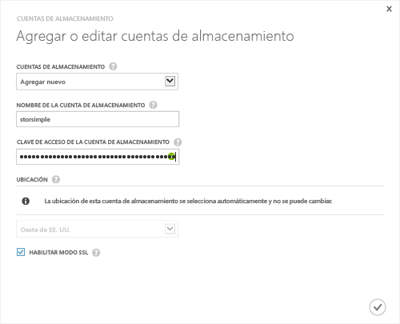

<!--author=SharS last changed: 9/17/15-->

#### Para agregar una nueva cuenta de almacenamiento en la versión de lanzamiento de StorSimple (GA)

1. En la página de aterrizaje del servicio de Administrador de StorSimple, seleccione el servicio y haga doble clic en él. Esto le llevará a la página **Inicio rápido**. Seleccione la página **Configurar**.

2. Haga clic en **Agregar/editar cuenta de almacenamiento**.

3. En el cuadro de diálogo **Agregar/editar cuenta de almacenamiento**, haga lo siguiente:

  1. Haga clic en **Agregar nuevo**.
  2. Proporcione un nombre para la cuenta de almacenamiento.
  3. Proporcione la **Clave de acceso** principal para la cuenta de almacenamiento de Microsoft Azure.
  4. Seleccione **Habilitar modo SSL** para crear un canal seguro para la comunicación de red entre su dispositivo y la nube. Desactive la casilla **Habilitar modo SSL** solo si está trabajando dentro de una nube privada.
  5. Haga clic en el icono de marca de verificación . Recibirá una notificación cuando la cuenta de almacenamiento se cree correctamente.

    

4. La cuenta de almacenamiento recién creada se mostrará en la página **Configurar** bajo **Cuentas de almacenamiento**. Haga clic en **Guardar** para guardar la cuenta de almacenamiento recién creada. Haga clic en **Aceptar** cuando se le pida confirmación.

<!---HONumber=Oct15_HO3-->