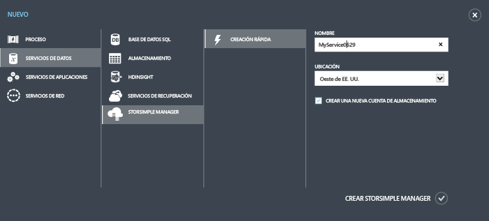
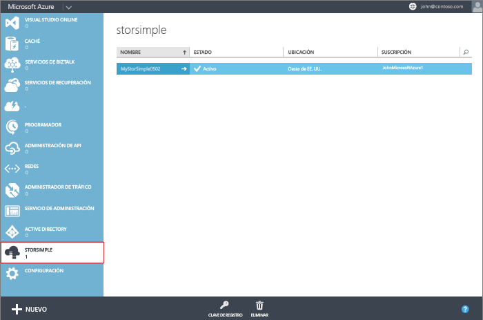

<!--author=alkohli last changed:01/14/2016-->

#### Para crear un nuevo servicio

1. Con sus credenciales de cuenta de Microsoft, inicie sesión en el Portal de Azure clásico en esta dirección URL: [https://manage.windowsazure.com/](https://manage.windowsazure.com/).

2. En el Portal de Azure clásico, haga clic en **Nuevo** > **Servicios de datos** > **Administrador de StorSimple** > **Creación rápida**.

3. En el formulario que aparece, haga lo siguiente:
  1. Proporcione un **Nombre** único para el servicio. Se trata de un nombre descriptivo que sirve para identificar el servicio. El nombre puede tener entre 2 y 50 caracteres que pueden ser letras, números y guiones. El nombre debe empezar y terminar con una letra o un número.
  2. Proporcione una **Ubicación** para el servicio. En general, elige una ubicación más cercana a la región geográfica donde quieras implementar el dispositivo. También puedes querer tener en cuenta lo siguiente: 
	 
		- Si ya tiene cargas de trabajo en Azure que se van a implementar con el dispositivo StorSimple, debe usar este centro de datos.
		- El servicio Administrador de StorSimple y el Almacenamiento de Azure pueden estar en dos ubicaciones independientes. En este caso, se le pedirá que cree la cuenta del Administrador de StorSimple y la del Almacenamiento de Azure por separado. Para crear una cuenta de Almacenamiento de Azure, vaya al servicio Almacenamiento de Azure en el Portal de administración y siga los pasos indicados en [Crear una cuenta de almacenamiento](storage-create-storage-account.md#create-a-storage-account). Después de crear esta cuenta, agréguela al servicio Administrador de StorSimple mediante los pasos indicados en [Configuración de una nueva cuenta de almacenamiento para el servicio](storsimple-deployment-walkthrough.md#configure-a-new-storage-account-for-the-service).
		 
  3. Elija una **Suscripción** en la lista desplegable. La suscripción está vinculada a la cuenta de facturación. Este campo no está presente si tiene una sola suscripción.
  4. Seleccione **Crear una cuenta de almacenamiento nueva** para crear automáticamente una cuenta de almacenamiento con el servicio. Esta cuenta de almacenamiento tendrá un nombre especial, como "storsimplebwv8c6dcnf." Si necesitas tener tus datos en una ubicación diferente, desactiva esta casilla. 
  5. Haga clic en **Crear Administrador de StorSimple** para crear el servicio.

   

  Se le dirigirá a la página de aterrizaje del **Servicio**. La creación del servicio tardará unos minutos. Después de que el servicio se cree correctamente, se le notificará de forma adecuada y el estado del servicio cambiará a **Activo**.
 
   

 **Vídeo disponible**

Para ver un vídeo que muestra cómo crear un nuevo servicio StorSimple Manager, haga clic en [aquí](https://azure.microsoft.com/documentation/videos/create-a-storsimple-manager-service/).

<!---HONumber=AcomDC_0128_2016-->