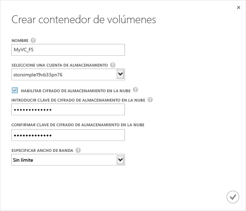

<!--author=SharS last changed: 9/17/15-->

#### Para crear un contenedor de volúmenes

1. En la página **Inicio rápido** del dispositivo, haga clic en **Agregar un contenedor de volúmenes**. Aparece el cuadro de diálogo **Crear contenedor de volúmenes**.

    

2. En el cuadro de diálogo **Crear contenedor de volúmenes**:
  1. Proporcione un **Nombre** para el contenedor de volúmenes. El nombre debe tener una longitud de entre 3 y 32 caracteres.
  2. Seleccione una **Cuenta de almacenamiento** para asociarla a este contenedor de volúmenes. Puede elegir la cuenta predeterminada que se genera en el momento en que se crea el servicio. También puede usar la opción **Agregar nuevo** para especificar una cuenta de almacenamiento que no esté vinculada a la suscripción al servicio.
  3. Seleccione **Habilitar el cifrado de almacenamiento en la nube** para habilitar el cifrado de los datos enviados del dispositivo a la nube.
  4. Proporcione y confirme una **Clave de cifrado de almacenamiento en la nube** con una longitud de entre 8 y 32 caracteres. El dispositivo usa esta clave para acceder a los datos cifrados.
  5. Seleccione **Ilimitado** en la lista desplegable **Especificar el ancho de banda** si desea consumir todo el ancho de banda disponible. También puede establecer esta opción en **Personalizado** para usar los controles de ancho de banda y especificar un valor de entre 1 y 1.000 Mbps. Si tiene a su disposición información sobre el uso del ancho de banda, es posible que pueda asignar ancho de banda en función de una programación especificando **Seleccionar una plantilla de ancho de banda**. Para conocer el procedimiento paso a paso, vaya a [Agregar una plantilla de ancho de banda](storsimple-manage-bandwidth-templates.md#add-a-bandwidth-template).
  6. Haga clic en el icono de marca de verificación  para guardar este contenedor de volúmenes y salir del asistente. 

  El contenedor de volúmenes recién creado se mostrará en la página **Contenedores de volúmenes**.

 **Vídeo disponible**

Para ver un vídeo que muestra cómo crear un contenedor de volúmenes en la solución de StorSimple, haga clic [aquí](https://azure.microsoft.com/documentation/videos/create-a-volume-container-in-your-storsimple-solution/).

<!---HONumber=AcomDC_0128_2016-->