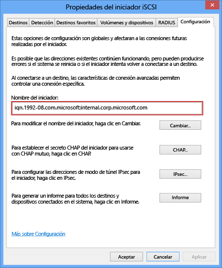

<!--author=SharS last changed: 9/17/15-->

#### Para obtener el IQN de un host de Windows

1. Inicie el iniciador iSCSI de Microsoft en el host de Windows. Haga clic en **Inicio** > **Herramientas administrativas** > **Iniciador iSCSI**.

2. En la ventana **Propiedades del iniciador iSCSI**, en la pestaña **Configuración**, seleccione y copie la cadena desde el campo **Nombre de iniciador**.
 
    

3. Guarde esta cadena.

<!---HONumber=AcomDC_0218_2016-->