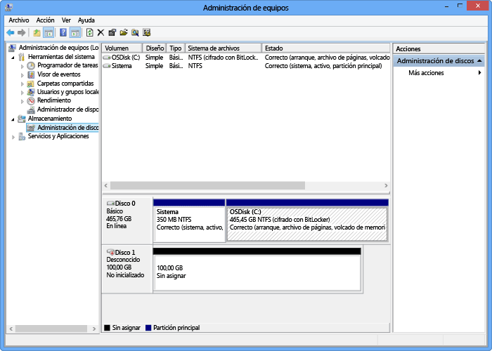

<!--author=SharS last changed: 9/17/15-->

#### Para montar, inicializar y formatear un volumen

1. Inicie el iniciador iSCSI de Microsoft.

2. En la ventana **Propiedades del iniciador iSCSI**, en la pestaña **Detección**, haga clic en **Detectar portal**.

3. En el cuadro de diálogo **Detectar portal de destino**, proporcione la dirección IP de la interfaz de red habilitada para iSCSI y, a continuación, haga clic en **Aceptar**.

4. En la ventana **Propiedades del iniciador iSCSI**, en la pestaña **Destinos**, busque los **Destinos detectados**. El estado del dispositivo debe aparecer como **Inactivo**.

5. Seleccione el dispositivo de destino y, a continuación, haga clic en **Conectar**. Después de conectar el dispositivo, el estado debería cambiar a **Conectado**. (Para obtener más información sobre el uso del iniciador iSCSI de Microsoft, consulte [Instalar y configurar el iniciador iSCSI de Microsoft][1]).

6. En el host de Windows, presione la tecla del logotipo de Windows + X y, a continuación, haga clic en **Ejecutar**.

7. En el cuadro de diálogo **Ejecutar**, escriba **Diskmgmt.msc**. Haga clic en **Aceptar**, y aparecerá el cuadro de diálogo **Administración de discos**. El panel derecho mostrará los volúmenes del host.

8. En la ventana **Administración de discos**, aparecerán los volúmenes montados, tal como se muestra en la siguiente ilustración. Haga clic con el botón derecho en el volumen detectado (haga clic en el nombre del disco) y, a continuación, haga clic en **Conectado**.

     

9. Vuelva a hacer clic con el botón derecho en el volumen (haga clic en el nombre del disco) y, a continuación, haga clic en **Inicializar**.

10. Para formatear un volumen simple, siga estos pasos:
  1. Seleccione el volumen, haga clic con el botón derecho en él (haga clic en el área adecuada) y haga clic en **Nuevo volumen simple**.
  2. En el Asistente para nuevo volumen simple, especifique el tamaño y la letra de unidad del volumen y configure el volumen como un sistema de archivos NTFS.
  3. Especifique un tamaño de unidad de asignación de 64 KB. Este tamaño de unidad de asignación funciona bien con los algoritmos de desduplicación usados en la solución de StorSimple.
  4. Realice un formateo rápido.

 **Vídeo disponible**

Para ver un vídeo que muestra cómo montar, inicializar y formatear un volumen de StorSimple, haga clic [aquí](https://azure.microsoft.com/documentation/videos/mount-initialize-and-format-a-storsimple-volume/).

<!--Link references-->
[1]: https://technet.microsoft.com/library/ee338480(WS.10).aspx

<!---HONumber=AcomDC_0128_2016-->