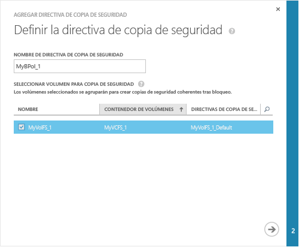
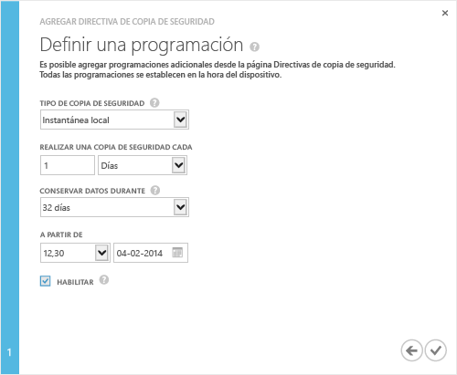

<!--author=alkohli last changed: 9/17/15-->

### Para realizar una copia de seguridad

1. En la página **Inicio rápido** del dispositivo, haga clic en **Agregar una directiva de copia de seguridad**. Esto iniciará el Asistente para agregar directivas de copia de seguridad. 

2. En la página **Definir la directiva de copia de seguridad**:
  1. Proporcione un nombre que tenga entre 3 y 150 caracteres para la directiva de copia de seguridad.
  2. Seleccione los volúmenes de los que se va a hacer la copia de seguridad. Si selecciona más de un volumen, estos volúmenes se agruparán para crear una copia de seguridad preparada para bloqueos.
  3. Haga clic en el icono de flecha . 
  
    

3. En la página **Definir una programación**:
  1. Seleccione el tipo de copia de seguridad en la lista desplegable. Para restauraciones más rápidas, seleccione **Instantánea local**. Para lograr resistencia de datos, seleccione **Instantánea en la nube**.
  2. Especifique la frecuencia de copia de seguridad en minutos, horas, días o semanas.
  3. Seleccione un tiempo de retención. Las opciones de retención dependen de la frecuencia de copia de seguridad. Por ejemplo, para una directiva diaria, la retención puede especificarse en semanas, mientras que la retención de una directiva mensual es en meses.
  4. Seleccione la fecha y hora de inicio para la directiva de copia de seguridad.
  5. Seleccione la casilla **Habilitar** para habilitar la directiva de copia de seguridad. 
  6. Haga clic en el icono de marca de verificación  para guardar la directiva.

    
 
     Ahora dispone de una directiva de copia de seguridad que creará copias de seguridad programadas de los datos del volumen.

Ahora ya acabó de configurar el dispositivo.

 **Vídeo disponible**

Para ver un vídeo que muestra cómo tomar una copia de seguridad de StorSimple, haga clic [aquí](https://azure.microsoft.com/documentation/videos/take-a-storsimple-backup/).

<!---HONumber=AcomDC_0128_2016-->