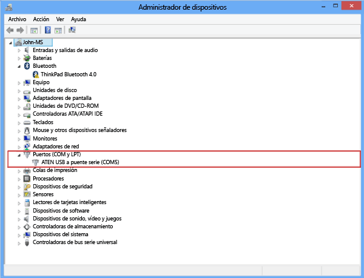
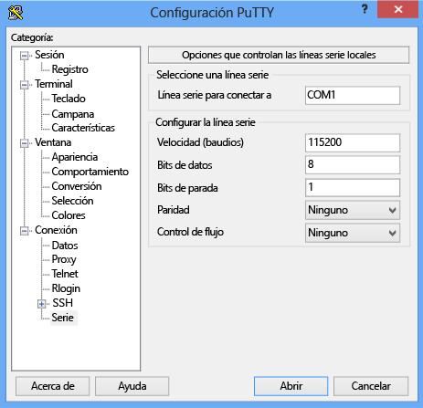

<!--author=SharS last changed: 9/17/15-->

#### Para conectarse a través de la consola serie

1. Conecte el cable serie al dispositivo (directamente o a través de un adaptador USB-serie).

2. Abra el **Panel de control** y, a continuación, abra el **Administrador de dispositivos**.

3. Identifique el puerto COM como se muestra en la siguiente ilustración.

     

4. Inicie PuTTY.

5. En el panel derecho, cambie el **Tipo de conexión** a **Serie**.

6. En el panel derecho, escriba el puerto COM adecuado. Asegúrese de que los parámetros de configuración en serie se establecen como sigue:
  - Velocidad: 115.200
  - Bits de datos: 8
  - Bits de parada: 1
  - Paridad: ninguno
  - Control de flujo: ninguno

    Esta configuración se muestra en la siguiente ilustración.

     

    > [AZURE.NOTE]Si la opción de control de flujo predeterminado no funciona, pruebe a establecer el control de flujo en XON/XOFF.

7. Haga clic en **Abrir** para iniciar una sesión en serie.
 

<!---HONumber=Oct15_HO3-->