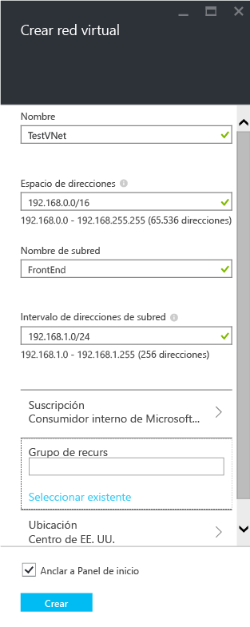
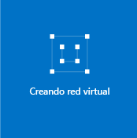
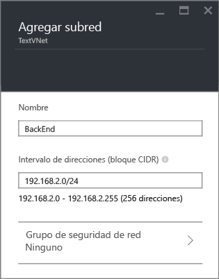
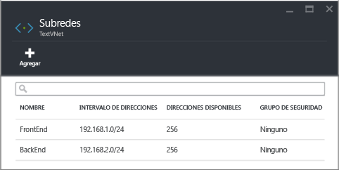

## Cómo crear una red virtual en el portal de Azure

Para crear una red virtual basada en el escenario anterior por medio del portal de vista previa de Azure, siga estos pasos.

1. Desde un explorador, vaya a http://portal.azure.com y, si es necesario, inicie sesión con su cuenta de Azure.
2. Haga clic en **NUEVO** > **Redes** > **Red virtual**, después haga clic en **Administrador de recursos** de la lista **Seleccionar un modelo de implementación**, y, a continuación, haga clic en **Crear**, tal como se muestra en la figura siguiente.

	

3. En la hoja **Crear red virtual**, configure los valores de la red virtual, como se muestra en la figura siguiente.

	

4. Haga clic en **Grupo de recursos** y seleccione un grupo de recursos al que va a agregar la red virtual, o haga clic en **Crear nuevo** para agregar la red virtual a un nuevo grupo de recursos. En la siguiente figura se muestra la configuración de grupo de recursos de un nuevo grupo de recursos denominado **TestRG**. Para obtener más información sobre los grupos de recursos, visite [Información general del Administrador de recursos de Azure](resource-group-overview.md/#resource-groups).

	

5. Si es necesario, cambie la configuración de la **Suscripción** y la **Ubicación** de la red virtual.

6. Si no desea ver la red virtual como un icono en el **Panel de inicio**, deshabilite **Anclar a panel de inicio**.

7. Haga clic en **Crear** y observe el icono denominado **Creación de red virtual** tal como se muestra en la figura siguiente.

	

8. Espere a que la red virtual se cree, a continuación, en la hoja **Red virtual**, haga clic en **Todas las configuraciones** > **Subredes** > **Agregar** tal como se muestra a continuación.

	

9. Especifique la configuración de subred para la subred *BackEnd*, tal como se muestra a continuación y haga clic en **Aceptar**.

	

10. Observe la lista de subredes, como se muestra en la siguiente figura.

	

<!---HONumber=AcomDC_0211_2016-->