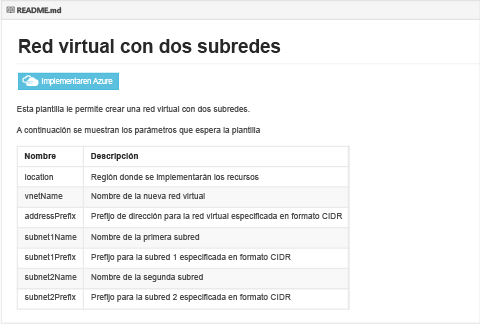
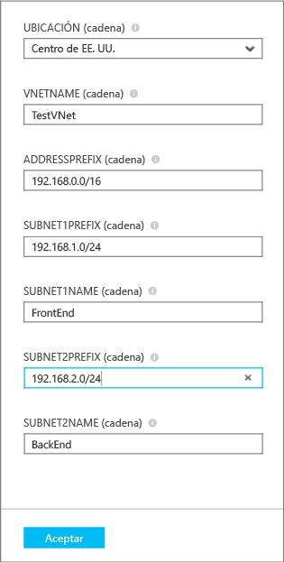
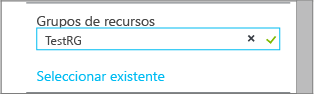
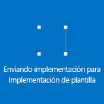

## Implementar la plantilla ARM por medio de un solo clic para implementar

Puede reutilizar plantillas ARM predefinidas que se han cargado en un repositorio github que mantiene Microsoft y está abierto a la comunidad. Estas plantillas pueden implementarse directamente desde github, o pueden descargarse y modificarse para que se ajusten a sus necesidades. Para implementar una plantilla que cree una red virtual con dos subredes, siga estos pasos.

1. Desde un explorador, vaya a [https://github.com/Azure/azure-quickstart-templates](https://github.com/Azure/azure-quickstart-templates).
2. Desplácese hacia abajo por la lista de plantillas y haga clic en **101-vnet-two-subnets**. Compruebe el archivo **README.md**, como se muestra a continuación.

	

3. Haga clic en **Implementar en Azure**. Si es necesario, escriba sus credenciales de inicio de sesión de Azure.
4. En la hoja **Parámetros**, escriba los valores que desee utilizar para crear la red virtual nueva y, a continuación, haga clic en **Aceptar**. En la siguiente figura se muestran los valores para este escenario.

	

4. Haga clic en **Grupo de recursos** y seleccione un grupo de recursos al que va a agregar la red virtual, o haga clic en **Crear nuevo** para agregar la red virtual a un nuevo grupo de recursos. Para obtener más información acerca de los grupos de recursos, consulte . La siguiente figura se muestra la configuración de grupo de recursos de un nuevo grupo de recursos denominado **TestRG**.

	

5. Si es necesario, cambie la configuración de la **Suscripción** y la **Ubicación** de la red virtual.
6. Si no desea ver la red virtual como un icono en el **Panel de inicio**, deshabilite **Anclar a panel de inicio**.
5. Haga clic en **Términos legales**, lea los términos y haga clic en **Comprar** para aceptar. 
6. Haga clic en **Crear** para crear la red virtual.

	

7. Una vez se haya realizado la implementación, haga clic en **TestVNet** > **Todas las configuraciones** > **Subredes** para ver las propiedades de la subred, tal como se muestra a continuación.

	

<!---HONumber=AcomDC_0211_2016-->