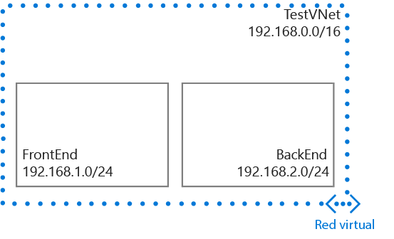

## Escenario

Para ilustrar mejor cómo crear una red virtual y las subredes, en este documento se utilizará el siguiente escenario.

En este escenario, creará una red virtual denominada **TestVNet** con un bloque CIDR reservado de **192.168.0.0./16**. La red virtual contendrá las subredes siguientes:

- **FrontEnd**, con **192.168.1.0/24** como su bloque CIDR.
- **BackEnd**, con **192.168.2.0/24** como su bloque CIDR.

 

<!---HONumber=Oct15_HO3-->